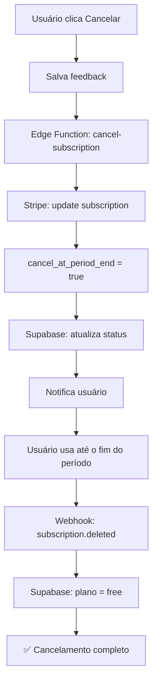
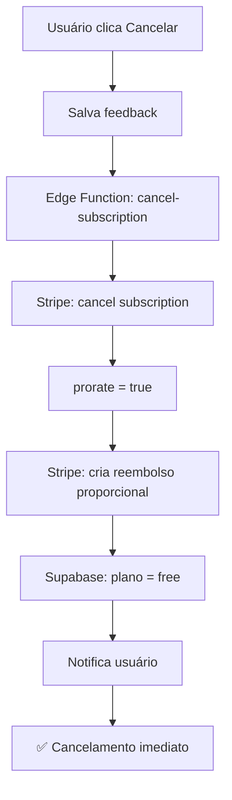

# 📋 ANÁLISE: Sistema de Cancelamento de Assinatura

**Data:** 23 de Dezembro de 2025  
**Prioridade:** 🔴 CRÍTICA  
**Status:** ⚠️ PROBLEMA IDENTIFICADO

---

## 🔍 Problema Identificado

**Situação Atual:** Quando um usuário cancela sua assinatura premium através da página Premium, apenas o banco de dados local (Supabase) é atualizado. **O Stripe não é notificado**, resultando em:

1. ❌ **Cobranças continuam acontecendo** no Stripe
2. ❌ **Assinatura permanece ativa** no Stripe
3. ❌ **Dados inconsistentes** entre Supabase e Stripe
4. ❌ **Experiência ruim** para o usuário (ainda é cobrado após "cancelar")
5. ❌ **Problemas legais** (cobranças indevidas)

---

## 📊 Análise Comparativa

### ✅ Sistema de Reembolso de Anúncios (CORRETO)

**Localização:** `supabase/functions/process-ad-refund/index.ts`

```typescript
// 1. Valida o anúncio e usuário
const { data: ad, error: adError } = await supabase
  .from('anuncios')
  .select('*')
  .eq('id', adId)
  .single();

// 2. ✅ CANCELA NO STRIPE PRIMEIRO
const refund = await stripe.refunds.create({
  payment_intent: ad.stripe_payment_intent_id,
  reason: 'requested_by_customer',
  metadata: {
    ad_id: adId,
    user_id: userId,
    reason: 'ad_rejected_refund'
  }
});

// 3. Atualiza banco de dados LOCAL
const { error: updateError } = await supabase
  .from('anuncios')
  .update({
    payment_status: 'refunded',
    status: 'ended',
    updated_at: new Date().toISOString()
  })
  .eq('id', adId);
```

**✅ Fluxo Correto:**
```
Usuário solicita reembolso
    ↓
STRIPE: Processa refund
    ↓
SUPABASE: Atualiza status local
    ↓
Usuário recebe reembolso
```

---

### ❌ Sistema de Cancelamento de Assinatura (INCORRETO)

**Localização:** `src/pages/PremiumPage.tsx` (linhas 263-298)

```typescript
const handleCancelSubscription = async (reason: string, details: string) => {
  if (!session?.user || !user) {
    addToast("Você precisa estar logado.", "error");
    return;
  }

  setIsCancelling(true);
  try {
    // 1. Salva feedback
    const { error: feedbackError } = await api.submitCancellationFeedback({
      user_id: session.user.id,
      previous_plan: user.plan || 'unknown',
      reason: reason,
      details: details,
    });

    // 2. ❌ ATUALIZA APENAS O BANCO LOCAL (SEM STRIPE!)
    const { error } = await api.upsertSubscription(session.user.id, 'free');

    if (error) {
      console.error("PremiumPage: Error cancelling subscription:", error);
      addToast("Erro ao cancelar a assinatura. Tente novamente.", "error");
    } else {
      addToast("Sua assinatura foi cancelada com sucesso.", "success");
      await refreshUser();
      setIsCancelModalOpen(false);
    }
  } catch (error) {
    console.error("PremiumPage: Unexpected error during cancellation:", error);
    addToast("Ocorreu um erro inesperado ao cancelar a assinatura.", "error");
  } finally {
    setIsCancelling(false);
  }
};
```

**❌ Fluxo Incorreto:**
```
Usuário clica "Cancelar"
    ↓
SUPABASE: Atualiza plano para 'free'
    ↓
STRIPE: ❌ NÃO É NOTIFICADO
    ↓
❌ Stripe continua cobrando
❌ Webhook atualiza de volta para 'paid'
❌ Usuário é cobrado mensalmente
```

---

## 🔧 Solução Proposta

### Abordagem 1: Edge Function Dedicada (RECOMENDADO)

Criar uma nova Edge Function seguindo o padrão de `process-ad-refund`:

**Arquivo:** `supabase/functions/cancel-subscription/index.ts`

```typescript
import { serve } from 'https://deno.land/std@0.168.0/http/server.ts';
import Stripe from 'https://esm.sh/stripe@14.21.0?target=deno';
import { createClient } from 'https://esm.sh/@supabase/supabase-js@2.45.0';

const stripe = new Stripe(Deno.env.get('STRIPE_SECRET_KEY') || '', {
  apiVersion: '2023-10-16',
});

const supabaseUrl = Deno.env.get('SUPABASE_URL')!;
const supabaseServiceKey = Deno.env.get('SUPABASE_SERVICE_ROLE_KEY')!;
const supabase = createClient(supabaseUrl, supabaseServiceKey);

const corsHeaders = {
  'Access-Control-Allow-Origin': '*',
  'Access-Control-Allow-Headers': 'authorization, x-client-info, apikey, content-type',
  'Access-Control-Allow-Methods': 'POST, OPTIONS',
};

serve(async (req: Request) => {
  if (req.method === 'OPTIONS') {
    return new Response('ok', { headers: corsHeaders });
  }

  try {
    const { userId, cancelImmediately = false } = await req.json();

    if (!userId) {
      throw new Error('Missing userId');
    }

    // 1. Buscar subscription ativa do usuário
    const { data: subscription, error: subError } = await supabase
      .from('subscriptions')
      .select('*')
      .eq('user_id', userId)
      .single();

    if (subError || !subscription) {
      throw new Error('Subscription not found');
    }

    // 2. Verificar se tem stripe_subscription_id
    if (!subscription.stripe_subscription_id) {
      throw new Error('No Stripe subscription found');
    }

    // 3. ✅ CANCELAR NO STRIPE
    let stripeResponse;
    if (cancelImmediately) {
      // Cancelamento imediato
      stripeResponse = await stripe.subscriptions.cancel(
        subscription.stripe_subscription_id,
        {
          prorate: true, // Reembolso proporcional
        }
      );
    } else {
      // Cancelamento no fim do período (padrão recomendado)
      stripeResponse = await stripe.subscriptions.update(
        subscription.stripe_subscription_id,
        {
          cancel_at_period_end: true,
          metadata: {
            canceled_by_user: 'true',
            canceled_at: new Date().toISOString(),
          }
        }
      );
    }

    // 4. Atualizar banco de dados local
    const updateData: any = {
      status: cancelImmediately ? 'canceled' : 'active',
      cancel_at_period_end: !cancelImmediately,
      updated_at: new Date().toISOString(),
    };

    if (cancelImmediately) {
      updateData.plan = 'free';
    }

    const { error: updateError } = await supabase
      .from('subscriptions')
      .update(updateData)
      .eq('user_id', userId);

    if (updateError) {
      console.error('Error updating subscription:', updateError);
    }

    // 5. Se cancelamento imediato, atualizar profile também
    if (cancelImmediately) {
      await supabase
        .from('profiles')
        .update({ plan: 'free' })
        .eq('id', userId);
    }

    // 6. Registrar evento de analytics
    await supabase.from('conversion_events').insert({
      user_id: userId,
      event_type: 'canceled_trial',
      event_data: {
        plan: subscription.plan,
        canceled_immediately: cancelImmediately,
        stripe_subscription_id: subscription.stripe_subscription_id,
      }
    });

    // 7. Enviar notificação ao usuário
    const notificationMessage = cancelImmediately
      ? 'Sua assinatura foi cancelada imediatamente.'
      : `Sua assinatura será cancelada em ${new Date(subscription.current_period_end).toLocaleDateString('pt-BR')}.`;

    await supabase.from('notifications').insert({
      recipient_id: userId,
      actor_id: userId,
      type: 'subscription_canceled',
      title: 'Assinatura Cancelada',
      message: notificationMessage,
    });

    return new Response(
      JSON.stringify({
        success: true,
        canceledImmediately: cancelImmediately,
        activeUntil: cancelImmediately ? null : subscription.current_period_end,
        stripeSubscriptionId: stripeResponse.id,
      }),
      {
        headers: { ...corsHeaders, 'Content-Type': 'application/json' },
        status: 200,
      }
    );

  } catch (error: any) {
    console.error('Error canceling subscription:', error);
    return new Response(
      JSON.stringify({ error: error.message, details: error }),
      {
        headers: { ...corsHeaders, 'Content-Type': 'application/json' },
        status: 200, // 200 para que o cliente possa ler o erro
      }
    );
  }
});
```

---

### Atualizar Frontend

**Arquivo:** `src/services/api.ts`

```typescript
// Nova função para cancelar subscription via Stripe
export const cancelSubscription = async (
  userId: string,
  cancelImmediately: boolean = false
) => {
  return supabase.functions.invoke('cancel-subscription', {
    body: {
      userId,
      cancelImmediately,
    },
  });
};
```

**Arquivo:** `src/pages/PremiumPage.tsx`

```typescript
const handleCancelSubscription = async (reason: string, details: string) => {
  if (!session?.user || !user) {
    addToast("Você precisa estar logado.", "error");
    return;
  }

  setIsCancelling(true);
  try {
    // 1. Salvar feedback do usuário
    const { error: feedbackError } = await api.submitCancellationFeedback({
      user_id: session.user.id,
      previous_plan: user.plan || 'unknown',
      reason: reason,
      details: details,
    });

    if (feedbackError) {
      console.error("Error submitting feedback:", feedbackError);
    }

    // 2. ✅ CANCELAR NO STRIPE (via Edge Function)
    const { data, error } = await api.cancelSubscription(
      session.user.id,
      false // false = cancelar no fim do período
    );

    if (error || data?.error) {
      console.error("Error cancelling subscription:", error || data?.error);
      addToast("Erro ao cancelar a assinatura. Tente novamente.", "error");
    } else {
      if (data.canceledImmediately) {
        addToast("Sua assinatura foi cancelada imediatamente.", "success");
      } else {
        const endDate = new Date(data.activeUntil).toLocaleDateString('pt-BR');
        addToast(
          `Sua assinatura será cancelada em ${endDate}. Você pode continuar usando até lá.`,
          "success"
        );
      }
      await refreshUser();
      setIsCancelModalOpen(false);
    }
  } catch (error) {
    console.error("Unexpected error during cancellation:", error);
    addToast("Ocorreu um erro inesperado ao cancelar a assinatura.", "error");
  } finally {
    setIsCancelling(false);
  }
};
```

---

## 🔄 Fluxo Correto Proposto

### Opção 1: Cancelar no Fim do Período (RECOMENDADO)



**Vantagens:**
- ✅ Usuário aproveita período pago
- ✅ Melhor experiência (não perde acesso imediato)
- ✅ Menos reembolsos
- ✅ Padrão do mercado (Netflix, Spotify, etc)

### Opção 2: Cancelar Imediatamente



**Vantagens:**
- ✅ Cancelamento instantâneo
- ✅ Reembolso automático proporcional

**Desvantagens:**
- ❌ Mais reembolsos para processar
- ❌ Usuário perde acesso imediato
- ❌ Pior experiência

---

## 📋 Checklist de Implementação

### Fase 1: Criar Edge Function
- [ ] Criar arquivo `supabase/functions/cancel-subscription/index.ts`
- [ ] Implementar lógica de cancelamento no Stripe
- [ ] Adicionar validações de segurança
- [ ] Implementar `cancel_at_period_end` (padrão)
- [ ] Implementar `cancel immediately` (opcional)
- [ ] Adicionar logs detalhados
- [ ] Testar em ambiente de desenvolvimento

### Fase 2: Atualizar API
- [ ] Adicionar função `cancelSubscription` em `src/services/api.ts`
- [ ] Exportar função para uso no frontend

### Fase 3: Atualizar Frontend
- [ ] Modificar `handleCancelSubscription` em `PremiumPage.tsx`
- [ ] Chamar nova Edge Function
- [ ] Atualizar mensagens de toast
- [ ] Adicionar opção de cancelamento imediato (opcional)

### Fase 4: Atualizar Webhook (se necessário)
- [ ] Verificar evento `customer.subscription.deleted`
- [ ] Garantir que atualiza status corretamente
- [ ] Adicionar logs para debugging

### Fase 5: Testes
- [ ] Testar cancelamento com `cancel_at_period_end`
- [ ] Testar cancelamento imediato
- [ ] Testar webhook `subscription.deleted`
- [ ] Verificar consistência entre Stripe e Supabase
- [ ] Testar notificações ao usuário

### Fase 6: Deploy
- [ ] Deploy da Edge Function para produção
- [ ] Deploy do frontend atualizado
- [ ] Monitorar logs do Stripe
- [ ] Monitorar feedback dos usuários

---

## 🎯 Comparação: Antes vs Depois

### ❌ ANTES (Problema Atual)

| Etapa | Supabase | Stripe | Resultado |
|-------|----------|--------|-----------|
| Usuário cancela | plan = 'free' | ❌ Nada | ❌ Inconsistência |
| Próxima cobrança | plan = 'pro' (webhook) | Cobra normalmente | ❌ Usuário cobrado |
| Suporte | Reclamação | Manual refund | ❌ Péssima experiência |

### ✅ DEPOIS (Com Solução)

| Etapa | Supabase | Stripe | Resultado |
|-------|----------|--------|-----------|
| Usuário cancela | cancel_at_period_end = true | cancel_at_period_end = true | ✅ Sincronizado |
| Durante período | plan = 'pro', status = 'active' | Subscription ativa | ✅ Usuário ainda usa |
| Fim do período | plan = 'free' (webhook) | Cancela automaticamente | ✅ Sem cobranças |

---

## 🚨 Riscos se Não Corrigir

1. **Legal:** Cobranças indevidas podem resultar em processos
2. **Financeiro:** Chargebacks custam caro (taxa + multa)
3. **Reputação:** Usuários insatisfeitos = reviews negativas
4. **Operacional:** Suporte sobrecarregado com reembolsos manuais
5. **Técnico:** Dados inconsistentes = bugs difíceis de resolver

---

## 💡 Recomendações

### Prioridade CRÍTICA
1. ✅ **Implementar Edge Function de cancelamento** (2-3 horas)
2. ✅ **Usar `cancel_at_period_end` como padrão** (melhor UX)
3. ✅ **Testar extensivamente** antes de deploy

### Melhorias Adicionais
4. 📊 **Adicionar analytics** de cancelamento
5. 💬 **Oferecer desconto** antes de cancelar (reduzir churn)
6. 📧 **Email de confirmação** de cancelamento
7. 🔔 **Notificação X dias** antes do fim do período

---

## 📚 Referências

**Stripe Docs:**
- [Cancel a subscription](https://stripe.com/docs/billing/subscriptions/cancel)
- [Update a subscription](https://stripe.com/docs/api/subscriptions/update)
- [Proration](https://stripe.com/docs/billing/subscriptions/prorations)

**Best Practices:**
- [Subscription lifecycle](https://stripe.com/docs/billing/subscriptions/overview)
- [Webhooks](https://stripe.com/docs/webhooks)

---

## ✅ Conclusão

**Problema:** Sistema atual cancela apenas no Supabase, ignorando o Stripe.  
**Solução:** Criar Edge Function que cancela no Stripe primeiro, seguindo o padrão do sistema de anúncios.  
**Recomendação:** Usar `cancel_at_period_end` para melhor experiência do usuário.  
**Prioridade:** 🔴 CRÍTICA - Implementar o mais rápido possível.

---

**Documento criado em:** 23 de Dezembro de 2025  
**Autor:** Análise Técnica - Sistema Vigil  
**Status:** ⚠️ Aguardando Implementação

