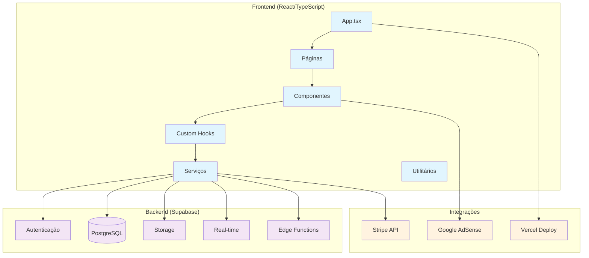
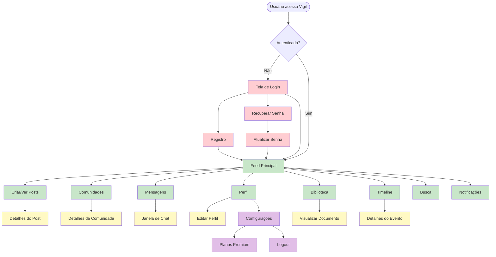

# 01 - Visão Geral do Sistema Vigil

## 📋 Identificação

| Campo | Valor |
|-------|-------|
| **Nome** | Vigil Social Network - Visão Geral do Sistema |
| **Versão** | 1.0.0 |
| **Data** | 12/12/2024 |
| **Responsável** | Equipe de Desenvolvimento Vigil |
| **Tipo** | Documento de Arquitetura e Visão Geral |

---

## 🎯 Visão Geral

### Descrição
O **Vigil** é uma rede social completa e moderna desenvolvida em React/TypeScript que combina funcionalidades tradicionais de redes sociais com recursos avançados como biblioteca de conteúdo, timeline histórica interativa, sistema de anúncios nativos e planos de assinatura premium.

### Objetivo e Propósito
- **Conectar pessoas** através de posts, comunidades e mensagens
- **Compartilhar conhecimento** via biblioteca de e-books e documentos
- **Explorar história** através de timeline interativa de eventos
- **Monetizar conteúdo** com sistema de anúncios e assinaturas
- **Moderar comunidade** com ferramentas administrativas avançadas

### Público-Alvo
- **Usuários Finais**: Pessoas interessadas em rede social com foco em conhecimento
- **Desenvolvedores**: Equipe técnica para manutenção e evolução
- **Administradores**: Moderadores e gestores da plataforma
- **Anunciantes**: Empresas interessadas em publicidade direcionada

---

## 🏗️ Arquitetura Técnica

### Stack Tecnológico

#### Frontend
- **React 18** - Biblioteca principal para UI
- **TypeScript** - Tipagem estática e melhor DX
- **Tailwind CSS** - Framework de estilização utilitária
- **Framer Motion** - Animações e transições
- **React Router DOM** - Navegação client-side
- **Vite** - Build tool e dev server

#### Backend
- **Supabase** - Backend as a Service
- **PostgreSQL** - Banco de dados relacional
- **Row Level Security (RLS)** - Segurança de dados
- **Real-time Subscriptions** - Atualizações em tempo real
- **Edge Functions** - Processamento serverless

#### Integrações Externas
- **Stripe** - Pagamentos e assinaturas
- **AdSense** - Monetização com anúncios
- **Vercel** - Deploy e hospedagem
- **PDF.js** - Visualização de documentos

### Diagrama de Arquitetura Geral



### Estrutura de Pastas

```
vigil/
├── components/           # Componentes React reutilizáveis
│   ├── ads/             # Componentes de anúncios
│   ├── admin/           # Componentes administrativos
│   ├── common/          # Componentes comuns (Avatar, Card, etc.)
│   ├── communities/     # Componentes de comunidades
│   ├── icons/           # Ícones customizados
│   ├── layout/          # Layout (Header, Sidebar, etc.)
│   ├── messages/        # Componentes de mensagens
│   ├── post/            # Componentes de posts
│   └── profile/         # Componentes de perfil
├── pages/               # Páginas da aplicação
├── src/
│   ├── components/      # Componentes adicionais
│   ├── hooks/           # Custom hooks
│   ├── services/        # Serviços e APIs
│   ├── utils/           # Funções utilitárias
│   └── config/          # Configurações
├── contexts/            # React Contexts
├── integrations/        # Integrações externas
└── types.ts            # Definições TypeScript
```

---

## 👤 Fluxos de Usuário Principais

### Diagrama de Fluxo de Navegação



---

## ⚙️ Funcionalidades Principais

### Core Features

#### 1. Sistema de Posts
- **Criação**: Texto, imagens, vídeos, áudio, enquetes
- **Interações**: Likes, comentários, compartilhamentos
- **Moderação**: Conteúdo sensível, palavras bloqueadas
- **Comunidades**: Posts específicos por comunidade

#### 2. Comunidades
- **Criação**: Usuários premium podem criar
- **Gestão**: Moderação, regras, membros ativos
- **Restrições**: Acesso por plano de assinatura
- **Métricas**: Número de membros e posts

#### 3. Sistema de Mensagens
- **Chat Privado**: Conversas 1:1 entre usuários
- **Chat Rooms**: Salas públicas e privadas
- **Notificações**: Mensagens não lidas em tempo real
- **Moderação**: Controle de acesso a salas

#### 4. Biblioteca de Conteúdo
- **Tipos**: E-books, artigos, revistas, documentos
- **Acesso**: Restrito a planos Pro e Premium
- **Funcionalidades**: Download, visualização, busca
- **Métricas**: Views e downloads

#### 5. Timeline Histórica
- **Eventos**: Cronologia interativa de eventos históricos
- **Categorias**: Política, ciência, saúde, religião, tecnologia
- **Interações**: Upvotes, downvotes, comentários
- **Moderação**: Aprovação de novos eventos

### Advanced Features

#### 6. Sistema de Anúncios
- **Tipos**: Anúncios nativos e AdSense
- **Targeting**: Por plano de usuário e comportamento
- **Métricas**: Views, clicks, CTR, conversões
- **Moderação**: Aprovação administrativa

#### 7. Planos Premium
- **Tiers**: Free, Basic ($3.99), Pro ($8.99), Premium ($19.99)
- **Benefícios**: Limites de caracteres, acesso a recursos
- **Pagamentos**: Integração com Stripe
- **Trials**: Períodos de teste gratuito

#### 8. Administração
- **Moderação**: Fila de posts e appeals
- **Analytics**: Métricas de uso e engajamento
- **Usuários**: Gestão de roles e permissões
- **Anúncios**: Aprovação e métricas de campanhas

---

## 🎨 Componentes de Interface

### Layout Principal
- **Header**: Navegação, busca, perfil do usuário
- **Sidebar**: Menu principal, navegação entre páginas
- **Rightbar**: Trending topics, sugestões de usuários
- **MobileBottomNav**: Navegação mobile

### Componentes Comuns
- **Avatar**: Foto do usuário com fallback
- **Card**: Container padrão para conteúdo
- **Tooltip**: Dicas contextuais
- **Modal**: Diálogos e confirmações
- **Toast**: Notificações temporárias

### Componentes Específicos
- **PostCard**: Exibição de posts no feed
- **CommentSection**: Sistema de comentários
- **CreatePost**: Formulário de criação de posts
- **UserProfile**: Perfil completo do usuário
- **CommunityCard**: Card de comunidade

---

## 🔗 Integrações e APIs

### Supabase APIs
- **Auth**: Autenticação e gestão de usuários
- **Database**: CRUD operations com RLS
- **Storage**: Upload de imagens, vídeos, documentos
- **Realtime**: Notificações e atualizações live

### APIs Externas
- **Stripe**: Processamento de pagamentos
- **AdSense**: Exibição de anúncios
- **PDF.js**: Renderização de documentos

### Serviços Internos
- **api.ts**: Serviço principal de API
- **chatService.ts**: Gestão de chat rooms
- **adApprovalService.ts**: Aprovação de anúncios
- **encryption.service.ts**: Criptografia de dados

---

## 📏 Regras de Negócio

### Planos e Permissões

| Recurso | Free | Basic | Pro | Premium |
|---------|------|-------|-----|---------|
| **Caracteres por post** | 280 | 1.000 | 5.000 | 25.000 |
| **Editar posts** | ❌ | ✅ | ✅ | ✅ |
| **Comunidades** | ❌ | ❌ | ✅ | ✅ |
| **Biblioteca** | ❌ | ❌ | ✅ | ✅ |
| **Criar comunidades** | ❌ | ❌ | ❌ | ✅ |
| **Anúncios** | Todos | Todos | Reduzidos | Nenhum |
| **Suporte** | Nenhum | Nenhum | Email | Chat |
| **Badge verificado** | ❌ | ❌ | ✅ | ✅ |

### Roles e Permissões

#### User (Padrão)
- Criar posts e comentários
- Participar de comunidades (conforme plano)
- Enviar mensagens privadas
- Acessar biblioteca (conforme plano)

#### Moderator
- Todas as permissões de User
- Moderar posts e comentários
- Gerenciar appeals
- Acessar fila de moderação

#### Admin
- Todas as permissões de Moderator
- Aprovar anúncios
- Gerenciar usuários
- Acessar analytics completo
- Configurar sistema

---

## 💡 Casos de Uso Práticos

### Para Usuários Finais

#### Cenário 1: Novo Usuário
1. **Registro**: Criar conta com email/senha
2. **Onboarding**: Tutorial das funcionalidades
3. **Primeiro Post**: Criar post de apresentação
4. **Descoberta**: Explorar comunidades e usuários
5. **Engajamento**: Curtir e comentar posts

#### Cenário 2: Usuário Premium
1. **Upgrade**: Assinar plano Premium via Stripe
2. **Biblioteca**: Acessar e baixar e-books
3. **Comunidade**: Criar nova comunidade
4. **Timeline**: Contribuir com eventos históricos
5. **Suporte**: Usar chat de suporte prioritário

### Para Desenvolvedores

#### Cenário 1: Nova Funcionalidade
1. **Análise**: Estudar PRDs relacionados
2. **Implementação**: Seguir padrões estabelecidos
3. **Testes**: Validar casos de uso
4. **Documentação**: Atualizar PRDs
5. **Deploy**: Seguir processo de CI/CD

#### Cenário 2: Bug Fix
1. **Reprodução**: Identificar cenário de erro
2. **Debug**: Usar logs e ferramentas de dev
3. **Correção**: Implementar fix seguindo padrões
4. **Teste**: Validar correção
5. **Monitoramento**: Acompanhar métricas pós-deploy

---

## 🚨 Tratamento de Erros

### Estratégias de Error Handling
- **API Errors**: Tratamento centralizado em `api.ts`
- **Network Errors**: Retry automático e fallbacks
- **Validation Errors**: Feedback imediato ao usuário
- **Auth Errors**: Redirecionamento para login
- **Permission Errors**: Mensagens explicativas

### Logging e Monitoramento
- **Console Logs**: Diferentes níveis (error, warn, info)
- **Error Boundaries**: Captura de erros React
- **Performance Monitoring**: Core Web Vitals
- **User Analytics**: Comportamento e engajamento

---

## ⚡ Performance e Otimizações

### Frontend
- **Code Splitting**: Lazy loading de rotas
- **Image Optimization**: Compressão e lazy loading
- **Caching**: React Query para cache de dados
- **Bundle Size**: Análise e otimização de chunks

### Backend
- **Database**: Índices otimizados e queries eficientes
- **Real-time**: Throttling de eventos
- **Storage**: CDN para assets estáticos
- **Edge Functions**: Processamento distribuído

### UX/UI
- **Loading States**: Skeletons e spinners
- **Infinite Scroll**: Paginação otimizada
- **Responsive Design**: Mobile-first approach
- **Accessibility**: WCAG 2.1 compliance

---

## ♿ Acessibilidade

### Implementações
- **Keyboard Navigation**: Navegação completa por teclado
- **Screen Readers**: ARIA labels e roles
- **Color Contrast**: Conformidade WCAG AA
- **Focus Management**: Indicadores visuais claros
- **Alt Text**: Descrições para imagens

### Testes
- **Automated**: Lighthouse e axe-core
- **Manual**: Testes com tecnologias assistivas
- **User Testing**: Feedback de usuários com deficiências

---

## 🧪 Testes e Qualidade

### Estratégia de Testes
- **Unit Tests**: Jest para lógica de negócio
- **Integration Tests**: React Testing Library
- **E2E Tests**: Cypress para fluxos críticos
- **Performance Tests**: Lighthouse CI

### Quality Assurance
- **Code Review**: Processo obrigatório
- **Linting**: ESLint e Prettier
- **Type Safety**: TypeScript strict mode
- **Security**: Análise de vulnerabilidades

---

## 🚀 Roadmap e Melhorias Futuras

### Próximas Funcionalidades
- **Stories**: Posts temporários (24h)
- **Live Streaming**: Transmissões ao vivo
- **Marketplace**: Compra/venda entre usuários
- **API Pública**: Integração com terceiros
- **Mobile App**: Aplicativo nativo

### Melhorias Técnicas
- **Micro-frontends**: Arquitetura modular
- **GraphQL**: API mais eficiente
- **PWA**: Funcionalidades offline
- **AI/ML**: Recomendações personalizadas
- **Blockchain**: NFTs e tokenização

### Expansão
- **Internacionalização**: Múltiplos idiomas
- **Localização**: Adaptação cultural
- **Compliance**: GDPR, LGPD, CCPA
- **Escalabilidade**: Suporte a milhões de usuários

---

## 📊 Métricas e KPIs

### Engajamento
- **DAU/MAU**: Usuários ativos diários/mensais
- **Session Duration**: Tempo médio de sessão
- **Posts per User**: Média de posts por usuário
- **Interaction Rate**: Taxa de interação (likes, comments)

### Crescimento
- **User Acquisition**: Novos usuários por período
- **Retention Rate**: Taxa de retenção (D1, D7, D30)
- **Churn Rate**: Taxa de abandono
- **Viral Coefficient**: Crescimento orgânico

### Monetização
- **Conversion Rate**: Free para Premium
- **ARPU**: Revenue per user
- **LTV**: Lifetime value
- **Ad Revenue**: Receita com anúncios

### Performance
- **Page Load Time**: Tempo de carregamento
- **Core Web Vitals**: LCP, FID, CLS
- **Error Rate**: Taxa de erros
- **Uptime**: Disponibilidade do sistema

---

## 📝 Considerações Finais

O Vigil representa uma evolução das redes sociais tradicionais, combinando interação social com conhecimento e história. A arquitetura modular e escalável permite crescimento sustentável, enquanto o modelo de monetização balanceia experiência do usuário com viabilidade comercial.

A documentação PRD serve como fonte única da verdade para todas as funcionalidades, garantindo alinhamento entre equipes técnicas, produto e negócio. Cada componente e funcionalidade está detalhadamente documentado nos PRDs específicos, facilitando onboarding, manutenção e evolução do sistema.

**Próximo Documento**: [02 - Autenticação](02_AUTENTICACAO.md)
