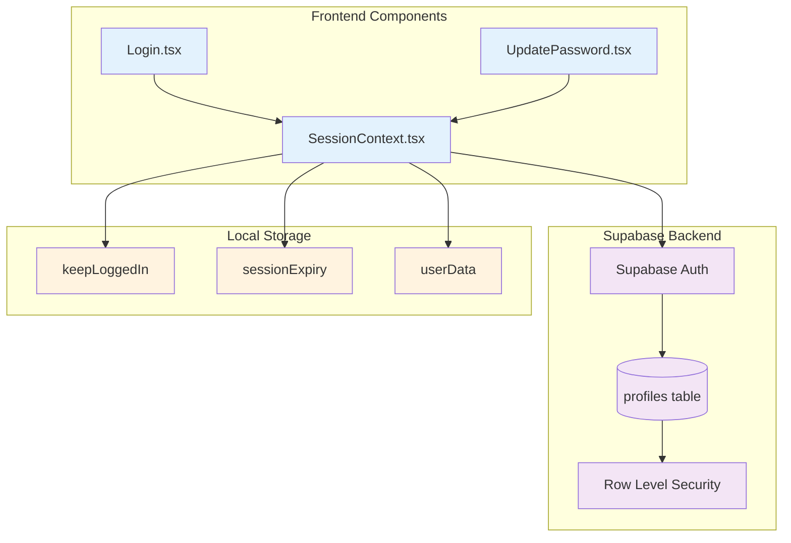
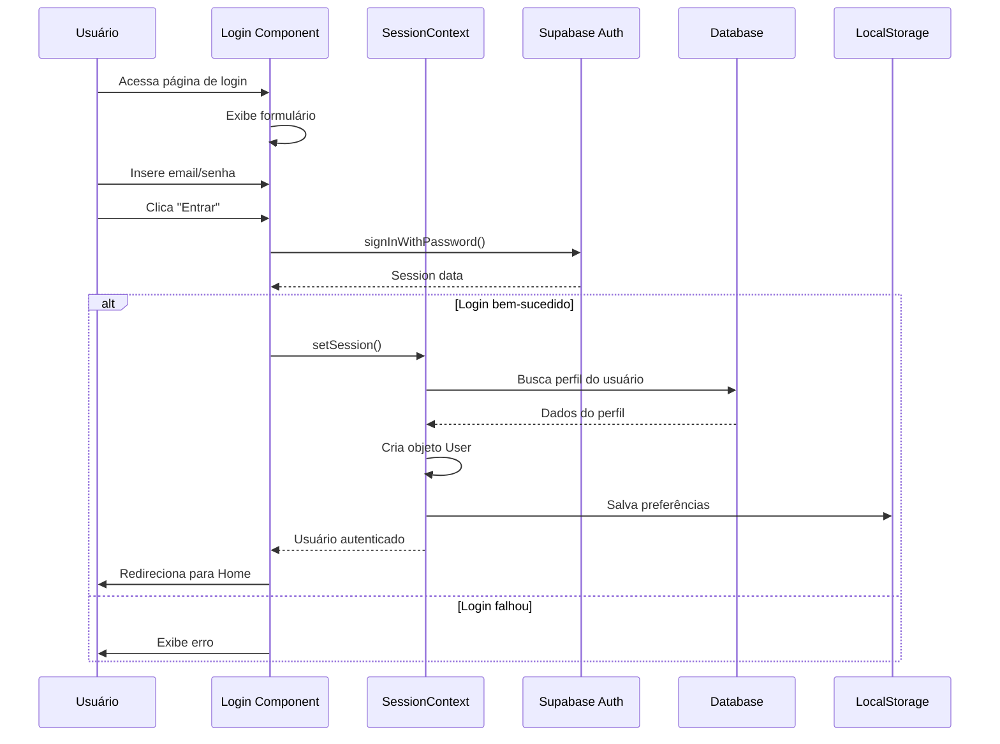

# 02 - Sistema de Autenticação

## 📋 Identificação

| Campo | Valor |
|-------|-------|
| **Nome** | Sistema de Autenticação Vigil |
| **Versão** | 1.0.0 |
| **Data** | 12/12/2024 |
| **Responsável** | Equipe de Desenvolvimento Vigil |
| **Tipo** | PRD - Autenticação e Gestão de Sessão |

---

## 🎯 Visão Geral

### Descrição
O sistema de autenticação do Vigil é responsável por gerenciar o acesso dos usuários à plataforma, incluindo registro, login, recuperação de senha, gestão de sessões e controle de permissões. Utiliza Supabase Auth como backend principal com funcionalidades avançadas de segurança.

### Objetivo e Propósito
- **Segurança**: Proteger dados dos usuários e da plataforma
- **Experiência**: Processo de login/registro simples e intuitivo
- **Flexibilidade**: Opções de "manter conectado" e logout automático
- **Recuperação**: Sistema robusto de recuperação de senha
- **Gestão**: Controle de sessões e permissões por roles

### Público-Alvo
- **Usuários Finais**: Acesso seguro e fácil à plataforma
- **Desenvolvedores**: Implementação e manutenção do sistema
- **Administradores**: Gestão de usuários e permissões

---

## 🏗️ Arquitetura Técnica

### Componentes Principais
- **Login.tsx** - Tela de login e registro
- **UpdatePassword.tsx** - Recuperação e atualização de senha
- **SessionContext.tsx** - Gerenciamento de estado de sessão
- **Supabase Auth** - Backend de autenticação

### Hooks Customizados
- **useSession()** - Estado global da sessão
- **useToast()** - Notificações de feedback
- **useTheme()** - Tema para interface

### Services/APIs
- **Supabase Auth API** - Autenticação principal
- **Profiles Table** - Dados complementares do usuário
- **RLS Policies** - Segurança a nível de linha

### Diagrama de Arquitetura



---

## 👤 Fluxos de Usuário

### Diagrama de Fluxo de Autenticação



### Fluxo de Registro

```mermaid
flowchart TD
    Start([Usuário clica "Criar Conta"]) --> Form[Preenche formulário]
    Form --> Validate{Validação OK?}
    
    Validate -->|Não| ShowError[Exibe erros]
    ShowError --> Form
    
    Validate -->|Sim| CreateAuth[Cria conta no Supabase Auth]
    CreateAuth --> CreateProfile[Cria perfil na tabela profiles]
    CreateProfile --> SendEmail[Envia email de confirmação]
    SendEmail --> Success[Exibe mensagem de sucesso]
    Success --> WaitConfirm[Aguarda confirmação por email]
    WaitConfirm --> Login[Usuário pode fazer login]
    
    classDef process fill:#e8f5e8
    classDef decision fill:#fff3cd
    classDef success fill:#d4edda
    classDef error fill:#f8d7da
    
    class Form,CreateAuth,CreateProfile,SendEmail process
    class Validate decision
    class Success,Login success
    class ShowError error
```

---

## ⚙️ Funcionalidades Detalhadas

### 1. Tela de Login (Login.tsx)

#### O que faz
- Exibe formulário de login com email/senha
- Permite alternância entre login e registro
- Oferece opção "manter conectado"
- Inclui recuperação de senha
- Mostra recursos da plataforma

#### Como funciona
```typescript
// Estados principais
const [email, setEmail] = useState('');
const [password, setPassword] = useState('');
const [keepLoggedIn, setKeepLoggedIn] = useState(false);
const [isCreatingAccount, setIsCreatingAccount] = useState(false);

// Processo de login
const handleLogin = async (e: React.FormEvent) => {
  const { data, error } = await supabase.auth.signInWithPassword({
    email, password
  });
  
  if (data.session) {
    // Configurar duração da sessão
    if (keepLoggedIn) {
      localStorage.setItem('sessionExpiry', 'never');
    } else {
      // 30 minutos de inatividade
      const expiry = Date.now() + (30 * 60 * 1000);
      localStorage.setItem('sessionExpiry', expiry.toString());
    }
  }
};
```

#### Interações do Usuário
- **Email/Senha**: Campos obrigatórios com validação
- **Manter Conectado**: Checkbox para sessão persistente
- **Alternar Modo**: Botão para mudar entre login/registro
- **Esqueci Senha**: Link para recuperação
- **Mostrar/Ocultar Senha**: Toggle de visibilidade

#### Estados Possíveis
- **Idle**: Formulário vazio, aguardando entrada
- **Loading**: Processando autenticação
- **Error**: Exibindo mensagem de erro
- **Success**: Redirecionando para aplicação

### 2. Recuperação de Senha (UpdatePassword.tsx)

#### O que faz
- Permite redefinição de senha via email
- Valida força da senha em tempo real
- Confirma nova senha
- Atualiza senha no Supabase

#### Como funciona
```typescript
// Cálculo de força da senha
const calculatePasswordStrength = (password: string): PasswordStrength => {
  const requirements = {
    length: password.length >= 8,
    uppercase: /[A-Z]/.test(password),
    lowercase: /[a-z]/.test(password),
    number: /[0-9]/.test(password),
    special: /[!@#$%^&*()_+\-=\[\]{};':"\\|,.<>\/?]/.test(password)
  };
  
  const score = Object.values(requirements).filter(Boolean).length;
  // Retorna score, label e cor baseado nos critérios
};
```

#### Validações
- **Comprimento**: Mínimo 8 caracteres
- **Maiúscula**: Pelo menos uma letra maiúscula
- **Minúscula**: Pelo menos uma letra minúscula
- **Número**: Pelo menos um dígito
- **Especial**: Pelo menos um caractere especial
- **Confirmação**: Senhas devem coincidir

### 3. Gestão de Sessão (SessionContext.tsx)

#### O que faz
- Gerencia estado global da sessão
- Busca dados do perfil do usuário
- Controla expiração de sessão
- Fornece função de refresh do usuário

#### Como funciona
```typescript
const getSessionAndProfile = useCallback(async () => {
  // Verificar expiração da sessão
  const keepLoggedIn = localStorage.getItem('keepLoggedIn');
  const sessionExpiry = localStorage.getItem('sessionExpiry');
  
  if (keepLoggedIn === 'false' && sessionExpiry !== 'never') {
    const expiryTime = parseInt(sessionExpiry);
    if (Date.now() >= expiryTime) {
      // Logout automático por inatividade
      await supabase.auth.signOut({ scope: 'local' });
      return;
    }
  }
  
  // Buscar sessão atual e perfil
  const currentSession = await getSessionSafe();
  if (currentSession?.user) {
    const { data: profile } = await supabase
      .from('profiles')
      .select('*')
      .eq('id', currentSession.user.id)
      .single();
    
    // Criar objeto User completo
    const appUser: User = {
      id: profile.id,
      name: `${profile.first_name} ${profile.last_name}`.trim(),
      username: profile.username,
      // ... outros campos
    };
  }
}, []);
```

---

## 🎨 Componentes de Interface

### Login Form
```typescript
interface LoginFormProps {
  email: string;
  password: string;
  keepLoggedIn: boolean;
  loading: boolean;
  onSubmit: (e: React.FormEvent) => void;
  onEmailChange: (email: string) => void;
  onPasswordChange: (password: string) => void;
  onKeepLoggedInChange: (keep: boolean) => void;
}
```

### Password Strength Indicator
```typescript
interface PasswordStrengthProps {
  password: string;
  requirements: {
    length: boolean;
    uppercase: boolean;
    lowercase: boolean;
    number: boolean;
    special: boolean;
  };
  score: number;
  label: string;
  color: string;
}
```

### Feature Cards (Login Page)
```typescript
interface FeatureCardProps {
  icon: React.ReactNode;
  title: string;
  children: React.ReactNode;
}
```

---

## 🔗 Integrações

### Supabase Auth
- **signInWithPassword()** - Login com email/senha
- **signUp()** - Registro de novo usuário
- **resetPasswordForEmail()** - Envio de email de recuperação
- **updateUser()** - Atualização de senha
- **signOut()** - Logout do usuário

### Profiles Table
```sql
CREATE TABLE profiles (
  id UUID REFERENCES auth.users(id) PRIMARY KEY,
  username TEXT UNIQUE NOT NULL,
  first_name TEXT,
  last_name TEXT,
  avatar_url TEXT,
  bio TEXT,
  plan TEXT DEFAULT 'free',
  role TEXT DEFAULT 'user',
  created_at TIMESTAMP WITH TIME ZONE DEFAULT NOW()
);
```

### Row Level Security
```sql
-- Usuários só podem ver/editar próprio perfil
CREATE POLICY "Users can view own profile" ON profiles
  FOR SELECT USING (auth.uid() = id);

CREATE POLICY "Users can update own profile" ON profiles
  FOR UPDATE USING (auth.uid() = id);
```

---

## 📏 Regras de Negócio

### Validação de Email
- Formato válido de email
- Não pode estar em uso por outro usuário
- Confirmação obrigatória via email

### Validação de Senha
- Mínimo 8 caracteres
- Pelo menos 1 maiúscula, 1 minúscula, 1 número
- Caractere especial recomendado
- Não pode ser igual ao email ou username

### Validação de Username
- 3-30 caracteres
- Apenas letras, números e underscore
- Único na plataforma
- Não pode ser alterado após criação

### Gestão de Sessão
- **Manter Conectado**: Sessão persistente até logout manual
- **Não Manter**: Logout automático após 30min de inatividade
- **Múltiplas Sessões**: Permitido em diferentes dispositivos

### Roles e Permissões
- **user**: Acesso básico à plataforma
- **moderator**: Pode moderar conteúdo
- **admin**: Acesso total ao sistema

---

## 💡 Casos de Uso Práticos

### Cenário 1: Primeiro Acesso
1. **Usuário** acessa vigil.com
2. **Sistema** exibe tela de login com recursos da plataforma
3. **Usuário** clica "Criar Conta"
4. **Sistema** exibe formulário de registro
5. **Usuário** preenche dados e submete
6. **Sistema** cria conta e envia email de confirmação
7. **Usuário** confirma email e faz primeiro login

### Cenário 2: Login Recorrente
1. **Usuário** acessa vigil.com
2. **Sistema** verifica sessão existente
3. Se válida, redireciona para Home
4. Se inválida, exibe tela de login
5. **Usuário** insere credenciais
6. **Sistema** autentica e redireciona

### Cenário 3: Esqueci Minha Senha
1. **Usuário** clica "Esqueci minha senha"
2. **Sistema** exibe campo de email
3. **Usuário** insere email e submete
4. **Sistema** envia email de recuperação
5. **Usuário** clica no link do email
6. **Sistema** exibe formulário de nova senha
7. **Usuário** define nova senha e confirma

---

## 🚨 Tratamento de Erros

### Erros de Login
- **Email não encontrado**: "Email não cadastrado"
- **Senha incorreta**: "Senha incorreta"
- **Email não confirmado**: "Confirme seu email antes de fazer login"
- **Conta bloqueada**: "Conta temporariamente bloqueada"

### Erros de Registro
- **Email em uso**: "Este email já está cadastrado"
- **Username em uso**: "Este nome de usuário não está disponível"
- **Senha fraca**: Indicador visual de força
- **Dados inválidos**: Validação em tempo real

### Erros de Rede
- **Timeout**: "Conexão lenta, tente novamente"
- **Offline**: "Verifique sua conexão com a internet"
- **Servidor indisponível**: "Serviço temporariamente indisponível"

### Recuperação de Falhas
- **Retry automático**: Para erros temporários
- **Fallback local**: Cache de dados quando possível
- **Graceful degradation**: Funcionalidade reduzida se necessário

---

## ⚡ Performance e Otimizações

### Frontend
- **Lazy loading**: Componentes carregados sob demanda
- **Debounce**: Validação de username com delay
- **Memoização**: Evitar re-renders desnecessários
- **Bundle splitting**: Código de auth separado

### Backend
- **Connection pooling**: Reutilização de conexões DB
- **Caching**: Cache de dados de perfil
- **Rate limiting**: Proteção contra ataques
- **CDN**: Assets estáticos via CDN

### UX/UI
- **Loading states**: Feedback visual durante processamento
- **Progressive enhancement**: Funciona sem JavaScript
- **Offline support**: Cache de credenciais (seguro)
- **Auto-complete**: Sugestões de email/username

---

## ♿ Acessibilidade

### Implementações
- **Labels**: Todos os campos têm labels associados
- **ARIA**: Roles e properties apropriados
- **Keyboard**: Navegação completa por teclado
- **Focus**: Indicadores visuais claros
- **Screen readers**: Anúncios de estado

### Exemplo de Implementação
```jsx
<input
  type="email"
  id="email"
  aria-label="Endereço de email"
  aria-required="true"
  aria-invalid={emailError ? 'true' : 'false'}
  aria-describedby={emailError ? 'email-error' : undefined}
/>
{emailError && (
  <div id="email-error" role="alert" aria-live="polite">
    {emailError}
  </div>
)}
```

---

## 🧪 Testes e Qualidade

### Casos de Teste

#### Login
- [ ] Login com credenciais válidas
- [ ] Login com email inválido
- [ ] Login com senha incorreta
- [ ] Login com email não confirmado
- [ ] Toggle "manter conectado"
- [ ] Logout automático por inatividade

#### Registro
- [ ] Registro com dados válidos
- [ ] Registro com email duplicado
- [ ] Registro com username duplicado
- [ ] Validação de força da senha
- [ ] Confirmação de email

#### Recuperação de Senha
- [ ] Envio de email de recuperação
- [ ] Redefinição com senha válida
- [ ] Validação de força da nova senha
- [ ] Expiração do link de recuperação

### Testes de Segurança
- [ ] Proteção contra SQL injection
- [ ] Validação de entrada (XSS)
- [ ] Rate limiting de tentativas
- [ ] Criptografia de senhas
- [ ] Tokens JWT seguros

---

## 🚀 Roadmap e Melhorias Futuras

### Próximas Funcionalidades
- **2FA**: Autenticação de dois fatores
- **Social Login**: Google, Facebook, GitHub
- **SSO**: Single Sign-On empresarial
- **Biometria**: Login por impressão digital/face
- **Magic Links**: Login sem senha via email

### Melhorias de Segurança
- **Detecção de fraude**: Análise comportamental
- **Geolocalização**: Alertas de login suspeito
- **Device fingerprinting**: Reconhecimento de dispositivos
- **Session management**: Controle granular de sessões

### UX/UI
- **Onboarding**: Tutorial interativo
- **Progressive profiling**: Coleta gradual de dados
- **Personalização**: Temas e preferências
- **Accessibility**: Melhorias contínuas

---

## 📊 Métricas e KPIs

### Autenticação
- **Conversion rate**: Registro → Login confirmado
- **Login success rate**: % de logins bem-sucedidos
- **Password reset rate**: % usuários que resetam senha
- **Session duration**: Tempo médio de sessão

### Segurança
- **Failed login attempts**: Tentativas de login falhadas
- **Account lockouts**: Contas bloqueadas por segurança
- **2FA adoption**: % usuários com 2FA ativo
- **Suspicious activity**: Detecções de atividade suspeita

### Performance
- **Login time**: Tempo médio para autenticar
- **Page load time**: Velocidade da tela de login
- **Error rate**: % de erros durante auth
- **Uptime**: Disponibilidade do serviço de auth

---

## 📝 Considerações Finais

O sistema de autenticação do Vigil foi projetado com foco em segurança, usabilidade e escalabilidade. A integração com Supabase Auth fornece uma base sólida e confiável, enquanto as funcionalidades customizadas atendem às necessidades específicas da plataforma.

A implementação de recursos como gestão inteligente de sessões, validação robusta de senhas e tratamento gracioso de erros garante uma experiência de usuário superior, mantendo os mais altos padrões de segurança.

**Próximo Documento**: [03 - Layout e Navegação](03_LAYOUT.md)
