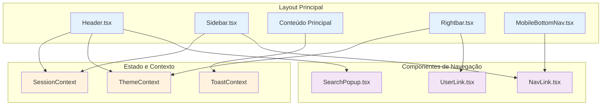
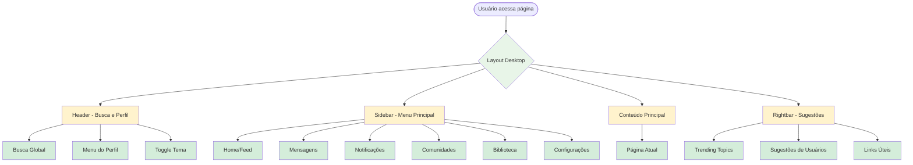
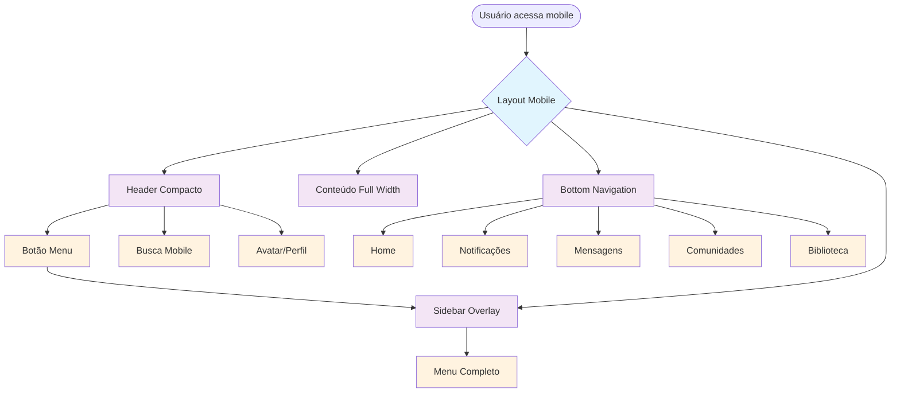

# 03 - Layout e Navegação

## 📋 Identificação

| Campo | Valor |
|-------|-------|
| **Nome** | Sistema de Layout e Navegação Vigil |
| **Versão** | 1.0.0 |
| **Data** | 12/12/2024 |
| **Responsável** | Equipe de Desenvolvimento Vigil |
| **Tipo** | PRD - Interface e Navegação |

---

## 🎯 Visão Geral

### Descrição
O sistema de layout do Vigil é responsável pela estrutura visual e navegação da aplicação, incluindo header, sidebar, rightbar e navegação mobile. Oferece uma experiência responsiva e intuitiva, adaptando-se a diferentes tamanhos de tela e preferências do usuário.

### Objetivo e Propósito
- **Navegação Intuitiva**: Acesso fácil a todas as funcionalidades
- **Responsividade**: Adaptação perfeita a desktop e mobile
- **Consistência**: Layout uniforme em toda a aplicação
- **Acessibilidade**: Navegação por teclado e tecnologias assistivas
- **Performance**: Carregamento rápido e transições suaves

### Público-Alvo
- **Usuários Finais**: Interface intuitiva e responsiva
- **Desenvolvedores**: Componentes reutilizáveis e bem estruturados
- **Designers**: Sistema de design consistente

---

## 🏗️ Arquitetura Técnica

### Componentes Principais
- **Header.tsx** - Cabeçalho com busca e perfil
- **Sidebar.tsx** - Menu lateral principal
- **Rightbar.tsx** - Barra lateral direita com sugestões
- **MobileBottomNav.tsx** - Navegação inferior mobile
- **NavLink.tsx** - Links de navegação reutilizáveis

### Hooks Customizados
- **useTheme()** - Controle de tema claro/escuro
- **useToast()** - Notificações de feedback

### Utilitários
- **history.ts** - Gerenciamento de navegação e estado
- **browserCompatibility.ts** - Compatibilidade cross-browser

### Diagrama de Arquitetura do Layout



---

## 👤 Fluxos de Usuário

### Diagrama de Navegação Desktop



### Diagrama de Navegação Mobile



---

## ⚙️ Funcionalidades Detalhadas

### 1. Header (Header.tsx)

#### O que faz
- Exibe logo e navegação principal
- Fornece busca global com sugestões
- Mostra avatar e menu do usuário
- Controla tema claro/escuro
- Adapta-se para mobile com menu hambúrguer

#### Como funciona
```typescript
interface HeaderProps {
  user: User;
  onSearch: (query: string) => void;
  query: string;
  allUsers: User[];
  communities: Community[];
  trendingTopics: TrendingTopic[];
  onNavigateToUser: (userId: string) => void;
  onNavigateToCommunity: (communityId: string) => void;
  onNavigateToTopic: (tag: string) => void;
  onToggleMobileSidebar?: () => void;
  isMobileSidebarOpen?: boolean;
  onLogout: () => void;
}

// Busca com sugestões em tempo real
const handleSearchChange = (e: React.ChangeEvent<HTMLInputElement>) => {
  const newQuery = e.target.value;
  onSearch(newQuery);
  setIsPopupOpen(!!newQuery); // Abre popup se há texto
};
```

#### Interações do Usuário
- **Logo**: Clique retorna ao Home
- **Busca**: Digite para ver sugestões, Enter para busca avançada
- **Tema**: Toggle entre claro/escuro
- **Avatar**: Menu dropdown com perfil e logout
- **Menu Mobile**: Hambúrguer abre/fecha sidebar

#### Estados Possíveis
- **Desktop**: Layout completo com todos os elementos
- **Mobile**: Layout compacto com menu hambúrguer
- **Searching**: Popup de sugestões ativo
- **Menu Open**: Dropdown do usuário aberto

### 2. Sidebar (Sidebar.tsx)

#### O que faz
- Menu principal de navegação
- Exibe contadores de notificações não lidas
- Permite colapsar/expandir (desktop)
- Funciona como overlay no mobile
- Adapta opções baseado no plano do usuário

#### Como funciona
```typescript
interface SidebarProps {
  user: User | null;
  currentPage: string;
  setCurrentPage: (page: any) => void;
  unreadNotificationsCount: number;
  unreadMessagesCount: number;
  isCollapsed: boolean;
  pendingModerationCount: number;
  pendingAppealsCount: number;
  pendingAdsCount?: number;
}

// Verificação de acesso à biblioteca
const handleLibraryClick = () => {
  if (!canAccessLibrary(user.plan, user.role)) {
    addToast(getLibraryAccessDeniedMessage(), 'error');
    setCurrentPage('Premium');
    return;
  }
  setCurrentPage('Library');
};
```

#### Itens de Menu
- **Home**: Feed principal
- **Perfil**: Perfil do usuário
- **Notificações**: Com contador de não lidas
- **Mensagens**: Com contador de não lidas
- **Salvos**: Posts salvos pelo usuário
- **Comunidades**: Lista de comunidades
- **Biblioteca**: E-books e documentos (Pro/Premium)
- **Timeline**: Timeline histórica
- **Chat**: Salas de chat (Premium)
- **Configurações**: Preferências do usuário

#### Itens Administrativos (Moderators/Admins)
- **Moderação**: Fila de moderação
- **Appeals**: Recursos de moderação
- **Dashboard**: Métricas administrativas
- **Aprovação de Ads**: Fila de aprovação de anúncios

### 3. Rightbar (Rightbar.tsx)

#### O que faz
- Exibe trending topics
- Sugere usuários para seguir
- Mostra links úteis (sobre, termos, etc.)
- Promove upgrade para Premium
- Adapta conteúdo baseado no contexto

#### Como funciona
```typescript
interface RightbarProps {
  trendingTopics: TrendingTopic[];
  usersToFollow: User[];
  onViewTag: (tag: string) => void;
  onViewProfile: (userId: string) => void;
  followedUserIds: string[];
  onFollowToggle: (userId: string) => void;
  currentUser: User;
  onOpenFollowModal: (user: User, tab: 'followers' | 'following') => void;
  onNavigatePremium: () => void;
}

// Componente de usuário para seguir
const UserToFollow: React.FC<UserToFollowProps> = ({ 
  user, isFollowing, onFollowToggle, onViewProfile 
}) => (
  <div className="flex items-center justify-between gap-3">
    <Avatar src={user.avatarUrl} alt={user.name} size="md" />
    <div className="flex-1 min-w-0">
      <p className="font-bold truncate">{user.name}</p>
      <p className="text-sm text-gray-500 truncate">@{user.username}</p>
    </div>
    <button onClick={() => onFollowToggle(user.id)}>
      {isFollowing ? 'Seguindo' : 'Seguir'}
    </button>
  </div>
);
```

#### Seções da Rightbar
- **Trending Topics**: Hashtags populares
- **Quem Seguir**: Sugestões personalizadas
- **Upgrade Premium**: CTA para planos pagos
- **Links Úteis**: Sobre, termos, privacidade, etc.

### 4. Mobile Bottom Navigation (MobileBottomNav.tsx)

#### O que faz
- Navegação rápida no mobile
- Auto-hide durante scroll
- Contadores de notificações
- Acesso às funcionalidades principais

#### Como funciona
```typescript
interface Props {
  currentPage: Page;
  onNavigate: (page: Page) => void;
  unreadNotificationsCount?: number;
  unreadMessagesCount?: number;
}

// Auto-hide durante scroll
useEffect(() => {
  const onScroll = () => {
    const y = window.scrollY;
    const diff = y - lastY.current;
    if (Math.abs(diff) > 4) {
      if (diff > 0 && y > 48) setHidden(true);
      else setHidden(false);
      lastY.current = y;
    }
  };
  window.addEventListener('scroll', onScroll, { passive: true });
}, []);
```

#### Itens da Bottom Nav
- **Home**: Feed principal
- **Notificações**: Com badge de contagem
- **Mensagens**: Com badge de contagem
- **Comunidades**: Acesso rápido
- **Biblioteca**: Para usuários Pro/Premium

### 5. NavLink (NavLink.tsx)

#### O que faz
- Componente reutilizável para links de navegação
- Suporta ícones e badges de notificação
- Adapta-se ao modo colapsado
- Estados visuais para ativo/inativo

#### Como funciona
```typescript
interface NavLinkProps {
  icon: React.ReactNode;
  label: string;
  isActive: boolean;
  onClick: () => void;
  notificationCount?: number;
  isCollapsed: boolean;
}

// Renderização condicional baseada no estado
<button 
  className={`w-full flex items-center transition-colors duration-200
    ${isCollapsed ? 'justify-center p-2' : 'gap-3 px-3 py-2'}
    ${isActive 
      ? 'bg-primary/20 text-primary font-bold' 
      : 'hover:bg-gray-200 dark:hover:bg-gray-700'
    }
  `}
  title={isCollapsed ? label : ''}
>
  <div className="relative">
    {icon}
    {notificationCount > 0 && (
      <span className="absolute -top-1 -right-1 bg-red-500 text-white rounded-full">
        {notificationCount > 99 ? '99+' : notificationCount}
      </span>
    )}
  </div>
  {!isCollapsed && <span>{label}</span>}
</button>
```

---

## 🎨 Componentes de Interface

### Layout Grid System
```css
/* Desktop Layout */
.layout-container {
  display: grid;
  grid-template-columns: 
    minmax(240px, 280px)  /* Sidebar */
    1fr                   /* Main Content */
    minmax(280px, 320px); /* Rightbar */
  gap: 1.5rem;
}

/* Sidebar Collapsed */
.layout-container.sidebar-collapsed {
  grid-template-columns: 
    80px                  /* Collapsed Sidebar */
    1fr                   /* Main Content */
    minmax(280px, 320px); /* Rightbar */
}

/* Mobile Layout */
@media (max-width: 768px) {
  .layout-container {
    grid-template-columns: 1fr;
    grid-template-rows: 
      auto  /* Header */
      1fr   /* Content */
      auto; /* Bottom Nav */
  }
}
```

### Responsive Breakpoints
```typescript
const breakpoints = {
  sm: '640px',   // Mobile large
  md: '768px',   // Tablet
  lg: '1024px',  // Desktop
  xl: '1280px',  // Large desktop
  '2xl': '1536px' // Extra large
};
```

### Theme Variables
```css
:root {
  /* Light Theme */
  --bg-light: #ffffff;
  --bg-light-secondary: #f8fafc;
  --text-light: #1f2937;
  --border-light: #e5e7eb;
  --primary: #3b82f6;
}

[data-theme="dark"] {
  /* Dark Theme */
  --bg-dark: #1f2937;
  --bg-dark-secondary: #374151;
  --text-dark: #f9fafb;
  --border-dark: #4b5563;
}
```

---

## 🔗 Integrações

### Gerenciamento de Estado
- **SessionContext**: Estado do usuário logado
- **ThemeContext**: Tema claro/escuro
- **ToastContext**: Notificações temporárias

### Navegação
- **React Router**: Roteamento client-side
- **History API**: Navegação com estado
- **URL Sync**: Sincronização com URL

### Responsividade
- **Tailwind CSS**: Classes utilitárias responsivas
- **CSS Grid**: Layout flexível
- **Media Queries**: Breakpoints customizados

---

## 📏 Regras de Negócio

### Visibilidade de Itens de Menu

| Item | Free | Basic | Pro | Premium | Admin/Mod |
|------|------|-------|-----|---------|-----------|
| **Home** | ✅ | ✅ | ✅ | ✅ | ✅ |
| **Perfil** | ✅ | ✅ | ✅ | ✅ | ✅ |
| **Notificações** | ✅ | ✅ | ✅ | ✅ | ✅ |
| **Mensagens** | ✅ | ✅ | ✅ | ✅ | ✅ |
| **Salvos** | ✅ | ✅ | ✅ | ✅ | ✅ |
| **Comunidades** | ❌ | ❌ | ✅ | ✅ | ✅ |
| **Biblioteca** | ❌ | ❌ | ✅ | ✅ | ✅ |
| **Timeline** | ✅ | ✅ | ✅ | ✅ | ✅ |
| **Chat** | ❌ | ❌ | ❌ | ✅ | ✅ |
| **Moderação** | ❌ | ❌ | ❌ | ❌ | ✅ |
| **Dashboard** | ❌ | ❌ | ❌ | ❌ | ✅ |

### Comportamento Responsivo
- **Desktop (≥1024px)**: Layout completo com sidebar e rightbar
- **Tablet (768px-1023px)**: Sidebar colapsável, rightbar oculta
- **Mobile (<768px)**: Sidebar overlay, bottom navigation

### Contadores de Notificação
- **Máximo exibido**: 99+ para números grandes
- **Atualização**: Tempo real via WebSocket
- **Persistência**: Mantido durante navegação

---

## 💡 Casos de Uso Práticos

### Cenário 1: Navegação Desktop
1. **Usuário** acessa Vigil no desktop
2. **Sistema** exibe layout completo (header + sidebar + content + rightbar)
3. **Usuário** clica em item do menu lateral
4. **Sistema** atualiza conteúdo principal mantendo layout
5. **Usuário** pode colapsar sidebar para mais espaço
6. **Sistema** ajusta grid layout automaticamente

### Cenário 2: Navegação Mobile
1. **Usuário** acessa Vigil no mobile
2. **Sistema** exibe header compacto + conteúdo + bottom nav
3. **Usuário** toca no menu hambúrguer
4. **Sistema** exibe sidebar como overlay
5. **Usuário** seleciona item do menu
6. **Sistema** fecha overlay e navega para página

### Cenário 3: Busca Global
1. **Usuário** clica no campo de busca
2. **Sistema** foca o input e prepara sugestões
3. **Usuário** digita termo de busca
4. **Sistema** exibe popup com sugestões em tempo real
5. **Usuário** clica em sugestão ou pressiona Enter
6. **Sistema** navega para resultado ou busca avançada

---

## 🚨 Tratamento de Erros

### Erros de Navegação
- **Página não encontrada**: Redirecionamento para Home
- **Acesso negado**: Mensagem explicativa + redirecionamento
- **Erro de carregamento**: Retry automático + fallback

### Erros de Layout
- **CSS não carregado**: Fallback para estilos básicos
- **JavaScript desabilitado**: Layout funcional básico
- **Resolução muito baixa**: Layout mínimo responsivo

### Recuperação Graceful
- **Offline**: Cache de layout e navegação básica
- **Conexão lenta**: Loading states e skeleton screens
- **Erro de componente**: Error boundaries com fallback

---

## ⚡ Performance e Otimizações

### Carregamento
- **Code Splitting**: Componentes de layout separados
- **Lazy Loading**: Rightbar carregada sob demanda
- **Preloading**: Recursos críticos pré-carregados
- **Service Worker**: Cache de assets estáticos

### Renderização
- **React.memo**: Componentes memorizados
- **useMemo/useCallback**: Otimização de re-renders
- **Virtual Scrolling**: Para listas longas
- **Intersection Observer**: Lazy loading de imagens

### Responsividade
- **CSS-in-JS**: Estilos otimizados
- **Media Query Optimization**: Breakpoints eficientes
- **Touch Optimization**: Targets de toque adequados
- **Gesture Support**: Swipe e pinch em mobile

---

## ♿ Acessibilidade

### Navegação por Teclado
- **Tab Order**: Sequência lógica de navegação
- **Skip Links**: Pular para conteúdo principal
- **Focus Visible**: Indicadores claros de foco
- **Escape Key**: Fechar modals e overlays

### Screen Readers
- **ARIA Labels**: Descrições para elementos
- **Landmarks**: Navegação por regiões
- **Live Regions**: Anúncios de mudanças
- **Alt Text**: Descrições de imagens e ícones

### Implementação
```jsx
// Exemplo de navegação acessível
<nav role="navigation" aria-label="Menu principal">
  <ul>
    <li>
      <a 
        href="/home" 
        aria-current={currentPage === 'Home' ? 'page' : undefined}
        className="focus:ring-2 focus:ring-primary"
      >
        <HomeIcon aria-hidden="true" />
        <span>Home</span>
      </a>
    </li>
  </ul>
</nav>

// Skip link
<a 
  href="#main-content" 
  className="sr-only focus:not-sr-only focus:absolute focus:top-0 focus:left-0"
>
  Pular para conteúdo principal
</a>
```

---

## 🧪 Testes e Qualidade

### Casos de Teste

#### Layout Responsivo
- [ ] Layout desktop com sidebar expandida
- [ ] Layout desktop com sidebar colapsada
- [ ] Layout tablet com rightbar oculta
- [ ] Layout mobile com bottom navigation
- [ ] Transições suaves entre breakpoints

#### Navegação
- [ ] Clique em todos os itens do menu
- [ ] Navegação por teclado (Tab, Enter, Escape)
- [ ] Contadores de notificação atualizados
- [ ] Estados ativos/inativos corretos
- [ ] Redirecionamentos por permissão

#### Busca
- [ ] Sugestões aparecem ao digitar
- [ ] Enter executa busca avançada
- [ ] Clique em sugestão navega corretamente
- [ ] Popup fecha ao clicar fora
- [ ] Busca mobile funcional

#### Mobile
- [ ] Menu hambúrguer abre/fecha sidebar
- [ ] Bottom nav auto-hide durante scroll
- [ ] Touch targets adequados (44px mínimo)
- [ ] Gestos de swipe funcionais

### Testes de Performance
- [ ] First Contentful Paint < 1.5s
- [ ] Largest Contentful Paint < 2.5s
- [ ] Cumulative Layout Shift < 0.1
- [ ] Time to Interactive < 3.5s

---

## 🚀 Roadmap e Melhorias Futuras

### Próximas Funcionalidades
- **Customização**: Usuário pode reordenar itens do menu
- **Widgets**: Rightbar personalizável com widgets
- **Gestures**: Navegação por gestos avançados
- **Voice Navigation**: Navegação por voz
- **Shortcuts**: Atalhos de teclado customizáveis

### Melhorias de UX
- **Breadcrumbs**: Navegação hierárquica
- **Quick Actions**: Ações rápidas no header
- **Context Menu**: Menu contextual por clique direito
- **Drag & Drop**: Reordenação de elementos
- **Multi-tab**: Abas para múltiplas páginas

### Performance
- **Micro-frontends**: Arquitetura modular
- **Edge Rendering**: SSR na edge
- **Progressive Enhancement**: Funcionalidade incremental
- **Offline First**: Funcionalidade offline completa

---

## 📊 Métricas e KPIs

### Usabilidade
- **Navigation Success Rate**: % navegações bem-sucedidas
- **Time to Find**: Tempo para encontrar funcionalidade
- **Menu Usage**: Itens mais/menos utilizados
- **Search Usage**: Taxa de uso da busca global

### Performance
- **Layout Shift**: Mudanças inesperadas de layout
- **Render Time**: Tempo de renderização de componentes
- **Bundle Size**: Tamanho dos chunks de layout
- **Cache Hit Rate**: Taxa de acerto do cache

### Responsividade
- **Mobile Usage**: % usuários mobile vs desktop
- **Breakpoint Distribution**: Distribuição por tamanho de tela
- **Touch Interaction**: Taxa de sucesso em touch targets
- **Orientation Changes**: Adaptação a mudanças de orientação

---

## 📝 Considerações Finais

O sistema de layout e navegação do Vigil foi projetado com foco na experiência do usuário, acessibilidade e performance. A arquitetura modular permite fácil manutenção e evolução, enquanto o design responsivo garante uma experiência consistente em todos os dispositivos.

A implementação de padrões de acessibilidade e otimizações de performance assegura que a aplicação seja inclusiva e rápida para todos os usuários, independentemente de suas necessidades ou limitações técnicas.

**Próximo Documento**: [04 - Sistema de Posts](04_POSTS.md)
