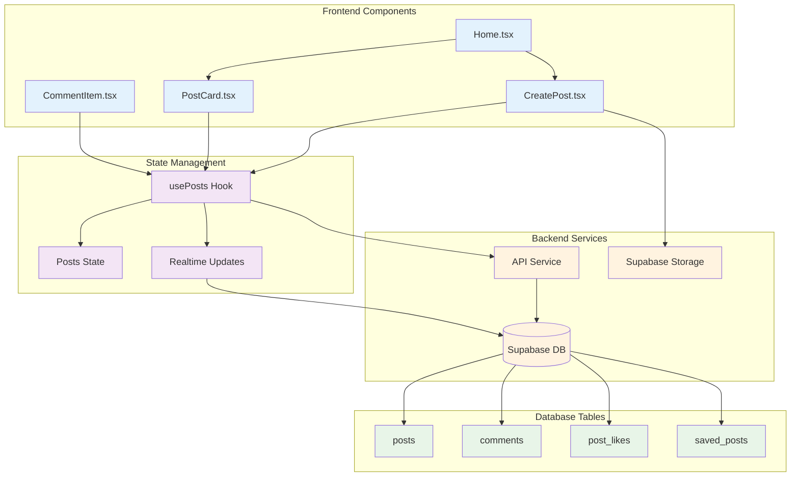
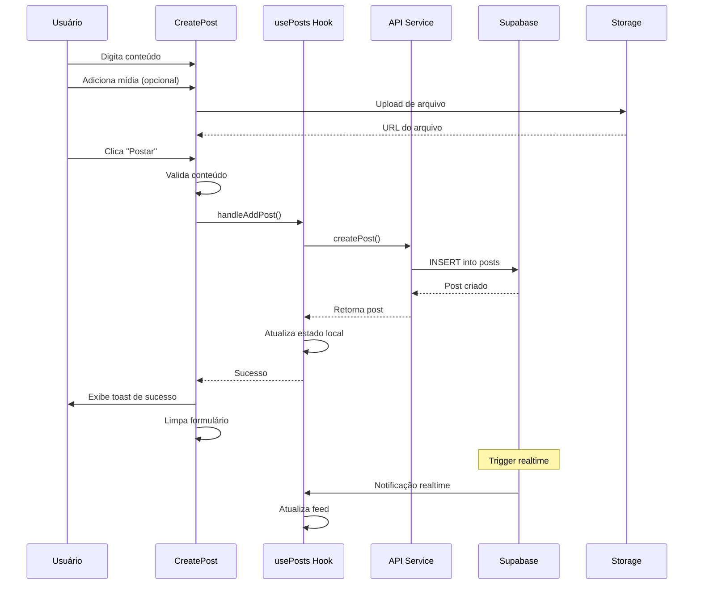
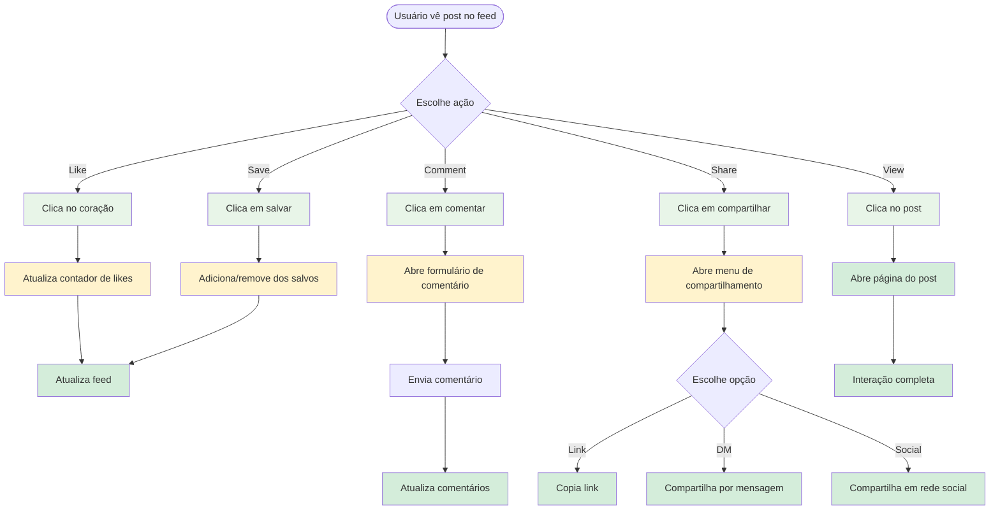

# 04 - Sistema de Posts

## 📋 Identificação

| Campo | Valor |
|-------|-------|
| **Nome** | Sistema de Posts Vigil |
| **Versão** | 1.1.0 |
| **Data** | 12/12/2024 |
| **Última Atualização** | 24/01/2026 |
| **Responsável** | Equipe de Desenvolvimento Vigil |
| **Tipo** | PRD - Funcionalidade Principal |

---

## 🎯 Visão Geral

### Descrição
O sistema de posts é o núcleo da rede social Vigil, permitindo que usuários criem, compartilhem e interajam com conteúdo. Suporta texto, imagens, vídeos, áudio, enquetes e quadros de evidência, com funcionalidades avançadas de interação social como likes, comentários, compartilhamentos e salvamento.

### Objetivo e Propósito
- **Criação de Conteúdo**: Interface intuitiva para criar posts ricos
- **Interação Social**: Likes, comentários, compartilhamentos e salvamento
- **Organização**: Posts por comunidades e hashtags
- **Moderação**: Controle de conteúdo sensível e spam
- **Engajamento**: Métricas e analytics de interação

### Público-Alvo
- **Usuários Finais**: Criação e consumo de conteúdo
- **Moderadores**: Controle de qualidade do conteúdo
- **Desenvolvedores**: Manutenção e evolução do sistema

---

## 🏗️ Arquitetura Técnica

### Componentes Principais
- **CreatePost.tsx** - Formulário de criação de posts
- **PostCard.tsx** - Exibição de posts no feed
- **CommentItem.tsx** - Sistema de comentários
- **usePosts.ts** - Hook de gerenciamento de estado
- **Home.tsx** - Feed principal com posts e anúncios

### Hooks Customizados
- **usePosts()** - Gerenciamento completo de posts
- **useTimeAgo()** - Formatação de timestamps
- **useToast()** - Feedback de ações

### Services/APIs
- **api.ts** - Operações CRUD de posts
- **Supabase Realtime** - Atualizações em tempo real
- **Storage** - Upload de mídia

### Estrutura de Dados
```typescript
interface Post {
  id: string;
  user: User;
  text: string;
  imageUrl?: string;
  videoUrl?: string;
  audioUrl?: string;
  poll?: Poll;
  evidenceBoard?: EvidenceItem[];
  timestamp: string;
  likes: number;
  comments: Comment[];
  commentsCount: number;
  shares: number;
  communityId?: string;
  liked_by_user?: boolean;
  views: number;
  isPinned?: boolean;
  user_voted_option?: number | null;
  media_is_sensitive?: boolean;
  tags?: string[];
}
```

### Diagrama de Arquitetura



---

## 👤 Fluxos de Usuário

### Diagrama de Fluxo de Criação de Post



### Fluxo de Interação com Posts



---

## ⚙️ Funcionalidades Detalhadas

### 1. Criação de Posts (CreatePost.tsx)

#### O que faz
- Formulário rico para criação de posts
- Suporte a múltiplos tipos de mídia
- Sistema de menções (@usuário)
- Seletor de emojis
- Enquetes com múltiplas opções
- Quadro de evidências para teorias
- Publicação em comunidades específicas

#### Como funciona
```typescript
const CreatePost: React.FC<CreatePostProps> = ({ 
  onAddPost, user, communities, joinedCommunityIds 
}) => {
  const [text, setText] = useState('');
  const [mediaType, setMediaType] = useState<'image' | 'video' | 'audio' | 'poll' | 'evidence' | null>(null);
  const [selectedCommunityId, setSelectedCommunityId] = useState<string | undefined>();
  
  // Limites baseados no plano do usuário
  const planLimits = getPlanLimits(user.plan);
  const characterLimit = planLimits.postCharLimit;
  const isOverLimit = text.length > characterLimit;
  
  const handlePost = () => {
    if (isOverLimit) {
      addToast('Post excede o limite de caracteres', 'error');
      return;
    }
    
    onAddPost(text, imageUrl, videoUrl, audioUrl, poll, selectedCommunityId, evidenceBoard, isSensitive);
    resetState();
  };
};
```

#### Tipos de Conteúdo Suportados
- **Texto**: Com formatação de hashtags e menções
- **Imagem**: Upload com preview e marcação de conteúdo sensível
- **Vídeo**: Upload com player integrado
- **Áudio**: Upload com player de áudio
- **Enquete**: Múltiplas opções com duração configurável
- **Quadro de Evidências**: Links, imagens, vídeos e documentos

#### Botões de Cancelamento
Cada tipo de mídia especial possui botão de cancelamento:

**Cancelar Enquete:**
```tsx
<button 
  onClick={handleRemoveMedia}
  className="text-sm font-semibold text-gray-700 hover:text-red-600"
>
  Cancelar Enquete
</button>
```
- Remove todas as opções da enquete
- Reseta duração para padrão
- Volta ao estado de seleção de mídia

**Cancelar Quadro de Evidências:**
```tsx
<button 
  onClick={handleRemoveMedia}
  className="text-sm font-semibold text-gray-700 hover:text-red-600"
>
  Cancelar Quadro de Evidências
</button>
```
- Remove todos os itens de evidência
- Limpa uploads pendentes
- Volta ao estado de seleção de mídia

**Função handleRemoveMedia:**
```typescript
const handleRemoveMedia = () => {
  setMediaType(null);
  setImageUrl(undefined);
  setVideoUrl(undefined);
  setAudioUrl(undefined);
  setIsSensitive(false);
  setPollOptions(['', '']);
  setPollDays(1);
  setPollHours(0);
  setPollMinutes(0);
  setEvidenceItems([]);
  if (mediaInputRef.current) mediaInputRef.current.value = '';
};
```

#### Validações
- **Limite de caracteres**: Baseado no plano do usuário
- **Tamanho de arquivo**: Máximo 10MB para imagens, 50MB para vídeos
- **Formatos suportados**: JPG, PNG, GIF, MP4, MP3, WAV
- **Enquetes**: Mínimo 2 opções, máximo 4
- **Duração da enquete**: 5 minutos a 7 dias
- **Evidências**: Mínimo 1 item, máximo 10 itens

### 2. Exibição de Posts (PostCard.tsx)

#### O que faz
- Renderiza posts no feed com layout responsivo
- Exibe informações do autor com badges
- Mostra contadores de interação em tempo real
- Suporta todos os tipos de mídia
- Menu de ações contextuais
- Sistema de comentários expandível

#### Como funciona
```typescript
const PostCard: React.FC<PostCardProps> = ({ 
  post, currentUser, onToggleLike, onToggleSave, savedPostIds 
}) => {
  const isLiked = post.liked_by_user;
  const isSaved = savedPostIds.includes(post.id);
  const [showComments, setShowComments] = useState(false);
  
  // Renderização condicional de mídia
  const renderMedia = () => {
    if (post.imageUrl) return ;
    if (post.videoUrl) return <ResilientVideo src={post.videoUrl} />;
    if (post.audioUrl) return <audio controls src={post.audioUrl} />;
    if (post.poll) return <PollDisplay poll={post.poll} />;
    if (post.evidenceBoard) return <EvidenceBoard items={post.evidenceBoard} />;
    return null;
  };
  
  return (
    <Card>
      <PostHeader user={post.user} timestamp={post.timestamp} />
      <PostContent text={post.text} />
      {renderMedia()}
      <PostActions 
        isLiked={isLiked}
        isSaved={isSaved}
        onToggleLike={() => onToggleLike(post.id, isLiked)}
        onToggleSave={() => onToggleSave(post.id)}
      />
      {showComments && <CommentSection comments={post.comments} />}
    </Card>
  );
};
```

#### Elementos da Interface
- **Header**: Avatar, nome, username, badges, timestamp
- **Conteúdo**: Texto com hashtags e menções formatadas
- **Mídia**: Imagem, vídeo, áudio, enquete ou evidências
- **Ações**: Like, comentar, compartilhar, salvar
- **Métricas**: Contadores de likes, comentários, shares, views
- **Menu**: Editar, excluir, reportar, bloquear usuário

### 3. Sistema de Comentários (CommentItem.tsx)

#### O que faz
- Comentários aninhados (replies)
- Likes em comentários individuais
- Edição e exclusão de comentários próprios
- Menções em comentários
- Upload de imagens em comentários
- Moderação de comentários

#### Como funciona
```typescript
const CommentItem: React.FC<CommentItemProps> = ({ 
  comment, postId, currentUser, onAddComment, onToggleLike 
}) => {
  const [isReplying, setIsReplying] = useState(false);
  const [isEditing, setIsEditing] = useState(false);
  const [editedText, setEditedText] = useState(comment.text);
  
  const handleReply = (replyText: string, imageUrl?: string) => {
    onAddComment(postId, replyText, imageUrl, comment.id);
    setIsReplying(false);
  };
  
  const handleEdit = () => {
    onUpdateComment(comment.id, editedText);
    setIsEditing(false);
  };
  
  return (
    <div className="comment-item">
      <CommentHeader user={comment.user} timestamp={comment.timestamp} />
      <CommentContent text={comment.text} imageUrl={comment.imageUrl} />
      <CommentActions 
        onReply={() => setIsReplying(true)}
        onLike={() => onToggleLike(comment.id, postId, comment.liked_by_user)}
      />
      {comment.replies?.map(reply => 
        <CommentItem key={reply.id} comment={reply} {...props} />
      )}
    </div>
  );
};
```

### 4. Gerenciamento de Estado (usePosts.ts)

#### O que faz
- Busca e cache de posts
- Atualizações em tempo real via WebSocket
- Operações CRUD otimistas
- Sincronização com backend
- Gerenciamento de posts salvos

#### Como funciona
```typescript
export const usePosts = (appUser: User | null, allUsers: User[]) => {
  const [posts, setPosts] = useState<Post[]>([]);
  const [isPostsLoading, setIsPostsLoading] = useState(true);
  const [savedPostIds, setSavedPostIds] = useState<string[]>([]);
  
  // Buscar posts do backend
  const fetchPosts = useCallback(async () => {
    const { data, error } = await api.fetchPosts(appUser.id);
    if (data) {
      const fetchedPosts = transformDbPostsToAppPosts(data);
      setPosts(fetchedPosts);
    }
  }, [appUser]);
  
  // Adicionar novo post
  const handleAddPost = async (text: string, imageUrl?: string, ...) => {
    const { data, error } = await api.createPost({
      content: text,
      image_url: imageUrl,
      user_id: appUser.id,
      community_id: communityId
    });
    
    if (data) {
      // Atualização otimista
      const newPost = transformDbPostToAppPost(data);
      setPosts(prev => [newPost, ...prev]);
      addToast('Post criado com sucesso!', 'success');
    }
  };
  
  // Realtime updates
  useEffect(() => {
    const channel = supabase.channel('public:posts')
      .on('postgres_changes', { event: '*', schema: 'public', table: 'posts' }, 
        () => fetchPosts()
      )
      .subscribe();
    
    return () => supabase.removeChannel(channel);
  }, [fetchPosts]);
  
  return {
    posts,
    isPostsLoading,
    savedPostIds,
    handleAddPost,
    handleUpdatePost,
    handleDeletePost,
    handleToggleLike,
    handleToggleSave,
    // ... outras funções
  };
};
```

---

## 🎨 Componentes de Interface

### CreatePost Interface
```typescript
interface CreatePostProps {
  onAddPost: (
    text: string,
    imageUrl?: string,
    videoUrl?: string,
    audioUrl?: string,
    poll?: Poll,
    communityId?: string,
    evidenceBoard?: EvidenceItem[],
    media_is_sensitive?: boolean
  ) => void;
  user: User;
  communities: Community[];
  joinedCommunityIds: string[];
  community?: Community;
  allUsers: User[];
  setCurrentPage: (page: any) => void;
}
```

### PostCard Interface
```typescript
interface PostCardProps {
  post: Post;
  currentUser: User;
  onToggleLike: (postId: string, isCurrentlyLiked: boolean) => void;
  onToggleSave: (postId: string) => void;
  onAddComment: (postId: string, content: string, parentId?: string) => void;
  onUpdateComment: (commentId: string, content: string) => void;
  onDeleteComment: (commentId: string) => void;
  onToggleCommentLike: (commentId: string, postId: string, isCurrentlyLiked: boolean) => void;
  onVoteOnPoll: (postId: string, optionIndex: number) => void;
  onViewPost: (postId: string) => void;
  onViewProfile: (userId: string) => void;
  savedPostIds: string[];
  shareableUsers: User[];
  onSendMessage: (params: { targetUserId: string, text: string }) => void;
  followedUserIds: string[];
  allUsers: User[];
}
```

### Poll Interface
```typescript
interface Poll {
  options: PollOption[];
  endDate: string; // ISO Date string
}

interface PollOption {
  text: string;
  votes: number;
}
```

### Evidence Board Interface
```typescript
interface EvidenceItem {
  id: string;
  type: 'text' | 'image' | 'link' | 'video';
  title: string;
  content: string;
}
```

---

## 🔗 Integrações

### Supabase Database
```sql
-- Tabela principal de posts
CREATE TABLE posts (
  id UUID PRIMARY KEY DEFAULT gen_random_uuid(),
  user_id UUID REFERENCES profiles(id) ON DELETE CASCADE,
  content TEXT NOT NULL,
  image_url TEXT,
  video_url TEXT,
  audio_url TEXT,
  poll_data JSONB,
  evidence_board_data JSONB,
  community_id UUID REFERENCES communities(id),
  likes_count INTEGER DEFAULT 0,
  comments_count INTEGER DEFAULT 0,
  shares_count INTEGER DEFAULT 0,
  views_count INTEGER DEFAULT 0,
  is_pinned BOOLEAN DEFAULT FALSE,
  media_is_sensitive BOOLEAN DEFAULT FALSE,
  created_at TIMESTAMP WITH TIME ZONE DEFAULT NOW(),
  updated_at TIMESTAMP WITH TIME ZONE DEFAULT NOW()
);

-- Tabela de likes
CREATE TABLE post_likes (
  id UUID PRIMARY KEY DEFAULT gen_random_uuid(),
  post_id UUID REFERENCES posts(id) ON DELETE CASCADE,
  user_id UUID REFERENCES profiles(id) ON DELETE CASCADE,
  created_at TIMESTAMP WITH TIME ZONE DEFAULT NOW(),
  UNIQUE(post_id, user_id)
);

-- Tabela de comentários
CREATE TABLE comments (
  id UUID PRIMARY KEY DEFAULT gen_random_uuid(),
  post_id UUID REFERENCES posts(id) ON DELETE CASCADE,
  user_id UUID REFERENCES profiles(id) ON DELETE CASCADE,
  parent_comment_id UUID REFERENCES comments(id) ON DELETE CASCADE,
  content TEXT NOT NULL,
  image_url TEXT,
  likes_count INTEGER DEFAULT 0,
  views_count INTEGER DEFAULT 0,
  created_at TIMESTAMP WITH TIME ZONE DEFAULT NOW(),
  updated_at TIMESTAMP WITH TIME ZONE DEFAULT NOW()
);
```

### Supabase Storage
- **Bucket**: `post-media`
- **Políticas**: RLS baseado no usuário
- **Formatos**: Imagens (JPG, PNG, GIF), Vídeos (MP4), Áudio (MP3, WAV)
- **Limites**: 10MB imagens, 50MB vídeos, 20MB áudio

### Real-time Subscriptions
```typescript
// Escutar mudanças em posts
const channel = supabase.channel('public:posts')
  .on('postgres_changes', {
    event: '*',
    schema: 'public',
    table: 'posts'
  }, (payload) => {
    // Atualizar estado local
    fetchPosts();
  })
  .subscribe();
```

---

## 📏 Regras de Negócio

### Limites por Plano

| Recurso | Free | Basic | Pro | Premium |
|---------|------|-------|-----|---------|
| **Caracteres por post** | 280 | 1.000 | 5.000 | 25.000 |
| **Upload de imagem** | ✅ | ✅ | ✅ | ✅ |
| **Upload de vídeo** | ❌ | ✅ | ✅ | ✅ |
| **Upload de áudio** | ❌ | ✅ | ✅ | ✅ |
| **Enquetes** | ❌ | ✅ | ✅ | ✅ |
| **Quadro de evidências** | ❌ | ❌ | ✅ | ✅ |
| **Editar posts** | ❌ | ✅ | ✅ | ✅ |
| **Posts em comunidades** | ❌ | ❌ | ✅ | ✅ |
| **Fixar posts** | ❌ | ❌ | ❌ | ✅ |

### Moderação de Conteúdo
- **Palavras bloqueadas**: Lista configurável por admin
- **Conteúdo sensível**: Marcação obrigatória pelo usuário
- **Spam detection**: Algoritmo anti-spam automático
- **Reportes**: Sistema de denúncias por usuários
- **Auto-moderação**: Remoção automática de conteúdo flagrado

### Permissões de Interação
- **Likes**: Todos os usuários autenticados
- **Comentários**: Todos os usuários autenticados
- **Compartilhamentos**: Todos os usuários autenticados
- **Salvamento**: Todos os usuários autenticados
- **Edição**: Apenas autor do post (planos Basic+)
- **Exclusão**: Autor, moderadores e admins

---

## 💡 Casos de Uso Práticos

### Cenário 1: Usuário Free cria primeiro post
1. **Usuário** acessa o feed principal
2. **Sistema** exibe CreatePost com limite de 280 caracteres
3. **Usuário** digita texto e adiciona imagem
4. **Sistema** valida conteúdo e tamanho
5. **Usuário** clica "Postar"
6. **Sistema** cria post e atualiza feed
7. **Outros usuários** veem o post em tempo real

### Cenário 2: Usuário Pro cria enquete em comunidade
1. **Usuário Pro** acessa comunidade específica
2. **Sistema** exibe CreatePost com opções avançadas
3. **Usuário** seleciona tipo "Enquete"
4. **Sistema** mostra formulário de enquete
5. **Usuário** adiciona 3 opções e define duração de 2 dias
6. **Sistema** cria enquete e publica na comunidade
7. **Membros** podem votar e ver resultados em tempo real

### Cenário 3: Interação com post viral
1. **Post** recebe muitos likes rapidamente
2. **Sistema** atualiza contadores em tempo real
3. **Usuários** adicionam comentários
4. **Sistema** organiza comentários por relevância
5. **Moderadores** monitoram para spam/abuso
6. **Sistema** pode promover post para trending

---

## 🚨 Tratamento de Erros

### Erros de Criação
- **Limite excedido**: "Post excede limite de X caracteres"
- **Upload falhou**: "Erro ao fazer upload da mídia, tente novamente"
- **Conteúdo vazio**: "Post não pode estar vazio"
- **Formato inválido**: "Formato de arquivo não suportado"

### Erros de Interação
- **Rede offline**: Cache local + sincronização posterior
- **Permissão negada**: "Você não tem permissão para esta ação"
- **Post não encontrado**: "Este post foi removido ou não existe"
- **Rate limiting**: "Muitas ações muito rápido, aguarde um momento"

### Recuperação de Falhas
- **Retry automático**: Para falhas temporárias de rede
- **Queue de ações**: Ações offline são enfileiradas
- **Rollback otimista**: Desfaz mudanças se API falhar
- **Fallback graceful**: Interface funciona mesmo com erros

---

## ⚡ Performance e Otimizações

### Frontend
- **Virtualização**: Lista infinita para feeds longos
- **Lazy loading**: Imagens carregadas sob demanda
- **Memoização**: React.memo para PostCard
- **Debounce**: Busca de menções com delay
- **Compression**: Imagens otimizadas automaticamente

### Backend
- **Índices**: Otimizados para queries frequentes
- **Pagination**: Carregamento incremental de posts
- **Caching**: Redis para posts populares
- **CDN**: Assets servidos via CDN
- **Connection pooling**: Reutilização de conexões DB

### Real-time
- **Throttling**: Limite de atualizações por segundo
- **Batching**: Múltiplas mudanças em uma notificação
- **Selective updates**: Apenas campos alterados
- **Graceful degradation**: Polling se WebSocket falhar

---

## ♿ Acessibilidade

### Implementações
- **Alt text**: Descrições automáticas para imagens
- **ARIA labels**: Labels para botões de ação
- **Keyboard navigation**: Navegação completa por teclado
- **Screen reader**: Anúncios de mudanças de estado
- **Focus management**: Foco adequado em modals

### Exemplo de Implementação
```jsx
<button
  onClick={() => onToggleLike(post.id, isLiked)}
  aria-label={`${isLiked ? 'Remover' : 'Adicionar'} like do post de ${post.user.name}`}
  aria-pressed={isLiked}
  className="like-button"
>
  <HeartIcon filled={isLiked} />
  <span aria-live="polite">{post.likes}</span>
</button>


```

---

## 🧪 Testes e Qualidade

### Casos de Teste

#### Criação de Posts
- [ ] Criar post apenas com texto
- [ ] Criar post com imagem
- [ ] Criar post com vídeo (Basic+)
- [ ] Criar enquete (Basic+)
- [ ] Validar limite de caracteres por plano
- [ ] Upload de arquivo muito grande
- [ ] Formato de arquivo inválido
- [ ] Criar post em comunidade (Pro+)

#### Interações
- [ ] Like/unlike post
- [ ] Adicionar comentário
- [ ] Responder comentário
- [ ] Compartilhar post
- [ ] Salvar/dessalvar post
- [ ] Votar em enquete
- [ ] Editar post próprio (Basic+)
- [ ] Excluir post próprio

#### Real-time
- [ ] Atualizações de likes em tempo real
- [ ] Novos comentários aparecem automaticamente
- [ ] Contadores atualizados instantaneamente
- [ ] Reconexão após perda de rede

### Testes de Performance
- [ ] Carregamento de feed com 100+ posts
- [ ] Scroll infinito sem travamentos
- [ ] Upload de múltiplas imagens
- [ ] Renderização de posts com vídeo
- [ ] Responsividade em dispositivos móveis

---

## 🚀 Roadmap e Melhorias Futuras

### Próximas Funcionalidades
- **Stories**: Posts temporários (24h)
- **Reações**: Múltiplos tipos além de like
- **Threads**: Posts conectados em sequência
- **Colaboração**: Posts em co-autoria
- **Agendamento**: Publicação programada

### Melhorias de UX
- **Editor rico**: Formatação de texto avançada
- **Rascunhos**: Salvamento automático
- **Templates**: Modelos pré-definidos
- **Sugestões**: IA para melhorar posts
- **Analytics**: Métricas detalhadas para criadores

### Integrações
- **Cross-posting**: Publicar em múltiplas redes
- **Import/Export**: Migração de conteúdo
- **API pública**: Integração com terceiros
- **Webhooks**: Notificações externas

---

## 📊 Métricas e KPIs

### Engajamento
- **Posts per User**: Média de posts por usuário ativo
- **Engagement Rate**: % de posts que recebem interação
- **Comment Ratio**: Comentários por post
- **Share Rate**: Taxa de compartilhamento
- **Save Rate**: Taxa de salvamento

### Conteúdo
- **Media Usage**: % posts com imagem/vídeo/áudio
- **Poll Participation**: Taxa de participação em enquetes
- **Community Posts**: % posts em comunidades
- **Hashtag Usage**: Tags mais populares

### Performance
- **Load Time**: Tempo de carregamento do feed
- **Upload Success**: Taxa de sucesso de uploads
- **Real-time Latency**: Delay de atualizações
- **Error Rate**: Taxa de erros por operação

### Moderação
- **Flagged Content**: % conteúdo reportado
- **Auto-moderation**: Eficácia da moderação automática
- **Response Time**: Tempo de resposta a reports
- **False Positives**: Taxa de falsos positivos

---

## 📝 Considerações Finais

O sistema de posts do Vigil foi projetado para ser o coração da interação social na plataforma, oferecendo uma experiência rica e envolvente para usuários de todos os planos. A arquitetura escalável e as funcionalidades avançadas como enquetes e quadros de evidência diferenciam a plataforma no mercado.

A implementação de atualizações em tempo real, otimizações de performance e recursos de acessibilidade garantem uma experiência superior para todos os usuários, enquanto o sistema de moderação mantém a qualidade e segurança do conteúdo.

**Próximo Documento**: [05 - Comunidades](05_COMUNIDADES.md)
