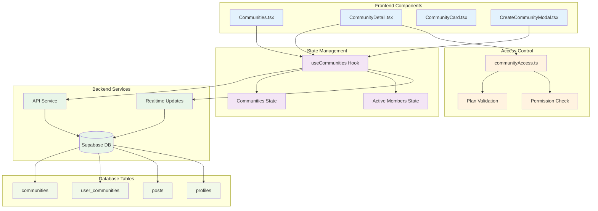
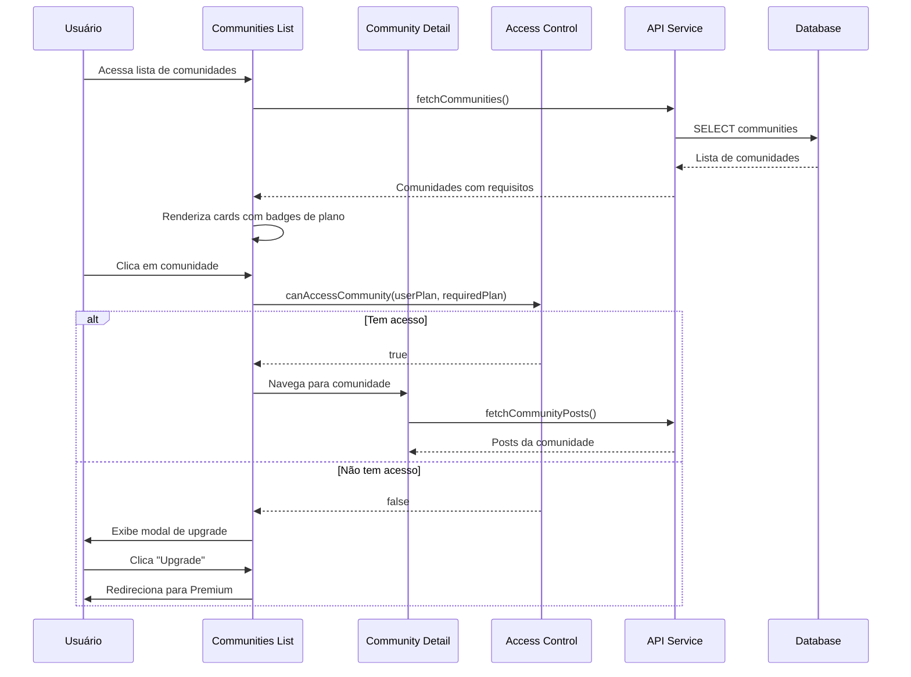

# 05 - Sistema de Comunidades

## 📋 Identificação

| Campo | Valor |
|-------|-------|
| **Nome** | Sistema de Comunidades Vigil |
| **Versão** | 1.1.0 |
| **Data** | 12/12/2024 |
| **Última Atualização** | 24/01/2026 |
| **Responsável** | Equipe de Desenvolvimento Vigil |
| **Tipo** | PRD - Funcionalidade Principal |

---

## 🎯 Visão Geral

### Descrição
O sistema de comunidades permite que usuários criem e participem de grupos temáticos focados em teorias, investigações e tópicos específicos. Oferece controle granular de acesso baseado em planos de assinatura, moderação dedicada e funcionalidades exclusivas para engajamento comunitário.

### Objetivo e Propósito
- **Organização Temática**: Agrupar discussões por temas específicos
- **Controle de Acesso**: Comunidades premium para conteúdo exclusivo
- **Engajamento**: Ferramentas para aumentar participação
- **Moderação**: Controle de qualidade e comportamento
- **Monetização**: Incentivo para upgrades de plano

### Público-Alvo
- **Usuários Pro/Premium**: Acesso e criação de comunidades
- **Criadores de Conteúdo**: Monetização através de comunidades premium
- **Moderadores**: Gestão de comunidades específicas
- **Administradores**: Supervisão geral do sistema

---

## 🏗️ Arquitetura Técnica

### Componentes Principais
- **Communities.tsx** - Lista de comunidades disponíveis
- **CommunityDetail.tsx** - Página individual da comunidade
- **CommunityCard.tsx** - Card de apresentação da comunidade
- **CreateCommunityModal.tsx** - Modal de criação de comunidades
- **useCommunities.ts** - Hook de gerenciamento de estado

### Hooks Customizados
- **useCommunities()** - Gerenciamento completo de comunidades
- **useAdInteractions()** - Interações com anúncios em comunidades
- **useToast()** - Feedback de ações

### Services/APIs
- **api.ts** - Operações CRUD de comunidades
- **communityAccess.ts** - Controle de acesso por plano
- **Supabase Realtime** - Atualizações em tempo real

### Estrutura de Dados
```typescript
interface Community {
  id: string;
  name: string;
  description: string;
  memberCount: number;
  postsCount: number;
  bannerUrl: string;
  tag: string;
  rules?: string[];
  requiredPlan?: 'all' | 'basic+' | 'pro+' | 'premium';
  creatorId?: string;
}

interface ActiveMember {
  user_id: string;
  username: string;
  avatar_url: string;
  name: string;
  post_count: number;
  plan?: 'free' | 'basic' | 'pro' | 'premium';
}
```

### Diagrama de Arquitetura



---

## 👤 Fluxos de Usuário

### Diagrama de Fluxo de Acesso a Comunidades



### Fluxo de Criação de Comunidade

```mermaid
flowchart TD
    Start([Usuário clica "Criar Comunidade"]) --> CheckPlan{Usuário é Premium?}
    
    CheckPlan -->|Não| ShowUpgrade[Exibe modal de upgrade]
    ShowUpgrade --> RedirectPremium[Redireciona para página Premium]
    
    CheckPlan -->|Sim| OpenModal[Abre modal de criação]
    OpenModal --> FillForm[Usuário preenche formulário]
    FillForm --> Validate{Validação OK?}
    
    Validate -->|Não| ShowErrors[Exibe erros de validação]
    ShowErrors --> FillForm
    
    Validate -->|Sim| CreateCommunity[Cria comunidade no backend]
    CreateCommunity --> AutoJoin[Auto-adiciona criador como membro]
    AutoJoin --> UpdateState[Atualiza estado local]
    UpdateState --> ShowSuccess[Exibe mensagem de sucesso]
    ShowSuccess --> NavigateToNew[Navega para nova comunidade]
    
    classDef process fill:#e8f5e8
    classDef decision fill:#fff3cd
    classDef success fill:#d4edda
    classDef error fill:#f8d7da
    
    class FillForm,CreateCommunity,AutoJoin,UpdateState process
    class CheckPlan,Validate decision
    class ShowSuccess,NavigateToNew success
    class ShowUpgrade,ShowErrors error
```

---

## ⚙️ Funcionalidades Detalhadas

### 1. Lista de Comunidades (Communities.tsx)

#### O que faz
- Exibe grid de comunidades disponíveis
- Mostra badges de plano requerido
- Permite criação de novas comunidades (Premium)
- Filtragem por acesso do usuário
- Navegação para detalhes da comunidade

#### Como funciona
```typescript
const Communities: React.FC<CommunitiesProps> = ({ 
  communities, joinedCommunityIds, onViewCommunity, user 
}) => {
  const [isCreateModalOpen, setIsCreateModalOpen] = useState(false);
  
  const handleOpenCreateModal = () => {
    if (user.plan === 'premium') {
      setIsCreateModalOpen(true);
    } else {
      setCurrentPage('Premium'); // Redireciona para upgrade
    }
  };
  
  return (
    <div>
      <div className="flex justify-between items-center mb-6">
        <h1>Comunidades</h1>
        <button onClick={handleOpenCreateModal}>
          Criar Comunidade
        </button>
      </div>
      
      <div className="grid grid-cols-1 md:grid-cols-2 gap-6">
        {communities.map(community => (
          <CommunityCard 
            key={community.id}
            community={community}
            onViewCommunity={onViewCommunity}
            isJoined={joinedCommunityIds.includes(community.id)}
            onJoinToggle={onJoinCommunityToggle}
          />
        ))}
      </div>
    </div>
  );
};
```

#### Estados Possíveis
- **Loading**: Carregando lista de comunidades
- **Empty**: Nenhuma comunidade disponível
- **Filtered**: Comunidades filtradas por acesso
- **Creating**: Modal de criação aberto

### 2. Detalhes da Comunidade (CommunityDetail.tsx)

#### O que faz
- Exibe informações completas da comunidade
- Feed de posts específicos da comunidade
- Lista de membros ativos
- Formulário de criação de posts na comunidade
- Controle de acesso baseado em plano
- Moderação para criadores

#### Como funciona
```typescript
const CommunityDetail: React.FC<CommunityDetailProps> = ({ 
  community, posts, activeMembers, user, isJoined 
}) => {
  // Verificar acesso à comunidade
  const hasAccess = useMemo(() => {
    if (!community.requiredPlan || community.requiredPlan === 'all') return true;
    
    const planHierarchy = { free: 0, basic: 1, pro: 2, premium: 3 };
    const userPlanLevel = planHierarchy[user.plan] || 0;
    
    switch (community.requiredPlan) {
      case 'basic+': return userPlanLevel >= planHierarchy.basic;
      case 'pro+': return userPlanLevel >= planHierarchy.pro;
      case 'premium': return userPlanLevel >= planHierarchy.premium;
      default: return true;
    }
  }, [community.requiredPlan, user.plan]);
  
  if (!hasAccess) {
    return <AccessDeniedView community={community} userPlan={user.plan} />;
  }
  
  return (
    <div>
      <CommunityHeader community={community} />
      <ActiveMembersList members={activeMembers} />
      <CreatePost community={community} />
      <PostsFeed posts={posts} />
    </div>
  );
};
```

#### Seções da Interface
- **Header**: Banner, nome, descrição, estatísticas
- **Membros Ativos**: Top contribuidores da comunidade
- **Criar Post**: Formulário específico para a comunidade
- **Feed**: Posts ordenados por relevância/data
- **Moderação**: Ferramentas para criador da comunidade

### 3. Card de Comunidade (CommunityCard.tsx)

#### O que faz
- Preview visual da comunidade
- Informações essenciais (membros, posts)
- Badge de plano requerido
- Botão de entrar/sair
- Navegação para detalhes

#### Como funciona
```typescript
const CommunityCard: React.FC<CommunityCardProps> = ({ 
  community, isJoined, onJoinToggle, onViewCommunity 
}) => {
  const handleJoinClick = (e: React.MouseEvent) => {
    e.stopPropagation(); // Evita navegação
    onJoinToggle(community.id);
  };
  
  const getPlanBadge = () => {
    if (!community.requiredPlan || community.requiredPlan === 'all') return null;
    
    const planConfig = {
      'basic+': { label: 'Basic+', color: 'bg-blue-500' },
      'pro+': { label: 'Pro+', color: 'bg-purple-500' },
      'premium': { label: 'Premium', color: 'bg-gold-500' }
    };
    
    const config = planConfig[community.requiredPlan];
    return (
      <span className={`px-2 py-1 text-xs rounded-full text-white ${config.color}`}>
        {config.label}
      </span>
    );
  };
  
  return (
    <Card onClick={() => onViewCommunity(community.id)} className="cursor-pointer">
      
      <div className="p-4">
        <div className="flex justify-between items-start mb-2">
          <h3 className="font-bold">{community.name}</h3>
          {getPlanBadge()}
        </div>
        <p className="text-gray-600 mb-4">{community.description}</p>
        <div className="flex justify-between items-center">
          <div className="flex gap-4 text-sm text-gray-500">
            <span>{community.memberCount} membros</span>
            <span>{community.postsCount} posts</span>
          </div>
          <button 
            onClick={handleJoinClick}
            className={isJoined ? 'btn-secondary' : 'btn-primary'}
          >
            {isJoined ? 'Sair' : 'Entrar'}
          </button>
        </div>
      </div>
    </Card>
  );
};
```

### 4. Gerenciamento de Estado (useCommunities.ts)

#### O que faz
- Busca e cache de comunidades
- Gerenciamento de comunidades participadas
- Criação de novas comunidades
- Atualizações em tempo real
- Controle de acesso

#### Como funciona
```typescript
export const useCommunities = (appUser: User | null) => {
  const [communities, setCommunities] = useState<Community[]>([]);
  const [joinedCommunityIds, setJoinedCommunityIds] = useState<string[]>([]);
  const { addToast } = useToast();
  
  const fetchCommunities = useCallback(async () => {
    const { data, error } = await api.fetchCommunities();
    if (data) {
      const safeCommunities = data.map(c => ({
        ...c,
        memberCount: c.member_count ?? 0,
        postsCount: c.posts_count ?? 0,
        bannerUrl: c.banner_url || generateDefaultBanner(c.id),
        requiredPlan: c.required_plan || 'all',
        creatorId: c.creator_id
      }));
      setCommunities(safeCommunities);
    }
  }, []);
  
  const handleJoinCommunityToggle = async (communityId: string) => {
    const community = communities.find(c => c.id === communityId);
    if (!community) return;
    
    // Verificar acesso
    if (!canAccessCommunity(appUser.plan, community.requiredPlan)) {
      addToast(getAccessDeniedMessage(community.requiredPlan), 'error');
      return;
    }
    
    const isCurrentlyJoined = joinedCommunityIds.includes(communityId);
    
    // Atualização otimista
    if (isCurrentlyJoined) {
      setJoinedCommunityIds(prev => prev.filter(id => id !== communityId));
    } else {
      setJoinedCommunityIds(prev => [...prev, communityId]);
    }
    
    const { error } = await api.toggleCommunityMembership(appUser.id, communityId);
    
    if (error) {
      // Reverter mudança otimista
      if (isCurrentlyJoined) {
        setJoinedCommunityIds(prev => [...prev, communityId]);
      } else {
        setJoinedCommunityIds(prev => prev.filter(id => id !== communityId));
      }
      addToast('Erro ao atualizar participação na comunidade', 'error');
    }
  };
  
  const handleCreateCommunity = async (communityData: NewCommunityData) => {
    const { data, error } = await api.createCommunity({
      ...communityData,
      creator_id: appUser.id
    });
    
    if (data) {
      // Adicionar à lista local
      setCommunities(prev => [data, ...prev]);
      // Auto-join na comunidade criada
      setJoinedCommunityIds(prev => [...prev, data.id]);
      addToast('Comunidade criada com sucesso!', 'success');
    }
  };
  
  // Real-time updates
  useEffect(() => {
    const channel = supabase.channel('communities-realtime')
      .on('postgres_changes', { 
        event: '*', 
        schema: 'public', 
        table: 'communities' 
      }, () => fetchCommunities())
      .on('postgres_changes', { 
        event: '*', 
        schema: 'public', 
        table: 'user_communities' 
      }, () => fetchJoinedCommunities())
      .subscribe();
    
    return () => supabase.removeChannel(channel);
  }, [fetchCommunities]);
  
  return {
    communities,
    joinedCommunityIds,
    handleJoinCommunityToggle,
    handleCreateCommunity,
    fetchTrendingTopics
  };
};
```

---

## 🔗 Integrações

### Supabase Database
```sql
-- Tabela principal de comunidades
CREATE TABLE communities (
  id UUID PRIMARY KEY DEFAULT gen_random_uuid(),
  name TEXT NOT NULL,
  description TEXT NOT NULL,
  tag TEXT UNIQUE NOT NULL,
  banner_url TEXT,
  rules TEXT[],
  required_plan TEXT DEFAULT 'all' CHECK (required_plan IN ('all', 'basic+', 'pro+', 'premium')),
  creator_id UUID REFERENCES profiles(id),
  member_count INTEGER DEFAULT 0,
  posts_count INTEGER DEFAULT 0,
  created_at TIMESTAMP WITH TIME ZONE DEFAULT NOW(),
  updated_at TIMESTAMP WITH TIME ZONE DEFAULT NOW()
);

-- Tabela de relacionamento usuário-comunidade
CREATE TABLE user_communities (
  id UUID PRIMARY KEY DEFAULT gen_random_uuid(),
  user_id UUID REFERENCES profiles(id) ON DELETE CASCADE,
  community_id UUID REFERENCES communities(id) ON DELETE CASCADE,
  joined_at TIMESTAMP WITH TIME ZONE DEFAULT NOW(),
  UNIQUE(user_id, community_id)
);

-- Função para atualizar contador de membros
CREATE OR REPLACE FUNCTION update_community_member_count()
RETURNS TRIGGER AS $$
BEGIN
  IF TG_OP = 'INSERT' THEN
    UPDATE communities 
    SET member_count = member_count + 1 
    WHERE id = NEW.community_id;
    RETURN NEW;
  ELSIF TG_OP = 'DELETE' THEN
    UPDATE communities 
    SET member_count = member_count - 1 
    WHERE id = OLD.community_id;
    RETURN OLD;
  END IF;
  RETURN NULL;
END;
$$ LANGUAGE plpgsql;

-- Trigger para atualizar contador automaticamente
CREATE TRIGGER update_community_member_count_trigger
  AFTER INSERT OR DELETE ON user_communities
  FOR EACH ROW EXECUTE FUNCTION update_community_member_count();
```

### Controle de Acesso

#### Verificação em App.tsx
```typescript
// App.tsx - Controle de acesso a comunidades
const canAccessCommunity = (community: Community): boolean => {
  // ADMIN TEM ACESSO IRRESTRITO A TUDO
  if (appUser?.role === 'admin') {
    return true;
  }

  if (!community.requiredPlan || community.requiredPlan === 'all') {
    return true;
  }

  const planHierarchy: Record<string, number> = {
    free: 0,
    basic: 1,
    pro: 2,
    premium: 3
  };

  const userLevel = planHierarchy[appUser?.plan || 'free'] || 0;

  switch (community.requiredPlan) {
    case 'basic+': return userLevel >= planHierarchy.basic;
    case 'pro+': return userLevel >= planHierarchy.pro;
    case 'premium': return userLevel >= planHierarchy.premium;
    default: return true;
  }
};
```

#### Verificação em CommunityDetail.tsx
```typescript
// CommunityDetail.tsx - Controle de acesso a posts
const hasAccess = useMemo(() => {
  // ADMIN TEM ACESSO IRRESTRITO
  if (user.role === 'admin') {
    return true;
  }

  if (!community?.requiredPlan || community.requiredPlan === 'all') {
    return true;
  }

  const planHierarchy: Record<string, number> = {
    free: 0,
    basic: 1,
    pro: 2,
    premium: 3
  };

  const userLevel = planHierarchy[user.plan || 'free'] || 0;

  switch (community.requiredPlan) {
    case 'basic+': return userLevel >= planHierarchy.basic;
    case 'pro+': return userLevel >= planHierarchy.pro;
    case 'premium': return userLevel >= planHierarchy.premium;
    default: return true;
  }
}, [user.plan, user.role, community?.requiredPlan]);
```

#### Hierarquia de Roles
```typescript
interface User {
  role: 'user' | 'moderator' | 'admin';
  plan: 'free' | 'basic' | 'pro' | 'premium';
}

// Ordem de prioridade
// 1. Admin: Acesso TOTAL e IRRESTRITO
// 2. Moderator: Acesso baseado em plano + poderes de moderação
// 3. User: Acesso baseado apenas em plano
```

---

## 📏 Regras de Negócio

### Acesso por Plano

| Funcionalidade | Free | Basic | Pro | Premium | Admin |
|----------------|------|-------|-----|---------|-------|
| **Ver comunidades públicas** | ✅ | ✅ | ✅ | ✅ | ✅ |
| **Participar comunidades** | ❌ | ❌ | ✅ | ✅ | ✅ |
| **Postar em comunidades** | ❌ | ❌ | ✅ | ✅ | ✅ |
| **Criar comunidades** | ❌ | ❌ | ❌ | ✅ | ✅ |
| **Moderar comunidades** | ❌ | ❌ | ❌ | ✅ | ✅ |
| **Comunidades Basic+** | ❌ | ✅ | ✅ | ✅ | ✅ |
| **Comunidades Pro+** | ❌ | ❌ | ✅ | ✅ | ✅ |
| **Comunidades Premium** | ❌ | ❌ | ❌ | ✅ | ✅ |
| **ACESSO IRRESTRITO** | ❌ | ❌ | ❌ | ❌ | ✅ |

**Nota Importante:** Administradores têm acesso irrestrito a TODAS as comunidades, independentemente do plano requerido. Isso permite supervisão, moderação e gestão completa da plataforma.
| **Comunidades Pro+** | ❌ | ❌ | ✅ | ✅ |
| **Comunidades Premium** | ❌ | ❌ | ❌ | ✅ |

### Tipos de Comunidades
- **Públicas (all)**: Acessíveis a usuários Pro+
- **Basic+ Communities**: Requer plano Basic ou superior
- **Pro+ Communities**: Requer plano Pro ou superior  
- **Premium Communities**: Exclusivas para Premium

### Limites e Restrições
- **Máximo de comunidades por usuário Premium**: 5
- **Máximo de membros por comunidade**: 10.000
- **Tamanho máximo da descrição**: 500 caracteres
- **Regras da comunidade**: Máximo 10 regras, 200 caracteres cada

### Moderação
- **Criador**: Controle total da comunidade
- **Auto-moderação**: Aplicação automática de regras globais
- **Reportes**: Sistema de denúncias específico por comunidade
- **Remoção**: Admins podem remover comunidades que violam ToS

---

## 💡 Casos de Uso Práticos

### Cenário 1: Usuário Pro descobre comunidades
1. **Usuário Pro** acessa página de Comunidades
2. **Sistema** exibe todas as comunidades com badges de acesso
3. **Usuário** vê comunidades "Basic+", "Pro+" e "Premium"
4. **Usuário** pode entrar em Basic+ e Pro+, mas não Premium
5. **Sistema** mostra modal de upgrade ao tentar acessar Premium

### Cenário 2: Usuário Premium cria comunidade exclusiva
1. **Usuário Premium** clica "Criar Comunidade"
2. **Sistema** abre modal de criação
3. **Usuário** preenche dados e seleciona "Premium" como requisito
4. **Sistema** cria comunidade e adiciona usuário como membro
5. **Comunidade** aparece na lista com badge "Premium"
6. **Apenas usuários Premium** podem ver e participar

### Cenário 3: Engajamento em comunidade ativa
1. **Usuário** entra em comunidade Pro+
2. **Sistema** exibe feed específico da comunidade
3. **Usuário** vê membros ativos e suas contribuições
4. **Usuário** cria post específico para a comunidade
5. **Post** aparece no feed da comunidade e no feed geral
6. **Membros** recebem notificações de nova atividade

---

## 🚨 Tratamento de Erros

### Erros de Acesso
- **Plano insuficiente**: Modal explicativo com opção de upgrade
- **Comunidade não encontrada**: Redirecionamento para lista
- **Comunidade removida**: Notificação e remoção da lista local
- **Limite de comunidades**: Mensagem para usuários Premium

### Erros de Criação
- **Nome duplicado**: "Nome já está em uso"
- **Tag duplicada**: "Tag já existe, escolha outra"
- **Dados inválidos**: Validação em tempo real
- **Limite atingido**: "Você atingiu o limite de 5 comunidades"

### Recuperação de Falhas
- **Offline**: Cache local de comunidades participadas
- **Sync error**: Retry automático com backoff exponencial
- **Partial failure**: Rollback de operações incompletas

---

## ⚡ Performance e Otimizações

### Frontend
- **Lazy loading**: Banners carregados sob demanda
- **Infinite scroll**: Paginação de comunidades
- **Memoização**: CommunityCard memoizado
- **Virtual scrolling**: Para listas longas de membros

### Backend
- **Índices otimizados**: Queries de busca e filtros
- **Materialized views**: Contadores pré-calculados
- **Caching**: Comunidades populares em Redis
- **Batch operations**: Operações em lote para joins/leaves

### Real-time
- **Selective updates**: Apenas mudanças relevantes
- **Debouncing**: Atualizações de contadores
- **Channel optimization**: Canais específicos por comunidade

---

## ♿ Acessibilidade

### Implementações
- **ARIA labels**: Descrições para badges e botões
- **Keyboard navigation**: Navegação completa por teclado
- **Screen reader**: Anúncios de mudanças de estado
- **Focus management**: Foco adequado em modals
- **Alt text**: Descrições para banners de comunidades

### Exemplo de Implementação
```jsx
<div 
  role="button"
  tabIndex={0}
  onClick={() => onViewCommunity(community.id)}
  onKeyDown={(e) => e.key === 'Enter' && onViewCommunity(community.id)}
  aria-label={`Acessar comunidade ${community.name}, ${community.memberCount} membros`}
>
  
  <div>
    <h3>{community.name}</h3>
    {community.requiredPlan !== 'all' && (
      <span 
        className="plan-badge"
        aria-label={`Requer plano ${community.requiredPlan}`}
      >
        {getPlanLabel(community.requiredPlan)}
      </span>
    )}
  </div>
</div>
```

---

## 🧪 Testes e Qualidade

### Casos de Teste

#### Acesso a Comunidades
- [ ] Usuário Free vê apenas comunidades públicas
- [ ] Usuário Basic acessa comunidades Basic+
- [ ] Usuário Pro acessa comunidades Pro+
- [ ] Usuário Premium acessa todas as comunidades
- [ ] Modal de upgrade aparece para acesso negado

#### Participação
- [ ] Entrar em comunidade atualiza contador
- [ ] Sair de comunidade atualiza contador
- [ ] Posts aparecem no feed da comunidade
- [ ] Membros ativos são atualizados

#### Criação (Premium)
- [ ] Apenas Premium pode criar comunidades
- [ ] Validação de nome e tag únicos
- [ ] Criador é automaticamente membro
- [ ] Configuração de plano requerido funciona

#### Real-time
- [ ] Novos membros aparecem instantaneamente
- [ ] Contadores atualizados em tempo real
- [ ] Posts novos aparecem no feed
- [ ] Mudanças de configuração sincronizam

---

## 🚀 Roadmap e Melhorias Futuras

### Próximas Funcionalidades
- **Subcomunidades**: Comunidades dentro de comunidades
- **Moderadores**: Múltiplos moderadores por comunidade
- **Eventos**: Sistema de eventos da comunidade
- **Badges**: Conquistas específicas por comunidade
- **Analytics**: Métricas detalhadas para criadores

### Melhorias de Engajamento
- **Gamificação**: Pontos e rankings de membros
- **Challenges**: Desafios temáticos
- **AMA**: Sessões de perguntas e respostas
- **Polls**: Enquetes da comunidade
- **Wiki**: Base de conhecimento colaborativa

### Monetização
- **Comunidades Pagas**: Assinatura específica por comunidade
- **Marketplace**: Venda de conteúdo exclusivo
- **Sponsorship**: Patrocínios de comunidades
- **Premium Features**: Recursos exclusivos para criadores

---

## 📊 Métricas e KPIs

### Engajamento
- **Community Join Rate**: Taxa de entrada em comunidades
- **Active Communities**: % comunidades com atividade recente
- **Posts per Community**: Média de posts por comunidade
- **Member Retention**: Taxa de retenção de membros

### Monetização
- **Premium Conversion**: Conversão Free → Premium via comunidades
- **Community Creation**: Número de comunidades criadas
- **Exclusive Access**: Uso de comunidades premium
- **Upgrade Attribution**: Upgrades atribuídos a comunidades

### Performance
- **Load Time**: Tempo de carregamento de comunidades
- **Join Success Rate**: Taxa de sucesso ao entrar
- **Real-time Latency**: Delay de atualizações
- **Search Performance**: Velocidade de busca

### Qualidade
- **Community Health**: Métricas de qualidade do conteúdo
- **Moderation Actions**: Ações de moderação por comunidade
- **User Reports**: Relatórios por comunidade
- **Creator Satisfaction**: Satisfação dos criadores

---

## 📝 Considerações Finais

O sistema de comunidades do Vigil é um diferencial competitivo importante, oferecendo organização temática e monetização através de acesso premium. A implementação cuidadosa do controle de acesso por planos incentiva upgrades naturalmente, enquanto mantém uma experiência inclusiva para todos os usuários.

A arquitetura escalável permite crescimento orgânico das comunidades, e as funcionalidades de moderação garantem qualidade do conteúdo. O sistema de tempo real mantém o engajamento alto e a experiência dinâmica.

**Próximo Documento**: [06 - Mensagens Privadas](06_MENSAGENS.md)
