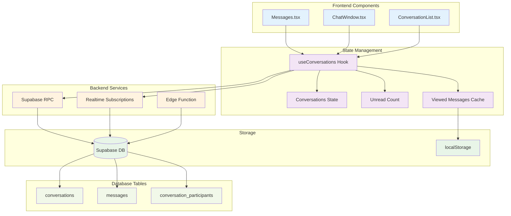
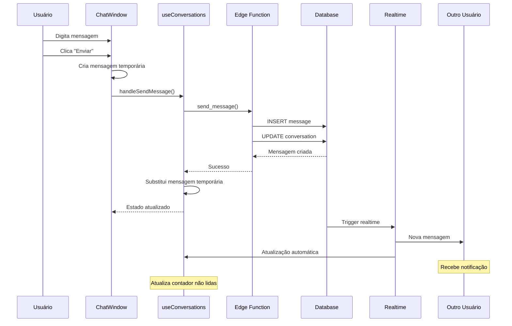

# 06 - Sistema de Mensagens Privadas

## 📋 Identificação

| Campo | Valor |
|-------|-------|
| **Nome** | Sistema de Mensagens Privadas Vigil |
| **Versão** | 1.0.0 |
| **Data** | 12/12/2024 |
| **Responsável** | Equipe de Desenvolvimento Vigil |
| **Tipo** | PRD - Funcionalidade Principal |

---

## 🎯 Visão Geral

### Descrição
O sistema de mensagens privadas permite comunicação direta entre usuários através de conversas 1:1. Oferece interface intuitiva similar a aplicativos de mensagens modernos, com recursos de tempo real, persistência local de mensagens visualizadas e integração com o sistema de notificações.

### Objetivo e Propósito
- **Comunicação Privada**: Canal direto entre usuários
- **Tempo Real**: Mensagens instantâneas via WebSocket
- **Persistência**: Histórico completo de conversas
- **Notificações**: Alertas de mensagens não lidas
- **Integração**: Compartilhamento de posts via DM

### Público-Alvo
- **Todos os Usuários**: Funcionalidade disponível para todos os planos
- **Usuários Ativos**: Comunicação frequente entre membros
- **Moderadores**: Canal direto para suporte e moderação

---

## 🏗️ Arquitetura Técnica

### Componentes Principais
- **Messages.tsx** - Página principal de mensagens
- **ChatWindow.tsx** - Interface de conversa individual
- **ConversationList.tsx** - Lista de conversas ativas
- **useConversations.ts** - Hook de gerenciamento de estado

### Hooks Customizados
- **useConversations()** - Gerenciamento completo de conversas
- **useSession()** - Estado do usuário atual
- **useToast()** - Feedback de ações

### Services/APIs
- **Supabase RPC** - Função `get_user_conversations`
- **Supabase Realtime** - Atualizações em tempo real
- **localStorage** - Cache de mensagens visualizadas

### Estrutura de Dados
```typescript
interface Conversation {
  id: string;
  participants: User[];
  messages: ChatMessage[];
}

interface ChatMessage {
  id: string;
  senderId: string;
  text: string;
  timestamp: string;
}
```

### Diagrama de Arquitetura



---

## 👤 Fluxos de Usuário

### Diagrama de Fluxo de Envio de Mensagem



### Fluxo de Nova Conversa

```mermaid
flowchart TD
    Start([Usuário quer enviar DM]) --> Source{De onde?}
    
    Source -->|Post Share| ShareModal[Modal de compartilhamento]
    Source -->|Página Messages| NewChatBtn[Botão "Nova Conversa"]
    Source -->|Perfil usuário| ProfileDM[Botão DM no perfil]
    
    ShareModal --> SelectUser[Seleciona usuário]
    NewChatBtn --> SearchUsers[Busca usuários seguidos]
    ProfileDM --> DirectTarget[Usuário já selecionado]
    
    SelectUser --> ComposeMessage[Compõe mensagem]
    SearchUsers --> SelectFromList[Seleciona da lista]
    SelectFromList --> ComposeMessage
    DirectTarget --> ComposeMessage
    
    ComposeMessage --> SendFirst[Envia primeira mensagem]
    SendFirst --> CreateConversation[Cria conversa no backend]
    CreateConversation --> UpdateState[Atualiza estado local]
    UpdateState --> OpenChat[Abre janela de chat]
    
    classDef action fill:#e8f5e8
    classDef process fill:#fff3cd
    classDef result fill:#d4edda
    
    class ShareModal,NewChatBtn,ProfileDM,SelectUser,SearchUsers,DirectTarget action
    class ComposeMessage,SendFirst,CreateConversation,UpdateState process
    class OpenChat result
```

---

## ⚙️ Funcionalidades Detalhadas

### 1. Página Principal (Messages.tsx)

#### O que faz
- Layout responsivo com lista de conversas e janela de chat
- Busca de conversas existentes
- Criação de novas conversas
- Gerenciamento de conversas (excluir)
- Contadores de mensagens não lidas

#### Como funciona
```typescript
const Messages: React.FC<MessagesProps> = ({ 
  conversations, handleSendMessage, isLoading, followedUsers, onDeleteConversation 
}) => {
  const [selectedConversationId, setSelectedConversationId] = useState<string | null>(null);
  const [messageText, setMessageText] = useState('');
  const [showNewChatModal, setShowNewChatModal] = useState(false);
  const [newChatTargetUser, setNewChatTargetUser] = useState<User | null>(null);
  
  // Auto-seleciona primeira conversa
  useEffect(() => {
    if (!selectedConversationId && conversations.length > 0 && !newChatTargetUser) {
      setSelectedConversationId(conversations[0].id);
    }
  }, [conversations, selectedConversationId, newChatTargetUser]);
  
  // Detecta nova conversa criada
  useEffect(() => {
    if (newChatTargetUser && conversations.length > 0) {
      const newConvo = conversations.find(c => 
        c.participants.some(p => p.id === newChatTargetUser.id) &&
        c.messages.length > 0
      );
      if (newConvo) {
        setSelectedConversationId(newConvo.id);
        setNewChatTargetUser(null);
      }
    }
  }, [conversations, newChatTargetUser]);
  
  const handleSubmit = async (e: React.FormEvent) => {
    e.preventDefault();
    if (!messageText.trim() || isSending) return;
    
    setIsSending(true);
    const textToSend = messageText;
    setMessageText(''); // Limpa imediatamente para melhor UX
    
    try {
      let conversationId: string | undefined;
      
      if (selectedConversationId) {
        conversationId = selectedConversationId;
      } else if (newChatTargetUser) {
        conversationId = undefined; // Nova conversa
      }
      
      await handleSendMessage({
        conversationId,
        targetUserId: newChatTargetUser?.id,
        text: textToSend
      });
    } catch (error) {
      setMessageText(textToSend); // Restaura texto em caso de erro
    } finally {
      setIsSending(false);
    }
  };
};
```

#### Layout Responsivo
- **Desktop**: Lista lateral + janela de chat
- **Mobile**: Navegação entre lista e chat
- **Tablet**: Layout adaptativo baseado na orientação

### 2. Janela de Chat (ChatWindow.tsx)

#### O que faz
- Interface de conversa individual
- Exibição de mensagens com bubbles
- Scroll automático para novas mensagens
- Indicadores de status (enviando, enviado)
- Header com informações do usuário

#### Como funciona
```typescript
const ChatWindow: React.FC<ChatWindowProps> = ({ 
  conversation, isSending, onSendMessage, currentUser 
}) => {
  const [text, setText] = useState('');
  const messagesEndRef = useRef<HTMLDivElement>(null);
  
  const scrollToBottom = () => {
    messagesEndRef.current?.scrollIntoView({ behavior: "smooth" });
  };
  
  useEffect(() => {
    scrollToBottom();
  }, [conversation?.messages]);
  
  if (!conversation) {
    return (
      <div className="flex-1 flex items-center justify-center">
        <div className="text-center text-gray-500">
          <h2>Selecione uma conversa</h2>
          <p>Escolha uma conversa existente ou inicie uma nova.</p>
        </div>
      </div>
    );
  }
  
  const otherUser = conversation.participants.find(p => p.id !== currentUser.id);
  
  const handleSubmit = (e: React.FormEvent) => {
    e.preventDefault();
    if (text.trim() && !isSending) {
      onSendMessage(text);
      setText('');
    }
  };
  
  return (
    <div className="flex-1 flex flex-col">
      {/* Header com info do usuário */}
      <div className="p-4 border-b flex items-center space-x-3">
        <Avatar src={otherUser.avatarUrl} alt={otherUser.name} size="md" />
        <div>
          <h3 className="font-bold">{otherUser.name}</h3>
          <p className="text-sm text-gray-500">@{otherUser.username}</p>
        </div>
      </div>
      
      {/* Lista de mensagens */}
      <div className="flex-1 p-4 overflow-y-auto space-y-4">
        {conversation.messages.map(message => {
          const isSentByMe = message.senderId === currentUser.id;
          const isTemp = message.id.startsWith('temp_');
          
          return (
            <div key={message.id} className={`flex ${isSentByMe ? 'justify-end' : 'justify-start'}`}>
              <div className={`max-w-xs p-3 rounded-lg ${
                isSentByMe 
                  ? 'bg-primary text-white rounded-br-none' 
                  : 'bg-gray-200 rounded-bl-none'
              } ${isTemp ? 'opacity-70' : ''}`}>
                <p>{message.text}</p>
                <p className="text-xs mt-1 text-right">
                  {isTemp ? 'Enviando...' : formatTime(message.timestamp)}
                </p>
              </div>
            </div>
          );
        })}
        <div ref={messagesEndRef} />
      </div>
      
      {/* Input de mensagem */}
      <div className="p-4 border-t">
        <form onSubmit={handleSubmit} className="flex items-center space-x-3">
          <input
            type="text"
            placeholder="Digite sua mensagem..."
            value={text}
            onChange={(e) => setText(e.target.value)}
            className="flex-1 border rounded-full px-4 py-2"
          />
          <button 
            type="submit" 
            disabled={!text.trim() || isSending}
            className="bg-primary text-white p-2 rounded-full"
          >
            {isSending ? <LoaderIcon /> : <SendIcon />}
          </button>
        </form>
      </div>
    </div>
  );
};
```

### 3. Gerenciamento de Estado (useConversations.ts)

#### O que faz
- Busca e cache de conversas
- Envio de mensagens com otimismo
- Contagem de mensagens não lidas
- Persistência local de mensagens visualizadas
- Atualizações em tempo real

#### Como funciona
```typescript
export const useConversations = (appUser: User | null) => {
  const [conversations, setConversations] = useState<Conversation[]>([]);
  const [unreadMessagesCount, setUnreadMessagesCount] = useState(0);
  const [isLoading, setIsLoading] = useState(true);
  
  // Cache local de mensagens visualizadas
  const getViewedMessages = (userId: string): Set<string> => {
    try {
      const stored = localStorage.getItem(`vigil_viewed_messages_${userId}`);
      return stored ? new Set(JSON.parse(stored)) : new Set();
    } catch {
      return new Set();
    }
  };
  
  const saveViewedMessages = (userId: string, messageIds: Set<string>) => {
    try {
      localStorage.setItem(
        `vigil_viewed_messages_${userId}`, 
        JSON.stringify([...messageIds])
      );
    } catch (error) {
      // Falha silenciosa
    }
  };
  
  // Calcula mensagens não lidas
  const calculateUnreadCount = useCallback((convos: Conversation[], userId: string): number => {
    const viewedMessages = getViewedMessages(userId);
    
    let unreadCount = 0;
    convos.forEach(conv => {
      conv.messages.forEach(msg => {
        if (msg.senderId !== userId && !viewedMessages.has(msg.id)) {
          unreadCount++;
        }
      });
    });
    
    return unreadCount;
  }, []);
  
  // Busca conversas do backend
  const fetchConversations = useCallback(async () => {
    if (!appUser) return;
    
    try {
      const { data, error } = await supabase.rpc('get_user_conversations');
      if (error) throw error;
      
      const formattedConversations = data.map(convo => ({
        id: convo.conversation_id,
        participants: convo.participants.map(p => ({
          id: p.id,
          name: `${p.first_name || ''} ${p.last_name || ''}`.trim() || p.username,
          username: p.username,
          avatarUrl: p.avatar_url || generateDefaultAvatar(p.id),
          plan: p.plan || 'free',
          role: p.role || 'user'
        })),
        messages: convo.messages.map(msg => ({
          id: msg.id,
          senderId: msg.sender_id,
          text: msg.content,
          timestamp: msg.created_at
        }))
      }));
      
      setConversations(formattedConversations);
      
      // Atualiza contador de não lidas
      const unreadCount = calculateUnreadCount(formattedConversations, appUser.id);
      setUnreadMessagesCount(unreadCount);
      
    } catch (error) {
      addToast('Erro ao carregar conversas', 'error');
    } finally {
      setIsLoading(false);
    }
  }, [appUser, calculateUnreadCount]);
  
  // Envia mensagem
  const handleSendMessage = async ({ conversationId, targetUserId, text }: {
    conversationId?: string;
    targetUserId?: string;
    text: string;
  }): Promise<string | undefined> => {
    if (!appUser || !text.trim()) return;
    
    // Mensagem temporária para UX otimista
    const tempMessage: ChatMessage = {
      id: `temp_${Date.now()}`,
      senderId: appUser.id,
      text: text.trim(),
      timestamp: new Date().toISOString()
    };
    
    // Atualiza UI imediatamente
    if (conversationId) {
      setConversations(prev => prev.map(conv => 
        conv.id === conversationId 
          ? { ...conv, messages: [...conv.messages, tempMessage] }
          : conv
      ));
    }
    
    try {
      const { data, error } = await supabase.functions.invoke('send-message', {
        body: {
          conversation_id: conversationId,
          target_user_id: targetUserId,
          content: text.trim()
        }
      });
      
      if (error) throw error;
      
      // Remove mensagem temporária e adiciona a real
      const realMessage = {
        id: data.message_id,
        senderId: appUser.id,
        text: text.trim(),
        timestamp: data.created_at
      };
      
      if (conversationId) {
        setConversations(prev => prev.map(conv => 
          conv.id === conversationId 
            ? { 
                ...conv, 
                messages: conv.messages
                  .filter(msg => msg.id !== tempMessage.id)
                  .concat(realMessage)
              }
            : conv
        ));
      }
      
      return data.conversation_id;
      
    } catch (error) {
      // Remove mensagem temporária em caso de erro
      if (conversationId) {
        setConversations(prev => prev.map(conv => 
          conv.id === conversationId 
            ? { 
                ...conv, 
                messages: conv.messages.filter(msg => msg.id !== tempMessage.id)
              }
            : conv
        ));
      }
      
      addToast('Erro ao enviar mensagem', 'error');
      throw error;
    }
  };
  
  // Marca mensagens como lidas
  const markMessagesAsRead = useCallback(() => {
    if (!appUser) return;
    
    const viewedMessages = getViewedMessages(appUser.id);
    let hasNewViewed = false;
    
    conversations.forEach(conv => {
      conv.messages.forEach(msg => {
        if (msg.senderId !== appUser.id && !viewedMessages.has(msg.id)) {
          viewedMessages.add(msg.id);
          hasNewViewed = true;
        }
      });
    });
    
    if (hasNewViewed) {
      saveViewedMessages(appUser.id, viewedMessages);
      setUnreadMessagesCount(0);
    }
  }, [conversations, appUser]);
  
  // Real-time subscriptions
  useEffect(() => {
    if (!appUser) return;
    
    const channel = supabase.channel('messages-realtime')
      .on('postgres_changes', {
        event: 'INSERT',
        schema: 'public',
        table: 'messages'
      }, () => {
        // Recarrega conversas quando nova mensagem é inserida
        setTimeout(fetchConversations, 500);
      })
      .subscribe();
    
    return () => supabase.removeChannel(channel);
  }, [appUser, fetchConversations]);
  
  return {
    conversations,
    unreadMessagesCount,
    isLoading,
    handleSendMessage,
    markMessagesAsRead,
    handleDeleteConversation: async (conversationId: string) => {
      // Implementação de exclusão de conversa
    }
  };
};
```

---

## 🔗 Integrações

### Supabase Database
```sql
-- Tabela de conversas
CREATE TABLE conversations (
  id UUID PRIMARY KEY DEFAULT gen_random_uuid(),
  created_at TIMESTAMP WITH TIME ZONE DEFAULT NOW(),
  updated_at TIMESTAMP WITH TIME ZONE DEFAULT NOW()
);

-- Tabela de participantes
CREATE TABLE conversation_participants (
  id UUID PRIMARY KEY DEFAULT gen_random_uuid(),
  conversation_id UUID REFERENCES conversations(id) ON DELETE CASCADE,
  user_id UUID REFERENCES profiles(id) ON DELETE CASCADE,
  joined_at TIMESTAMP WITH TIME ZONE DEFAULT NOW(),
  UNIQUE(conversation_id, user_id)
);

-- Tabela de mensagens
CREATE TABLE messages (
  id UUID PRIMARY KEY DEFAULT gen_random_uuid(),
  conversation_id UUID REFERENCES conversations(id) ON DELETE CASCADE,
  sender_id UUID REFERENCES profiles(id) ON DELETE CASCADE,
  content TEXT NOT NULL,
  created_at TIMESTAMP WITH TIME ZONE DEFAULT NOW()
);

-- Função RPC para buscar conversas do usuário
CREATE OR REPLACE FUNCTION get_user_conversations()
RETURNS TABLE (
  conversation_id UUID,
  participants JSONB,
  messages JSONB
) AS $$
BEGIN
  RETURN QUERY
  SELECT 
    c.id as conversation_id,
    COALESCE(
      jsonb_agg(
        DISTINCT jsonb_build_object(
          'id', p.id,
          'username', p.username,
          'first_name', p.first_name,
          'last_name', p.last_name,
          'avatar_url', p.avatar_url,
          'plan', p.plan,
          'role', p.role
        )
      ) FILTER (WHERE p.id IS NOT NULL), 
      '[]'::jsonb
    ) as participants,
    COALESCE(
      jsonb_agg(
        jsonb_build_object(
          'id', m.id,
          'sender_id', m.sender_id,
          'content', m.content,
          'created_at', m.created_at
        ) ORDER BY m.created_at ASC
      ) FILTER (WHERE m.id IS NOT NULL),
      '[]'::jsonb
    ) as messages
  FROM conversations c
  JOIN conversation_participants cp ON c.id = cp.conversation_id
  LEFT JOIN profiles p ON cp.user_id = p.id
  LEFT JOIN messages m ON c.id = m.conversation_id
  WHERE c.id IN (
    SELECT DISTINCT conversation_id 
    FROM conversation_participants 
    WHERE user_id = auth.uid()
  )
  GROUP BY c.id
  ORDER BY c.updated_at DESC;
END;
$$ LANGUAGE plpgsql SECURITY DEFINER;
```

### Edge Function (send-message)
```typescript
// supabase/functions/send-message/index.ts
import { serve } from "https://deno.land/std@0.168.0/http/server.ts"
import { createClient } from 'https://esm.sh/@supabase/supabase-js@2'

serve(async (req) => {
  try {
    const { conversation_id, target_user_id, content } = await req.json()
    
    const supabase = createClient(
      Deno.env.get('SUPABASE_URL') ?? '',
      Deno.env.get('SUPABASE_SERVICE_ROLE_KEY') ?? ''
    )
    
    // Obter usuário atual
    const authHeader = req.headers.get('Authorization')!
    const token = authHeader.replace('Bearer ', '')
    const { data: { user } } = await supabase.auth.getUser(token)
    
    if (!user) {
      return new Response(JSON.stringify({ error: 'Unauthorized' }), {
        status: 401,
        headers: { 'Content-Type': 'application/json' }
      })
    }
    
    let finalConversationId = conversation_id
    
    // Se não há conversation_id, criar nova conversa
    if (!conversation_id && target_user_id) {
      // Verificar se já existe conversa entre os usuários
      const { data: existingConv } = await supabase
        .from('conversations')
        .select(`
          id,
          conversation_participants!inner(user_id)
        `)
        .eq('conversation_participants.user_id', user.id)
        .eq('conversation_participants.user_id', target_user_id)
        .single()
      
      if (existingConv) {
        finalConversationId = existingConv.id
      } else {
        // Criar nova conversa
        const { data: newConv } = await supabase
          .from('conversations')
          .insert({})
          .select('id')
          .single()
        
        finalConversationId = newConv.id
        
        // Adicionar participantes
        await supabase
          .from('conversation_participants')
          .insert([
            { conversation_id: finalConversationId, user_id: user.id },
            { conversation_id: finalConversationId, user_id: target_user_id }
          ])
      }
    }
    
    // Inserir mensagem
    const { data: message } = await supabase
      .from('messages')
      .insert({
        conversation_id: finalConversationId,
        sender_id: user.id,
        content: content
      })
      .select('id, created_at')
      .single()
    
    // Atualizar timestamp da conversa
    await supabase
      .from('conversations')
      .update({ updated_at: new Date().toISOString() })
      .eq('id', finalConversationId)
    
    return new Response(JSON.stringify({
      conversation_id: finalConversationId,
      message_id: message.id,
      created_at: message.created_at
    }), {
      headers: { 'Content-Type': 'application/json' }
    })
    
  } catch (error) {
    return new Response(JSON.stringify({ error: error.message }), {
      status: 500,
      headers: { 'Content-Type': 'application/json' }
    })
  }
})
```

### Real-time Subscriptions
```typescript
// Escutar novas mensagens
const channel = supabase.channel('messages-realtime')
  .on('postgres_changes', {
    event: 'INSERT',
    schema: 'public',
    table: 'messages'
  }, (payload) => {
    // Recarregar conversas quando nova mensagem é inserida
    fetchConversations();
  })
  .subscribe();
```

---

## 📏 Regras de Negócio

### Acesso e Permissões
- **Todos os usuários** podem enviar e receber mensagens
- **Limite de caracteres**: 1000 caracteres por mensagem
- **Rate limiting**: Máximo 10 mensagens por minuto
- **Spam protection**: Detecção automática de spam

### Privacidade
- **Conversas privadas**: Apenas participantes podem ver mensagens
- **Exclusão**: Usuários podem excluir conversas (apenas para si)
- **Bloqueio**: Usuários bloqueados não podem enviar mensagens
- **Moderação**: Admins podem acessar conversas para investigação

### Notificações
- **Tempo real**: Notificações instantâneas via WebSocket
- **Push notifications**: Para usuários mobile (futuro)
- **Email notifications**: Para mensagens importantes (configurável)
- **Contador**: Badge com número de mensagens não lidas

### Retenção de Dados
- **Histórico completo**: Todas as mensagens são mantidas
- **Cache local**: Mensagens visualizadas salvas no localStorage
- **Backup**: Backup automático das conversas
- **GDPR**: Usuários podem solicitar exportação/exclusão

---

## 💡 Casos de Uso Práticos

### Cenário 1: Compartilhamento de post via DM
1. **Usuário** vê post interessante no feed
2. **Usuário** clica no botão "Compartilhar"
3. **Sistema** abre modal com opções de compartilhamento
4. **Usuário** seleciona "Enviar por mensagem"
5. **Sistema** mostra lista de usuários seguidos
6. **Usuário** seleciona destinatário e adiciona comentário
7. **Sistema** envia mensagem com link do post
8. **Destinatário** recebe notificação em tempo real

### Cenário 2: Nova conversa com usuário
1. **Usuário** acessa perfil de outro usuário
2. **Usuário** clica em "Enviar mensagem"
3. **Sistema** abre página de mensagens
4. **Sistema** cria conversa temporária
5. **Usuário** digita primeira mensagem
6. **Sistema** cria conversa no backend
7. **Sistema** atualiza interface com conversa real
8. **Conversa** aparece na lista para ambos os usuários

### Cenário 3: Conversa em tempo real
1. **Usuário A** envia mensagem
2. **Sistema** mostra "Enviando..." temporariamente
3. **Backend** processa e salva mensagem
4. **Sistema** substitui por mensagem real
5. **WebSocket** notifica Usuário B
6. **Usuário B** vê nova mensagem instantaneamente
7. **Contador** de não lidas é atualizado
8. **Usuário B** responde, processo se repete

---

## 🚨 Tratamento de Erros

### Erros de Envio
- **Rede offline**: Mensagem fica em fila para envio posterior
- **Usuário bloqueado**: "Não é possível enviar mensagem para este usuário"
- **Conversa não encontrada**: Recria conversa automaticamente
- **Rate limit**: "Muitas mensagens enviadas, aguarde um momento"

### Erros de Carregamento
- **Falha na conexão**: Retry automático com backoff exponencial
- **Dados corrompidos**: Fallback para cache local
- **Timeout**: Mensagem de erro com opção de retry manual
- **Permissão negada**: Redirecionamento para login

### Recuperação de Falhas
- **Offline mode**: Cache local permite visualizar conversas
- **Sync automático**: Sincronização quando conexão retorna
- **Rollback otimista**: Desfaz mudanças se API falhar
- **Graceful degradation**: Interface funciona mesmo com erros

---

## ⚡ Performance e Otimizações

### Frontend
- **Virtualização**: Lista de mensagens virtualizada para conversas longas
- **Lazy loading**: Mensagens antigas carregadas sob demanda
- **Debouncing**: Indicador "digitando" com delay
- **Memoização**: Componentes memoizados para evitar re-renders

### Backend
- **Paginação**: Carregamento incremental de mensagens
- **Índices otimizados**: Queries rápidas por conversa e usuário
- **Connection pooling**: Reutilização de conexões WebSocket
- **Caching**: Cache de conversas ativas em Redis

### Real-time
- **Channel optimization**: Canais específicos por conversa
- **Batching**: Múltiplas mensagens em uma notificação
- **Throttling**: Limite de atualizações por segundo
- **Selective updates**: Apenas mudanças relevantes

---

## ♿ Acessibilidade

### Implementações
- **ARIA labels**: Descrições para botões e estados
- **Keyboard navigation**: Navegação completa por teclado
- **Screen reader**: Anúncios de novas mensagens
- **Focus management**: Foco adequado em input de mensagem
- **High contrast**: Suporte a modo de alto contraste

### Exemplo de Implementação
```jsx
<div 
  role="log" 
  aria-live="polite" 
  aria-label="Mensagens da conversa"
  className="messages-container"
>
  {messages.map(message => (
    <div 
      key={message.id}
      role="article"
      aria-label={`Mensagem de ${message.sender.name} às ${formatTime(message.timestamp)}`}
    >
      <p>{message.text}</p>
    </div>
  ))}
</div>

<form onSubmit={handleSubmit} role="form" aria-label="Enviar mensagem">
  <input
    type="text"
    value={text}
    onChange={(e) => setText(e.target.value)}
    aria-label="Digite sua mensagem"
    placeholder="Digite sua mensagem..."
  />
  <button 
    type="submit" 
    disabled={!text.trim() || isSending}
    aria-label="Enviar mensagem"
  >
    <SendIcon aria-hidden="true" />
  </button>
</form>
```

---

## 🧪 Testes e Qualidade

### Casos de Teste

#### Envio de Mensagens
- [ ] Enviar mensagem em conversa existente
- [ ] Criar nova conversa com primeira mensagem
- [ ] Envio com conexão instável
- [ ] Rate limiting funciona corretamente
- [ ] Mensagens temporárias são substituídas

#### Interface
- [ ] Lista de conversas carrega corretamente
- [ ] Seleção de conversa atualiza chat
- [ ] Scroll automático para novas mensagens
- [ ] Layout responsivo em mobile
- [ ] Busca de conversas funciona

#### Real-time
- [ ] Novas mensagens aparecem instantaneamente
- [ ] Contador de não lidas atualiza
- [ ] Reconexão após perda de rede
- [ ] Multiple tabs sincronizadas
- [ ] Notificações em background

#### Persistência
- [ ] Mensagens visualizadas são lembradas
- [ ] Cache local funciona offline
- [ ] Sincronização após reconexão
- [ ] Exclusão de conversa funciona

---

## 🚀 Roadmap e Melhorias Futuras

### Próximas Funcionalidades
- **Mensagens de mídia**: Envio de imagens, vídeos, áudios
- **Mensagens de voz**: Gravação e reprodução de áudio
- **Reações**: Emojis de reação em mensagens
- **Encaminhamento**: Encaminhar mensagens entre conversas
- **Busca**: Busca dentro das mensagens

### Melhorias de UX
- **Indicador "digitando"**: Mostrar quando usuário está digitando
- **Status de entrega**: Enviado, entregue, visualizado
- **Mensagens temporárias**: Auto-destruição após tempo
- **Temas**: Personalização visual das conversas
- **Atalhos**: Comandos rápidos por teclado

### Funcionalidades Avançadas
- **Grupos**: Conversas com múltiplos participantes
- **Bots**: Integração com chatbots
- **Criptografia**: End-to-end encryption
- **Backup**: Exportação de conversas
- **Integração**: APIs para terceiros

---

## 📊 Métricas e KPIs

### Engajamento
- **Messages per User**: Média de mensagens por usuário ativo
- **Daily Active Conversations**: Conversas ativas por dia
- **Response Rate**: Taxa de resposta em conversas
- **Session Duration**: Tempo médio na página de mensagens

### Performance
- **Message Delivery Time**: Tempo de entrega de mensagens
- **Real-time Latency**: Delay das atualizações em tempo real
- **Load Time**: Tempo de carregamento da página
- **Error Rate**: Taxa de erros no envio

### Qualidade
- **Spam Detection**: Eficácia da detecção de spam
- **User Reports**: Relatórios de abuso em mensagens
- **Moderation Actions**: Ações de moderação necessárias
- **User Satisfaction**: Satisfação com o sistema de mensagens

### Retenção
- **Message Retention**: Taxa de retenção via mensagens
- **Cross-feature Usage**: Uso de mensagens + outras features
- **Conversion**: Conversão de visualizadores para usuários ativos
- **Churn Prevention**: Prevenção de churn via engajamento

---

## 📝 Considerações Finais

O sistema de mensagens privadas do Vigil oferece uma experiência moderna e fluida de comunicação, similar aos melhores aplicativos de mensagens do mercado. A implementação de recursos em tempo real, interface responsiva e otimizações de performance garantem uma experiência superior para os usuários.

A arquitetura escalável permite crescimento futuro com funcionalidades avançadas, enquanto mantém a simplicidade e usabilidade que os usuários esperam. O sistema de cache local e sincronização garante confiabilidade mesmo em condições de rede instável.

**Próximo Documento**: [07 - Chat Rooms](07_CHAT_ROOMS.md)
