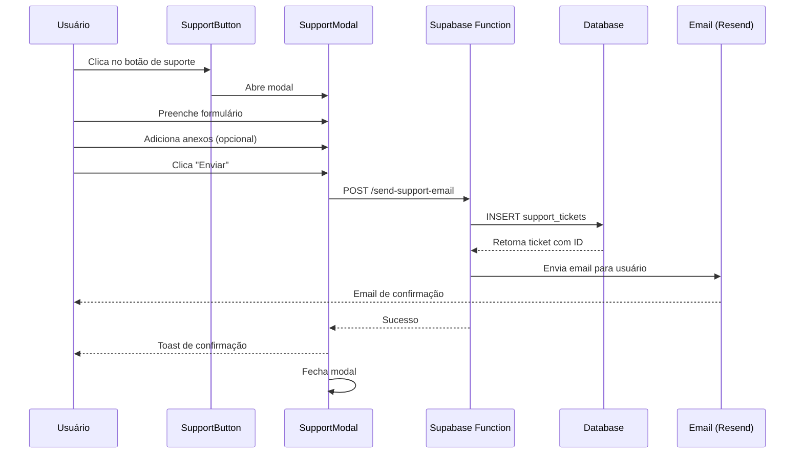
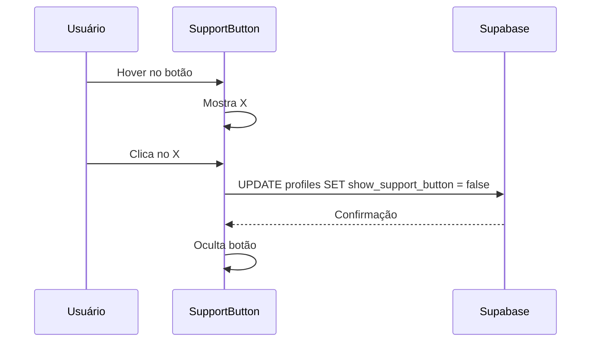

# 20 - Sistema de Suporte ao Cliente

## 📋 Identificação

| Campo | Valor |
|-------|-------|
| **Nome** | Sistema de Suporte Vigil |
| **Versão** | 1.0.0 |
| **Data** | 24/01/2026 |
| **Responsável** | Equipe de Desenvolvimento Vigil |
| **Tipo** | PRD - Sistema de Atendimento |

---

## 🎯 Visão Geral

### Descrição
Sistema completo de suporte ao cliente com botão flutuante, modal de criação de tickets, categorização automática, sistema de prioridades e envio de emails via Resend API.

### Objetivo e Propósito
- **Acessibilidade**: Suporte disponível em qualquer página do app
- **Organização**: Categorização e priorização automática de tickets
- **Rastreabilidade**: Histórico completo de interações
- **Eficiência**: Informações técnicas automáticas para diagnóstico
- **Comunicação**: Notificação por email para usuário e equipe

---

## 🏗️ Arquitetura Técnica

### Componentes React

#### `SupportButton.tsx`
```typescript
interface SupportButtonProps {
  user: User;
  variant?: 'floating' | 'inline';
  onVisibilityChange?: (visible: boolean) => void;
}
```

**Funcionalidades:**
- Botão flutuante fixo no canto inferior direito
- Animação de hover com tooltip
- Opção de ocultar permanentemente (salvo no perfil)
- Variante inline para uso em páginas específicas

#### `SupportModal.tsx`
```typescript
interface SupportTicket {
  userId: string;
  userEmail: string;
  userName: string;
  userPlan: string;
  category: 'technical' | 'billing' | 'feature' | 'other';
  subject: string;
  description: string;
  priority: 'low' | 'medium' | 'high';
  userAgent: string;
  timestamp: string;
  attachments?: Array<{ name: string; content: string; type: string }>;
}
```

**Funcionalidades:**
- Formulário completo de criação de ticket
- Categorias: Técnico, Cobrança, Funcionalidade, Outro
- Prioridades: Baixa, Média, Alta
- Upload de anexos (imagens, documentos)
- Validação de campos obrigatórios
- Preview de anexos antes do envio

### Banco de Dados

#### Tabela `support_tickets`
```sql
CREATE TABLE support_tickets (
  id UUID PRIMARY KEY DEFAULT uuid_generate_v4(),
  user_id UUID REFERENCES profiles(id) NOT NULL,
  category TEXT NOT NULL,
  subject TEXT NOT NULL,
  description TEXT NOT NULL,
  priority TEXT NOT NULL,
  status TEXT DEFAULT 'open',
  user_agent TEXT,
  user_plan TEXT,
  created_at TIMESTAMP DEFAULT NOW(),
  updated_at TIMESTAMP DEFAULT NOW(),
  resolved_at TIMESTAMP,
  assigned_to UUID REFERENCES profiles(id)
);
```

#### Tabela `profiles` (campo adicional)
```sql
ALTER TABLE profiles 
ADD COLUMN show_support_button BOOLEAN DEFAULT true;
```

### Edge Functions

#### `send-support-email`
**Propósito:** Enviar email de confirmação para o usuário e notificação para a equipe

**Fluxo:**
1. Recebe dados do ticket via POST
2. Cria registro na tabela `support_tickets`
3. Gera número do ticket (8 primeiros caracteres do UUID)
4. Monta HTML do email com template responsivo
5. Envia email via Resend API
6. Retorna confirmação de sucesso

**Email Template:**
- Header com logo e título
- Badge de status "Ticket Recebido"
- Card do usuário com avatar, nome, email
- Grid de informações: Plano, Prioridade, Categoria, Data/Hora
- Seção de assunto destacada
- Descrição detalhada
- Anexos (se houver)
- Informações técnicas (User ID, User Agent, Timestamp)
- Footer com logo e link de contato

---

## 👤 Fluxos de Usuário

### Fluxo 1: Criar Ticket de Suporte



### Fluxo 2: Ocultar Botão de Suporte



---

## ⚙️ Funcionalidades Detalhadas

### 1. Botão Flutuante

**Posicionamento:**
- Desktop: Canto inferior direito (bottom-6 right-6)
- Mobile: Acima da navegação (bottom-24 right-6)
- Z-index: 40 (acima de outros elementos)

**Estados:**
- **Normal**: Ícone de suporte
- **Hover**: Mostra tooltip "Precisa de ajuda?" + botão X
- **Hover no X**: Tooltip "Ocultar permanentemente"

**Animações:**
- Entrada: Fade in + scale
- Hover: Scale up + shadow
- Pulse suave contínuo

### 2. Modal de Criação de Ticket

**Campos do Formulário:**

| Campo | Tipo | Obrigatório | Validação |
|-------|------|-------------|-----------|
| Categoria | Select | Sim | technical, billing, feature, other |
| Assunto | Text | Sim | Min 5, Max 100 caracteres |
| Descrição | Textarea | Sim | Min 20, Max 2000 caracteres |
| Prioridade | Select | Sim | low, medium, high |
| Anexos | File Upload | Não | Max 5 arquivos, 5MB cada |

**Categorias:**
- 🔧 **Técnico**: Bugs, erros, problemas de funcionamento
- 💳 **Cobrança**: Pagamentos, faturas, reembolsos
- 💡 **Funcionalidade**: Sugestões, dúvidas sobre recursos
- 📝 **Outro**: Outros assuntos

**Prioridades:**
- 🟢 **Baixa**: Dúvidas gerais, sugestões
- 🟡 **Média**: Problemas que não impedem uso
- 🔴 **Alta**: Problemas críticos, bloqueio de funcionalidades

### 3. Upload de Anexos

**Funcionalidades:**
- Drag & drop ou clique para selecionar
- Preview de imagens
- Ícone para outros tipos de arquivo
- Botão de remoção individual
- Conversão automática para Base64
- Validação de tamanho e tipo

**Tipos Aceitos:**
- Imagens: PNG, JPG, JPEG, GIF, WebP
- Documentos: PDF
- Limite: 5 arquivos, 5MB cada

### 4. Sistema de Email

**Email para o Usuário:**
- **Assunto**: `[PLANO] 🔴 Título do Ticket - #ID`
- **Conteúdo**: Confirmação de recebimento com detalhes do ticket
- **From**: `suporte@myvigil.co`
- **To**: Email do usuário
- **Template**: HTML responsivo com VML para Outlook

**Informações Incluídas:**
- Número do ticket (8 caracteres)
- Status do ticket
- Dados do usuário (nome, email, plano)
- Prioridade e categoria
- Assunto e descrição
- Anexos (se houver)
- Informações técnicas (User ID, User Agent, Timestamp)
- Link de contato: suporte@myvigil.co

---

## 📏 Regras de Negócio

### Criação de Tickets
- **Autenticação**: Apenas usuários logados podem criar tickets
- **Limite**: Sem limite de tickets por usuário
- **Duplicação**: Sistema não impede tickets duplicados (responsabilidade do usuário)
- **Anexos**: Opcional, mas recomendado para problemas técnicos

### Priorização Automática
- **Alta**: Palavras-chave como "erro", "não funciona", "bloqueado"
- **Média**: Padrão para maioria dos tickets
- **Baixa**: Sugestões, dúvidas gerais

### Status de Tickets
- **open**: Ticket criado, aguardando resposta
- **in_progress**: Em análise pela equipe
- **waiting_user**: Aguardando resposta do usuário
- **resolved**: Resolvido
- **closed**: Fechado

### Privacidade
- **Dados Técnicos**: Coletados automaticamente para diagnóstico
- **User Agent**: Identifica navegador e sistema operacional
- **Timestamp**: Horário exato da criação
- **User ID**: Para rastreamento interno

---

## 💡 Casos de Uso Práticos

### Cenário 1: Problema Técnico
1. **Usuário** encontra erro ao criar post
2. **Usuário** clica no botão de suporte flutuante
3. **Sistema** abre modal com formulário
4. **Usuário** seleciona categoria "Técnico"
5. **Usuário** descreve o problema
6. **Usuário** anexa screenshot do erro
7. **Usuário** seleciona prioridade "Alta"
8. **Sistema** cria ticket e envia email
9. **Usuário** recebe confirmação por email
10. **Equipe** recebe notificação e investiga

### Cenário 2: Dúvida sobre Cobrança
1. **Usuário Premium** tem dúvida sobre fatura
2. **Usuário** abre suporte
3. **Usuário** seleciona "Cobrança"
4. **Usuário** descreve a dúvida
5. **Sistema** identifica plano Premium automaticamente
6. **Sistema** prioriza ticket (planos pagos têm prioridade)
7. **Email** é enviado com badge Premium destacado
8. **Equipe** responde em até 24h

### Cenário 3: Sugestão de Funcionalidade
1. **Usuário** tem ideia para melhoria
2. **Usuário** abre suporte
3. **Usuário** seleciona "Funcionalidade"
4. **Usuário** descreve a sugestão
5. **Prioridade** definida como "Baixa"
6. **Sistema** cria ticket
7. **Equipe** avalia e adiciona ao roadmap

---

## 🚨 Tratamento de Erros

### Erros de Validação
```typescript
// Campos obrigatórios vazios
if (!subject || !description) {
  addToast('Preencha todos os campos obrigatórios', 'error');
  return;
}

// Descrição muito curta
if (description.length < 20) {
  addToast('Descrição deve ter no mínimo 20 caracteres', 'error');
  return;
}

// Arquivo muito grande
if (file.size > 5 * 1024 * 1024) {
  addToast('Arquivo deve ter no máximo 5MB', 'error');
  return;
}
```

### Erros de Envio
- **Falha na API**: Retry automático (3 tentativas)
- **Timeout**: Mensagem clara ao usuário
- **Email não enviado**: Ticket é criado mesmo se email falhar
- **Anexo inválido**: Removido automaticamente, ticket prossegue

### Erros de Rede
- **Offline**: Detecta e informa usuário
- **Conexão lenta**: Loading state com timeout de 30s
- **Erro 500**: Mensagem genérica, log detalhado no console

---

## ⚡ Performance

### Otimizações Implementadas
- **Lazy Loading**: Modal carregado apenas quando necessário
- **Debounce**: Validação de campos com delay de 300ms
- **Compression**: Imagens comprimidas antes do upload
- **Base64 Optimization**: Conversão eficiente de anexos
- **Memoization**: Cálculos de validação memoizados

### Métricas de Performance
- **Tempo de abertura do modal**: < 100ms
- **Tempo de envio do ticket**: < 2s (sem anexos)
- **Tempo de envio com anexos**: < 5s (5 arquivos)
- **Tamanho do bundle**: ~15KB (gzipped)

---

## ♿ Acessibilidade

### ARIA Labels
```typescript
<button
  aria-label="Abrir suporte"
  title="Precisa de ajuda?"
  role="button"
>
```

### Navegação por Teclado
- **Tab**: Navega entre campos
- **Enter**: Submete formulário (quando válido)
- **Esc**: Fecha modal
- **Space**: Abre/fecha dropdowns

### Screen Readers
- Labels descritivos em todos os campos
- Mensagens de erro anunciadas
- Status de loading anunciado
- Confirmações verbalizadas

---

## 🧪 Testes

### Casos de Teste

#### TC-SUP-001: Criar Ticket Básico
1. Clicar no botão de suporte
2. Preencher categoria, assunto, descrição
3. Selecionar prioridade
4. Enviar
5. **Esperado**: Ticket criado, email enviado, toast de sucesso

#### TC-SUP-002: Validação de Campos
1. Abrir modal
2. Tentar enviar sem preencher campos
3. **Esperado**: Mensagens de erro, formulário não enviado

#### TC-SUP-003: Upload de Anexos
1. Abrir modal
2. Adicionar 3 imagens
3. Remover 1 imagem
4. Enviar ticket
5. **Esperado**: 2 anexos enviados corretamente

#### TC-SUP-004: Ocultar Botão
1. Hover no botão de suporte
2. Clicar no X
3. Recarregar página
4. **Esperado**: Botão permanece oculto

#### TC-SUP-005: Email Recebido
1. Criar ticket
2. Verificar inbox
3. **Esperado**: Email com formatação correta, logo visível, informações completas

---

## 🎨 Interface e UX

### Design do Botão Flutuante
- **Cor**: Primary (roxo do Vigil)
- **Tamanho**: 56x56px
- **Ícone**: Headset/suporte
- **Shadow**: Elevação 3 (shadow-lg)
- **Hover**: Scale 1.1 + shadow-xl
- **Animação**: Pulse suave

### Design do Modal
- **Largura**: Max 600px
- **Altura**: Auto (max 90vh)
- **Overlay**: Backdrop blur + dark overlay
- **Animação**: Slide up + fade in
- **Responsivo**: Full screen em mobile

### Estados Visuais

**Loading:**
- Spinner no botão de envio
- Campos desabilitados
- Overlay semi-transparente

**Sucesso:**
- Toast verde com ícone de check
- Modal fecha automaticamente após 2s
- Animação de confetti (opcional)

**Erro:**
- Toast vermelho com ícone de alerta
- Campo com erro destacado em vermelho
- Mensagem específica abaixo do campo

---

## 🔗 Integrações

### Resend API
```typescript
const resendResponse = await fetch('https://api.resend.com/emails', {
  method: 'POST',
  headers: {
    'Content-Type': 'application/json',
    'Authorization': `Bearer ${RESEND_API_KEY}`,
  },
  body: JSON.stringify({
    from: 'suporte@myvigil.co',
    to: [ticket.userEmail],
    subject: `[${ticket.userPlan.toUpperCase()}] ${priorityEmoji} ${ticket.subject} - #${ticketNumber}`,
    html: emailHtml,
    attachments: attachments
  }),
});
```

### Supabase
- **Auth**: Identificação automática do usuário
- **Database**: Armazenamento de tickets
- **Storage**: Potencial para anexos grandes (futuro)
- **Realtime**: Atualização de status em tempo real (futuro)

---

## 📊 Métricas e KPIs

### Métricas de Uso
- **Tickets criados por dia**
- **Taxa de resolução**
- **Tempo médio de resposta**
- **Satisfação do usuário** (futuro)

### Métricas por Categoria
- **Técnico**: % de tickets
- **Cobrança**: % de tickets
- **Funcionalidade**: % de tickets
- **Outro**: % de tickets

### Métricas por Prioridade
- **Alta**: Tempo de resposta < 4h
- **Média**: Tempo de resposta < 24h
- **Baixa**: Tempo de resposta < 72h

### Métricas por Plano
- **Premium**: Prioridade máxima
- **Pro**: Alta prioridade
- **Basic**: Prioridade normal
- **Free**: Prioridade padrão

---

## 🚀 Roadmap e Melhorias Futuras

### Próximas Funcionalidades
- **Chat ao Vivo**: Suporte em tempo real para Premium
- **Base de Conhecimento**: FAQ integrada no modal
- **Histórico de Tickets**: Visualização de tickets anteriores
- **Status Tracking**: Acompanhamento em tempo real
- **Respostas Automáticas**: IA para respostas rápidas
- **Satisfação**: Rating após resolução
- **Multilíngue**: Suporte em múltiplos idiomas

### Melhorias de UX
- **Smart Suggestions**: Sugestões baseadas no problema descrito
- **Template de Tickets**: Modelos para problemas comuns
- **Video Recording**: Gravação de tela para problemas técnicos
- **Voice Input**: Descrição por voz
- **Contextual Help**: Ajuda baseada na página atual

### Melhorias Técnicas
- **WebSocket**: Notificações em tempo real
- **Compression**: Otimização de anexos
- **CDN**: Entrega rápida de assets
- **Analytics**: Tracking detalhado de uso
- **A/B Testing**: Otimização de conversão

---

## 🔒 Segurança e Privacidade

### Proteção de Dados
- **Criptografia**: Dados sensíveis criptografados em trânsito
- **LGPD**: Conformidade com lei brasileira
- **GDPR**: Conformidade com lei europeia
- **Anonimização**: Opção de criar ticket anônimo (futuro)

### Validação de Input
- **XSS Protection**: Sanitização de HTML
- **SQL Injection**: Prepared statements
- **File Upload**: Validação de tipo MIME
- **Rate Limiting**: Max 10 tickets por hora por usuário

---

## 📞 Contatos de Suporte

### Canais Disponíveis
- **Email**: suporte@myvigil.co
- **Ticket System**: Via botão flutuante no app
- **Chat** (Premium): Suporte prioritário em tempo real

### Horários de Atendimento
- **Email**: 24/7 (resposta em até 24h)
- **Tickets**: 24/7 (resposta conforme prioridade)
- **Chat Premium**: Segunda a Sexta, 9h-18h (horário de Brasília)

---

**Próximo Documento**: [21 - Analytics e Relatórios](21_ANALYTICS.md) (a criar)
**Documento Anterior**: [19 - Componentes Comuns](19_COMPONENTES_COMUNS.md)
