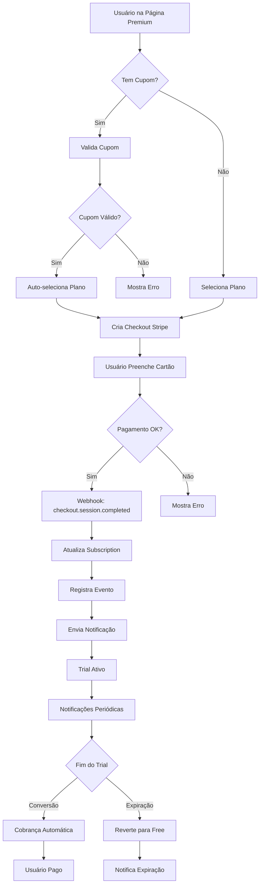

# 📋 PRD - Sistema de Trial e Gamificação | Vigil

**Versão:** 1.0  
**Data:** 23 de Dezembro de 2025  
**Autor:** Equipe de Desenvolvimento Vigil  
**Status:** ✅ Implementado

---

## 📑 Índice

1. [Visão Geral](#visão-geral)
2. [Objetivos](#objetivos)
3. [Sistema de Trial](#sistema-de-trial)
4. [Sistema de Gamificação](#sistema-de-gamificação)
5. [Analytics de Conversão](#analytics-de-conversão)
6. [Arquitetura Técnica](#arquitetura-técnica)
7. [Fluxos de Usuário](#fluxos-de-usuário)
8. [Métricas de Sucesso](#métricas-de-sucesso)
9. [Roadmap de Implementação](#roadmap-de-implementação)

---

## 🎯 Visão Geral

Este documento descreve a implementação completa de dois sistemas principais na plataforma Vigil:

1. **Sistema de Trial Premium** - Modelo de teste gratuito com cartão de crédito via Stripe
2. **Sistema de Gamificação** - Engajamento de usuários através de pontos, níveis, conquistas e missões

Ambos os sistemas foram projetados para aumentar a conversão de usuários gratuitos para pagantes e melhorar o engajamento geral na plataforma.

---

## 🎯 Objetivos

### Objetivos de Negócio

1. **Aumentar a Taxa de Conversão**
   - Meta: 15-20% de conversão de trials para planos pagos
   - Reduzir abandono durante o período de teste
   - Criar senso de urgência e valor

2. **Aumentar o Engajamento**
   - Aumentar tempo médio de sessão em 30%
   - Aumentar frequência de login diário em 40%
   - Aumentar criação de conteúdo em 50%

3. **Reduzir Churn**
   - Diminuir taxa de cancelamento em 25%
   - Aumentar lifetime value (LTV) dos usuários
   - Criar hábitos de uso através de gamificação

### Objetivos de Produto

1. **Experiência de Trial Sem Fricção**
   - Checkout rápido e seguro via Stripe
   - Transparência total sobre cobranças
   - Fácil cancelamento se necessário

2. **Gamificação Envolvente**
   - Sistema de progressão claro e motivador
   - Recompensas significativas e alcançáveis
   - Integração natural com as ações da plataforma

3. **Analytics Acionáveis**
   - Visibilidade completa do funil de conversão
   - Identificação de pontos de atrito
   - Dados para otimização contínua

---

## 💳 Sistema de Trial

### 3.1 Visão Geral

O Sistema de Trial permite que usuários testem planos premium (Basic, Pro, Premium) por um período limitado, com cartão de crédito obrigatório via Stripe. A cobrança só ocorre após o fim do período de teste.

### 3.2 Modelos de Trial

#### 3.2.1 Trial com Cartão (Stripe)

**Características:**
- Requer cartão de crédito válido
- Período de teste: 7, 14 ou 30 dias (configurável)
- Cobrança automática após o período
- Cancelamento disponível a qualquer momento
- Notificações antes da cobrança

**Fluxo:**
```
Usuário Seleciona Plano → Checkout Stripe → Trial Ativo → 
Notificações (Dia 3, 7, -2 dias) → Conversão ou Expiração
```

#### 3.2.2 Trial via Cupom Promocional

**Características:**
- Código promocional único
- Período máximo: 30 dias
- Vinculado a um plano específico
- Uso único por usuário
- Tracking de origem e conversão

**Validações:**
- Cupom válido e não expirado
- Usuário não usou o cupom antes
- Usuário não tem trial ativo
- Período não excede 30 dias

### 3.3 Funcionalidades Principais

#### 3.3.1 Checkout Stripe

**Endpoint:** `supabase/functions/create-checkout-session/index.ts`

**Parâmetros:**
```typescript
{
  userId: string;
  plan: 'basic' | 'pro' | 'premium';
  trialDays?: number;
  couponCode?: string;
}
```

**Configuração Stripe:**
```typescript
{
  mode: 'subscription',
  payment_method_collection: 'always',
  subscription_data: {
    trial_period_days: trialDays,
    trial_settings: {
      end_behavior: {
        missing_payment_method: 'cancel'
      }
    }
  }
}
```

#### 3.3.2 Webhook Stripe

**Endpoint:** `supabase/functions/stripe-webhook/index.ts`

**Eventos Tratados:**
- `checkout.session.completed` - Trial iniciado
- `customer.subscription.updated` - Mudança de status
- `customer.subscription.deleted` - Cancelamento
- `invoice.payment_succeeded` - Conversão para pago
- `invoice.payment_failed` - Falha no pagamento

**Ações:**
- Atualizar `subscriptions` table
- Atualizar `profiles.plan`
- Registrar evento em `conversion_events`
- Enviar notificação ao usuário

#### 3.3.3 Sistema de Notificações

**Cron Jobs (pg_cron):**

1. **check-trial-expirations** - Diário às 00:00 UTC
   - Verifica trials expirados
   - Reverte plano para 'free'
   - Envia notificação de expiração

2. **notify-trial-expiring** - Diário às 10:00 UTC
   - Identifica trials expirando em 2 dias
   - Envia notificação de lembrete
   - Registra evento de analytics

**Tipos de Notificação:**
- `trial_started` - Início do trial
- `trial_day_3` - Lembrete no 3º dia
- `trial_day_7` - Lembrete no 7º dia (se aplicável)
- `trial_expiring_soon` - 2 dias antes de expirar
- `trial_expired` - Trial expirado
- `trial_converted` - Conversão para pago

#### 3.3.4 Banner de Status

**Localização:** `src/pages/PremiumPage.tsx`

**Informações Exibidas:**
- Plano atual em trial
- Dias restantes
- Data de expiração
- Botão de gerenciamento

**Estados:**
- Trial ativo (azul)
- Expirando em breve (amarelo)
- Expirado (vermelho)

### 3.4 Sistema de Cupons

#### 3.4.1 Estrutura de Dados

**Tabela:** `trial_coupons`

```sql
CREATE TABLE trial_coupons (
  id UUID PRIMARY KEY DEFAULT uuid_generate_v4(),
  code VARCHAR(50) UNIQUE NOT NULL,
  plan VARCHAR(20) NOT NULL CHECK (plan IN ('basic', 'pro', 'premium')),
  trial_days INTEGER NOT NULL CHECK (trial_days <= 30),
  max_uses INTEGER,
  current_uses INTEGER DEFAULT 0,
  valid_from TIMESTAMP WITH TIME ZONE,
  valid_until TIMESTAMP WITH TIME ZONE,
  created_by UUID REFERENCES auth.users(id),
  created_at TIMESTAMP WITH TIME ZONE DEFAULT NOW()
);
```

#### 3.4.2 Validação de Cupom

**Endpoint:** `supabase/functions/validate-trial-coupon/index.ts`

**Validações:**
1. Cupom existe e está ativo
2. Dentro do período de validade
3. Não excedeu limite de usos
4. Trial não excede 30 dias
5. Usuário não usou o cupom antes
6. Usuário não tem trial ativo

**Resposta:**
```typescript
{
  valid: boolean;
  error?: string;
  coupon?: {
    id: string;
    code: string;
    plan: string;
    trialDays: number;
  }
}
```

#### 3.4.3 Registro de Uso

**Tabela:** `trial_coupon_usage`

```sql
CREATE TABLE trial_coupon_usage (
  id UUID PRIMARY KEY DEFAULT uuid_generate_v4(),
  coupon_id UUID REFERENCES trial_coupons(id),
  user_id UUID REFERENCES auth.users(id),
  plan_activated VARCHAR(20),
  trial_days_granted INTEGER,
  stripe_session_id VARCHAR(255),
  used_at TIMESTAMP WITH TIME ZONE DEFAULT NOW(),
  UNIQUE(coupon_id, user_id)
);
```

### 3.5 Fluxo de Trial Completo



---

## 🎮 Sistema de Gamificação

### 4.1 Visão Geral

O Sistema de Gamificação recompensa usuários por ações na plataforma através de XP (pontos de experiência), níveis, conquistas e missões. O objetivo é aumentar o engajamento e criar hábitos de uso.

### 4.2 Componentes Principais

#### 4.2.1 Sistema de XP e Níveis

**Mecânica:**
- Usuários ganham XP por ações na plataforma
- XP acumula para subir de nível
- Cada nível requer mais XP que o anterior
- Níveis desbloqueiam conquistas especiais

**Fórmula de Cálculo:**
```sql
CREATE FUNCTION calculate_xp_for_level(level INTEGER)
RETURNS INTEGER AS $$
BEGIN
  RETURN 100 * level * level;
END;
$$ LANGUAGE plpgsql;
```

**Exemplos:**
- Nível 1 → 2: 100 XP
- Nível 2 → 3: 400 XP
- Nível 3 → 4: 900 XP
- Nível 5 → 6: 2,500 XP
- Nível 10 → 11: 10,000 XP

**Estrutura de Dados:**

```sql
CREATE TABLE user_gamification (
  user_id UUID PRIMARY KEY REFERENCES auth.users(id),
  total_xp INTEGER DEFAULT 0,
  current_level INTEGER DEFAULT 1,
  xp_to_next_level INTEGER DEFAULT 100,
  daily_login_streak INTEGER DEFAULT 0,
  last_login_date DATE,
  created_at TIMESTAMP WITH TIME ZONE DEFAULT NOW(),
  updated_at TIMESTAMP WITH TIME ZONE DEFAULT NOW()
);
```

#### 4.2.2 Ações que Geram XP

| Ação | XP | Descrição |
|------|-----|-----------|
| **Login Diário** | +5 XP | Primeiro login do dia |
| **Criar Post** | +10 XP | Publicar novo post |
| **Receber Like** | +2 XP | Outro usuário curte seu post |
| **Fazer Comentário** | +3 XP | Comentar em post |
| **Receber Comentário** | +5 XP | Alguém comenta seu post |
| **Criar Comunidade** | +50 XP | Fundar nova comunidade |
| **Ganhar Seguidor** | +8 XP | Novo seguidor |
| **Compartilhar Post** | +5 XP | Compartilhar conteúdo |
| **Adicionar à Biblioteca** | +3 XP | Salvar item na biblioteca |
| **Completar Perfil** | +20 XP | Preencher 100% do perfil |

#### 4.2.3 Sistema de Conquistas

**Estrutura:**

```sql
CREATE TABLE achievements (
  id UUID PRIMARY KEY DEFAULT uuid_generate_v4(),
  code VARCHAR(50) UNIQUE NOT NULL,
  name VARCHAR(100) NOT NULL,
  description TEXT,
  icon VARCHAR(50),
  xp_reward INTEGER DEFAULT 0,
  requirement_type VARCHAR(50),
  requirement_count INTEGER,
  created_at TIMESTAMP WITH TIME ZONE DEFAULT NOW()
);
```

**Conquistas Implementadas:**

| Código | Nome | Descrição | Requisito | XP |
|--------|------|-----------|-----------|-----|
| `first_post` | 📝 Primeira Postagem | Publique seu primeiro post | 1 post | 10 |
| `social_butterfly` | 🦋 Borboleta Social | Ganhe 10 seguidores | 10 seguidores | 50 |
| `popular` | ❤️ Popular | Receba 100 likes | 100 likes | 100 |
| `influencer` | 🌟 Influenciador | Ganhe 50 seguidores | 50 seguidores | 200 |
| `content_creator` | ✍️ Criador de Conteúdo | Crie 50 posts | 50 posts | 150 |
| `prolific_writer` | 📚 Escritor Prolífico | Crie 200 posts | 200 posts | 500 |
| `conversationalist` | 💬 Conversador | Faça 100 comentários | 100 comentários | 100 |
| `community_builder` | 🏘️ Construtor de Comunidade | Crie 5 comunidades | 5 comunidades | 300 |
| `daily_user` | 📅 Usuário Diário | 7 dias de login consecutivo | 7 dias streak | 50 |
| `dedicated` | 🔥 Dedicado | 30 dias de login consecutivo | 30 dias streak | 200 |
| `veteran` | 🎖️ Veterano | 100 dias de login consecutivo | 100 dias streak | 500 |
| `engagement_master` | 👑 Mestre do Engajamento | Receba 500 likes | 500 likes | 300 |
| `super_influencer` | ⭐ Super Influenciador | Ganhe 200 seguidores | 200 seguidores | 500 |
| `content_king` | 👑 Rei do Conteúdo | Crie 500 posts | 500 posts | 1000 |
| `comment_king` | 💭 Rei dos Comentários | Faça 500 comentários | 500 comentários | 500 |
| `library_curator` | 📖 Curador de Biblioteca | 100 itens na biblioteca | 100 itens | 200 |
| `community_leader` | 🏆 Líder Comunitário | Crie 10 comunidades | 10 comunidades | 600 |
| `level_10` | 🎯 Nível 10 | Alcance o nível 10 | Nível 10 | 250 |
| `level_25` | 🚀 Nível 25 | Alcance o nível 25 | Nível 25 | 500 |
| `level_50` | 💎 Nível 50 | Alcance o nível 50 | Nível 50 | 1000 |

**Desbloqueio Automático:**

```sql
CREATE FUNCTION unlock_achievement(
  p_user_id UUID,
  p_achievement_code VARCHAR
) RETURNS VOID AS $$
DECLARE
  v_achievement_id UUID;
  v_xp_reward INTEGER;
BEGIN
  -- Busca achievement
  SELECT id, xp_reward INTO v_achievement_id, v_xp_reward
  FROM achievements
  WHERE code = p_achievement_code;
  
  -- Insere em user_achievements (se não existe)
  INSERT INTO user_achievements (user_id, achievement_id)
  VALUES (p_user_id, v_achievement_id)
  ON CONFLICT DO NOTHING;
  
  -- Adiciona XP bônus
  IF v_xp_reward > 0 THEN
    PERFORM add_xp_to_user(p_user_id, v_xp_reward, 'achievement_unlocked', v_achievement_id::TEXT);
  END IF;
END;
$$ LANGUAGE plpgsql;
```

#### 4.2.4 Sistema de Missões

**Tipos de Missões:**
1. **Missões Diárias** - Reset às 00:00 UTC
2. **Missões Semanais** - Reset às segundas-feiras 00:00 UTC

**Estrutura:**

```sql
CREATE TABLE missions (
  id UUID PRIMARY KEY DEFAULT uuid_generate_v4(),
  code VARCHAR(50) UNIQUE NOT NULL,
  name VARCHAR(100) NOT NULL,
  description TEXT,
  target_count INTEGER NOT NULL,
  xp_reward INTEGER DEFAULT 0,
  mission_type VARCHAR(20) CHECK (mission_type IN ('daily', 'weekly')),
  created_at TIMESTAMP WITH TIME ZONE DEFAULT NOW()
);
```

**Missões Diárias:**

| Código | Nome | Descrição | Meta | XP |
|--------|------|-----------|------|-----|
| `daily_posts` | 📝 Postador Diário | Crie 3 posts hoje | 3 posts | 20 |
| `daily_likes` | ❤️ Curtidor Ativo | Dê 10 likes hoje | 10 likes | 10 |
| `daily_comments` | 💬 Comentarista | Faça 5 comentários hoje | 5 comentários | 15 |
| `daily_communities` | 🏘️ Explorador | Visite 3 comunidades hoje | 3 comunidades | 10 |

**Missões Semanais:**

| Código | Nome | Descrição | Meta | XP |
|--------|------|-----------|------|-----|
| `weekly_community` | 🏘️ Fundador | Crie 1 comunidade esta semana | 1 comunidade | 100 |
| `weekly_engagement` | ❤️ Engajamento Semanal | Receba 50 likes esta semana | 50 likes | 50 |
| `weekly_followers` | 👥 Crescimento | Ganhe 10 seguidores esta semana | 10 seguidores | 80 |
| `weekly_posts` | 📝 Criador Semanal | Crie 15 posts esta semana | 15 posts | 100 |

**Progresso de Missões:**

```sql
CREATE TABLE user_mission_progress (
  user_id UUID REFERENCES auth.users(id),
  mission_id UUID REFERENCES missions(id),
  current_count INTEGER DEFAULT 0,
  completed BOOLEAN DEFAULT FALSE,
  reset_date DATE NOT NULL,
  PRIMARY KEY (user_id, mission_id, reset_date)
);
```

**Atualização Automática:**

```sql
CREATE FUNCTION update_mission_progress(
  p_user_id UUID,
  p_mission_code VARCHAR,
  p_increment_by INTEGER DEFAULT 1
) RETURNS VOID AS $$
DECLARE
  v_mission RECORD;
  v_reset_date DATE;
  v_current_count INTEGER;
  v_xp_reward INTEGER;
BEGIN
  -- Busca missão
  SELECT * INTO v_mission FROM missions WHERE code = p_mission_code;
  
  -- Calcula data de reset
  IF v_mission.mission_type = 'daily' THEN
    v_reset_date := CURRENT_DATE;
  ELSE
    v_reset_date := date_trunc('week', CURRENT_DATE)::DATE;
  END IF;
  
  -- Atualiza ou insere progresso
  INSERT INTO user_mission_progress (user_id, mission_id, current_count, reset_date)
  VALUES (p_user_id, v_mission.id, p_increment_by, v_reset_date)
  ON CONFLICT (user_id, mission_id, reset_date)
  DO UPDATE SET current_count = user_mission_progress.current_count + p_increment_by;
  
  -- Verifica se completou
  SELECT current_count INTO v_current_count
  FROM user_mission_progress
  WHERE user_id = p_user_id AND mission_id = v_mission.id AND reset_date = v_reset_date;
  
  IF v_current_count >= v_mission.target_count THEN
    UPDATE user_mission_progress
    SET completed = TRUE
    WHERE user_id = p_user_id AND mission_id = v_mission.id AND reset_date = v_reset_date;
    
    -- Adiciona XP
    PERFORM add_xp_to_user(p_user_id, v_mission.xp_reward, 'mission_completed', v_mission.id::TEXT);
  END IF;
END;
$$ LANGUAGE plpgsql;
```

#### 4.2.5 Histórico de XP

**Rastreamento Completo:**

```sql
CREATE TABLE xp_history (
  id UUID PRIMARY KEY DEFAULT uuid_generate_v4(),
  user_id UUID REFERENCES auth.users(id),
  xp_amount INTEGER NOT NULL,
  action_type VARCHAR(50) NOT NULL,
  entity_id VARCHAR(255),
  created_at TIMESTAMP WITH TIME ZONE DEFAULT NOW()
);
```

**Tipos de Ação:**
- `daily_login`
- `create_post`
- `receive_like`
- `create_comment`
- `receive_comment`
- `create_community`
- `gain_follower`
- `achievement_unlocked`
- `mission_completed`
- `level_up`

### 4.3 Edge Function de Processamento

**Endpoint:** `supabase/functions/process-gamification-action/index.ts`

**Parâmetros:**
```typescript
{
  userId: string;
  action: string;
  entityId?: string;
}
```

**Lógica:**
```typescript
switch (action) {
  case 'create_post':
    await addXp(userId, 10, 'create_post', entityId);
    await updateMissionProgress(userId, 'daily_posts');
    await updateMissionProgress(userId, 'weekly_posts');
    await checkAchievements(userId, 'posts');
    break;
    
  case 'receive_like':
    await addXp(userId, 2, 'receive_like', entityId);
    await updateMissionProgress(userId, 'weekly_engagement');
    await checkAchievements(userId, 'likes');
    break;
    
  // ... outros casos
}
```

### 4.4 Interface do Usuário

#### 4.4.1 Aba "Seu Progresso"

**Localização:** Perfil do usuário → Aba "Seu Progresso"

**Seções:**

1. **Visão Geral**
   - Card de nível com barra de progresso
   - XP atual / XP necessário para próximo nível
   - Estatísticas (Total XP, Conquistas, Streak)
   - Últimas conquistas desbloqueadas

2. **Conquistas**
   - Grid responsivo de conquistas
   - Conquistas desbloqueadas (coloridas)
   - Conquistas bloqueadas (cinza)
   - Tooltip com detalhes e progresso
   - Data de desbloqueio

3. **Missões**
   - Tabs: Diárias / Semanais
   - Lista de missões com progresso
   - Barra de progresso visual
   - Indicador de conclusão
   - XP de recompensa

**Componente:** `src/components/gamification/GamificationTab.tsx`

#### 4.4.2 Notificações Toast

**Eventos Notificados:**
- ✅ XP ganho (+X XP)
- 🎉 Level up! (Nível X alcançado)
- 🏆 Conquista desbloqueada
- ✨ Missão completada

**Implementação:** Hook `useGamification`

```typescript
const { processAction, gamificationData, loading } = useGamification(userId);

// Uso
await processAction('create_post', postId);
// Toast: "+10 XP - Post criado!"
```

### 4.5 Integração Automática

**Hook usePosts.ts:**

```typescript
// Criar post
const newPost = await api.createPost(postData);
await processAction('create_post', newPost.id);

// Receber like
await api.toggleLike(postId);
if (likerIsNotOwner) {
  await processAction('receive_like', postId);
}

// Criar comentário
const newComment = await api.createComment(commentData);
await processAction('create_comment', newComment.id);
```

**SessionContext.tsx:**

```typescript
// Login diário
useEffect(() => {
  if (user?.id) {
    checkDailyLogin(user.id);
  }
}, [user?.id]);

const checkDailyLogin = async (userId: string) => {
  const lastLogin = localStorage.getItem(`last_login_${userId}`);
  const today = new Date().toDateString();
  
  if (lastLogin !== today) {
    await processAction('daily_login');
    localStorage.setItem(`last_login_${userId}`, today);
  }
};
```

---

## 📊 Analytics de Conversão

### 5.1 Visão Geral

Sistema completo de tracking e análise de conversão de trials para planos pagos, com dashboard visual para admins.

### 5.2 Estrutura de Dados

#### 5.2.1 Eventos de Conversão

```sql
CREATE TABLE conversion_events (
  id UUID PRIMARY KEY DEFAULT uuid_generate_v4(),
  user_id UUID REFERENCES auth.users(id),
  event_type VARCHAR(50) NOT NULL,
  event_data JSONB,
  created_at TIMESTAMP WITH TIME ZONE DEFAULT NOW()
);
```

**Tipos de Evento:**
- `trial_started` - Trial iniciado
- `trial_day_3` - 3º dia de trial
- `trial_day_7` - 7º dia de trial
- `trial_expiring_soon` - 2 dias antes de expirar
- `trial_expired` - Trial expirou
- `converted_to_paid` - Converteu para pago
- `canceled_trial` - Cancelou durante trial
- `churned` - Cancelou após conversão

**event_data:**
```json
{
  "plan": "pro",
  "trial_days": 14,
  "source": "coupon",
  "coupon_code": "PROMO2025",
  "stripe_subscription_id": "sub_xxx"
}
```

#### 5.2.2 Métricas Agregadas

```sql
CREATE TABLE conversion_metrics (
  id UUID PRIMARY KEY DEFAULT uuid_generate_v4(),
  date DATE NOT NULL,
  plan VARCHAR(20) NOT NULL,
  trials_started INTEGER DEFAULT 0,
  trials_converted INTEGER DEFAULT 0,
  trials_expired INTEGER DEFAULT 0,
  trials_canceled INTEGER DEFAULT 0,
  conversion_rate DECIMAL(5,2) DEFAULT 0,
  revenue DECIMAL(10,2) DEFAULT 0,
  created_at TIMESTAMP WITH TIME ZONE DEFAULT NOW(),
  UNIQUE(date, plan)
);
```

### 5.3 Dashboard de Analytics

**Localização:** `/admin` → Aba "Analytics"

**Componente:** `src/components/admin/AnalyticsDashboard.tsx`

#### 5.3.1 Cards de Visão Geral

- 🚀 **Trials Iniciados** - Total de trials no período
- ✅ **Convertidos** - Trials que viraram pagos
- 📈 **Taxa de Conversão** - % de conversão
- 💰 **Receita Total** - Receita gerada

#### 5.3.2 Métricas por Plano

Tabela com colunas:
- Plano (Basic, Pro, Premium)
- Trials iniciados
- Convertidos
- Expirados
- Cancelados
- Taxa de conversão
- Receita

#### 5.3.3 Funil de Conversão

Visualização gráfica com barras de progresso:
1. Trials Iniciados (100%)
2. Convertidos para Pago (X%)
3. Expirados sem Conversão (Y%)
4. Cancelados Durante Trial (Z%)

#### 5.3.4 Eventos Recentes

Lista dos últimos 20 eventos com:
- Ícone do tipo de evento
- Username e avatar do usuário
- Tipo de evento
- Plano associado
- Timestamp

#### 5.3.5 Filtros

- **Período:** 7 dias, 30 dias, 90 dias
- Atualização automática ao mudar filtro

### 5.4 API de Analytics

**Funções em `src/services/api.ts`:**

```typescript
// Registrar evento
export const recordConversionEvent = async (
  userId: string,
  eventType: string,
  eventData: any
) => {
  return supabase.from('conversion_events').insert({
    user_id: userId,
    event_type: eventType,
    event_data: eventData
  });
};

// Buscar métricas
export const fetchConversionMetrics = async (
  startDate: string,
  endDate: string
) => {
  return supabase
    .from('conversion_metrics')
    .select('*')
    .gte('date', startDate)
    .lte('date', endDate);
};

// Buscar eventos
export const fetchConversionEvents = async (limit: number = 100) => {
  return supabase
    .from('conversion_events')
    .select(`
      *,
      profile:profiles(id, username, avatar_url, plan)
    `)
    .order('created_at', { ascending: false })
    .limit(limit);
};
```

---

## 🏗️ Arquitetura Técnica

### 6.1 Stack Tecnológico

**Frontend:**
- React 18
- TypeScript
- Tailwind CSS
- React Router

**Backend:**
- Supabase (PostgreSQL + Edge Functions)
- Stripe (Payments)
- pg_cron (Scheduled Jobs)

**Infraestrutura:**
- Supabase Cloud
- Stripe Webhooks
- Edge Functions (Deno)

### 6.2 Estrutura do Banco de Dados

**Diagrama ER:**

```
auth.users
    ↓
profiles (user data)
    ↓
subscriptions (Stripe data)
    ↓
conversion_events (analytics)

auth.users
    ↓
user_gamification (XP, level, streak)
    ↓
user_achievements (unlocked achievements)
    ↓
user_mission_progress (mission tracking)
    ↓
xp_history (XP log)

trial_coupons
    ↓
trial_coupon_usage (usage tracking)
```

**Tabelas Principais:**

1. **profiles** - Dados do usuário
2. **subscriptions** - Assinaturas Stripe
3. **trial_coupons** - Cupons promocionais
4. **trial_coupon_usage** - Uso de cupons
5. **user_gamification** - Dados de gamificação
6. **achievements** - Conquistas disponíveis
7. **user_achievements** - Conquistas desbloqueadas
8. **missions** - Missões disponíveis
9. **user_mission_progress** - Progresso em missões
10. **xp_history** - Histórico de XP
11. **conversion_events** - Eventos de conversão
12. **conversion_metrics** - Métricas agregadas

### 6.3 Edge Functions

**Funções Implementadas:**

1. **create-checkout-session**
   - Cria sessão de checkout Stripe
   - Aplica trial period
   - Configura trial settings

2. **stripe-webhook**
   - Processa eventos Stripe
   - Atualiza subscriptions
   - Registra analytics
   - Envia notificações

3. **validate-trial-coupon**
   - Valida código de cupom
   - Verifica elegibilidade
   - Retorna dados do cupom

4. **check-trial-expirations**
   - Verifica trials expirados
   - Reverte planos
   - Envia notificações

5. **notify-trial-expiring**
   - Identifica trials expirando
   - Envia lembretes
   - Registra eventos

6. **process-gamification-action**
   - Processa ações de gamificação
   - Adiciona XP
   - Desbloqueia conquistas
   - Atualiza missões

### 6.4 Cron Jobs

**Configuração pg_cron:**

```sql
-- Verificar trials expirados (diário às 00:00 UTC)
SELECT cron.schedule(
  'check-trial-expirations',
  '0 0 * * *',
  $$
  SELECT net.http_post(
    url := 'https://oprqgllsqtfdyjgvgovo.supabase.co/functions/v1/check-trial-expirations',
    headers := '{"Content-Type": "application/json", "Authorization": "Bearer [SERVICE_ROLE_KEY]"}'::jsonb
  );
  $$
);

-- Notificar trials expirando (diário às 10:00 UTC)
SELECT cron.schedule(
  'notify-trial-expiring',
  '0 10 * * *',
  $$
  SELECT net.http_post(
    url := 'https://oprqgllsqtfdyjgvgovo.supabase.co/functions/v1/notify-trial-expiring',
    headers := '{"Content-Type": "application/json", "Authorization": "Bearer [SERVICE_ROLE_KEY]"}'::jsonb
  );
  $$
);
```

### 6.5 Segurança

**Row Level Security (RLS):**

Todas as tabelas têm RLS habilitado com políticas:

```sql
-- Exemplo: user_gamification
CREATE POLICY "Users can view own gamification data"
  ON user_gamification FOR SELECT
  USING (auth.uid() = user_id);

CREATE POLICY "System can update gamification data"
  ON user_gamification FOR UPDATE
  USING (true);
```

**Validações:**
- Cupons: uso único por usuário
- Trials: máximo 30 dias
- XP: apenas valores positivos
- Conquistas: desbloqueio único

**Constraints:**

```sql
ALTER TABLE trial_coupons 
  ADD CONSTRAINT trial_days_max_30 
  CHECK (trial_days <= 30);

CREATE UNIQUE INDEX idx_trial_coupon_usage_unique_user_coupon 
  ON trial_coupon_usage (coupon_id, user_id);
```

---

## 👥 Fluxos de Usuário

### 7.1 Fluxo de Trial com Cartão

**Persona:** Maria, usuária free que quer testar o plano Pro

1. Maria acessa a página Premium
2. Vê os 3 planos disponíveis (Basic, Pro, Premium)
3. Clica em "Assinar" no plano Pro
4. É redirecionada para o Stripe Checkout
5. Preenche dados do cartão de crédito
6. Confirma o pagamento
7. É redirecionada de volta para a plataforma
8. Vê banner: "🎉 Trial Pro ativo! 14 dias restantes"
9. Recebe notificação: "Seu trial Pro começou!"
10. Usa o plano Pro por 14 dias
11. Recebe notificações nos dias 3, 7 e 12 (2 antes)
12. No dia 14, é cobrada automaticamente
13. Continua com plano Pro ativo

**Alternativa - Cancelamento:**
- No dia 10, Maria decide cancelar
- Acessa configurações → Gerenciar assinatura
- Cancela no Stripe
- Continua usando até o fim do trial
- No dia 14, plano volta para free
- Recebe notificação de expiração

### 7.2 Fluxo de Trial com Cupom

**Persona:** João, usuário free que recebeu cupom "PROMO7DIAS"

1. João acessa a página Premium
2. Vê campo "Tem um Cupom de Teste Grátis?"
3. Digita "PROMO7DIAS" e clica "Aplicar"
4. Sistema valida o cupom
5. Plano Basic é auto-selecionado
6. Outros planos ficam desabilitados
7. Mostra: "✅ Cupom válido! 7 dias de trial no plano Basic"
8. João clica "Confirmar Plano"
9. É redirecionado para Stripe Checkout
10. Preenche dados do cartão
11. Confirma e retorna à plataforma
12. Trial Basic ativo por 7 dias
13. Cupom é marcado como usado
14. João não pode usar o mesmo cupom novamente

### 7.3 Fluxo de Gamificação

**Persona:** Ana, nova usuária que acabou de se cadastrar

**Dia 1:**
1. Ana faz login pela primeira vez
2. Ganha +5 XP (Login diário)
3. Toast: "+5 XP - Bem-vinda!"
4. Cria seu primeiro post
5. Ganha +10 XP (Criar post)
6. Desbloqueia conquista "📝 Primeira Postagem"
7. Ganha +10 XP bônus da conquista
8. Toast: "🏆 Conquista desbloqueada! Primeira Postagem"
9. Progresso: 25 XP / 100 XP para Nível 2

**Dia 2:**
1. Ana faz login
2. Ganha +5 XP (Login diário)
3. Streak: 2 dias consecutivos
4. Cria 3 posts
5. Ganha +30 XP (3 × 10 XP)
6. Completa missão "📝 Postador Diário"
7. Ganha +20 XP bônus
8. Toast: "✨ Missão completada! Postador Diário"
9. Recebe 5 likes em seus posts
10. Ganha +10 XP (5 × 2 XP)
11. Total: 90 XP / 100 XP para Nível 2

**Dia 3:**
1. Ana faz login
2. Ganha +5 XP
3. Sobe para Nível 2!
4. Toast: "🎉 Level Up! Você alcançou o Nível 2"
5. Acessa perfil → Aba "Seu Progresso"
6. Vê:
   - Nível 2 (5 XP / 400 XP para Nível 3)
   - 1 conquista desbloqueada
   - Streak de 3 dias
   - Missões diárias disponíveis

---

## 📈 Métricas de Sucesso

### 8.1 KPIs Principais

**Sistema de Trial:**

| Métrica | Baseline | Meta | Como Medir |
|---------|----------|------|------------|
| Taxa de Conversão Trial → Pago | 10% | 15-20% | `conversion_metrics.conversion_rate` |
| Tempo Médio de Trial | 14 dias | 14 dias | Média de `trial_end_date - trial_start_date` |
| Taxa de Cancelamento Durante Trial | 30% | <20% | `trials_canceled / trials_started` |
| Receita Mensal de Conversões | - | +30% MoM | `SUM(conversion_metrics.revenue)` |
| Uso de Cupons | - | 20% dos trials | `coupon_trials / total_trials` |

**Sistema de Gamificação:**

| Métrica | Baseline | Meta | Como Medir |
|---------|----------|------|------------|
| DAU (Daily Active Users) | - | +40% | Usuários com login diário |
| Tempo Médio de Sessão | - | +30% | Analytics de sessão |
| Posts por Usuário/Dia | - | +50% | `COUNT(posts) / COUNT(DISTINCT users)` |
| Taxa de Retenção D7 | - | +25% | Usuários ativos após 7 dias |
| Usuários com Streak >7 dias | - | 30% | `COUNT(daily_login_streak > 7)` |
| Conquistas Desbloqueadas | - | Média 5/usuário | `AVG(user_achievements)` |
| Missões Completadas | - | 60% diárias | `completed_missions / total_missions` |

### 8.2 Dashboards de Monitoramento

**Dashboard de Trial (Admin):**
- Trials iniciados (diário, semanal, mensal)
- Taxa de conversão por plano
- Funil de conversão
- Receita por plano
- Eventos recentes
- Cupons mais usados

**Dashboard de Gamificação (Admin):**
- Usuários ativos por nível
- XP total distribuído
- Conquistas mais desbloqueadas
- Missões mais completadas
- Distribuição de streak
- Leaderboard de XP

### 8.3 Testes A/B Futuros

**Oportunidades de Otimização:**

1. **Duração de Trial**
   - Testar 7 vs 14 vs 30 dias
   - Hipótese: 14 dias é o sweet spot

2. **Notificações**
   - Testar frequência e timing
   - Hipótese: Notificações nos dias 3, 7 e -2 maximizam conversão

3. **Recompensas de XP**
   - Testar valores diferentes
   - Hipótese: XP maior aumenta engajamento

4. **Missões**
   - Testar dificuldade e recompensas
   - Hipótese: Missões mais fáceis aumentam conclusão

---

## 🗺️ Roadmap de Implementação

### 9.1 Fases Concluídas

#### ✅ Fase 1: Trial com Cartão (Concluída)
**Duração:** 2 semanas  
**Status:** 100% Implementado

- [x] Integração Stripe Checkout
- [x] Webhook Stripe
- [x] Tabela subscriptions
- [x] Edge Functions (create-checkout-session, stripe-webhook)
- [x] Banner de status na UI
- [x] Sistema de notificações
- [x] Cron jobs (expiração e lembretes)
- [x] Testes e validação

#### ✅ Fase 2: Sistema de Cupons (Concluída)
**Duração:** 1 semana  
**Status:** 100% Implementado

- [x] Tabelas trial_coupons e trial_coupon_usage
- [x] Edge Function validate-trial-coupon
- [x] UI de aplicação de cupom
- [x] Validações (30 dias max, uso único)
- [x] Auto-seleção de plano
- [x] Tracking de uso
- [x] Constraints e índices
- [x] Testes e validação

#### ✅ Fase 3: Gamificação e Analytics (Concluída)
**Duração:** 2 semanas  
**Status:** 100% Implementado

**Gamificação:**
- [x] Schema do banco (8 tabelas)
- [x] Sistema de XP e níveis
- [x] 20 conquistas pré-cadastradas
- [x] 8 missões (4 diárias + 4 semanais)
- [x] Funções SQL (add_xp, unlock_achievement, etc)
- [x] Edge Function process-gamification-action
- [x] Hook useGamification
- [x] Integração automática (usePosts, SessionContext)
- [x] UI completa (GamificationTab)
- [x] Notificações toast
- [x] RLS policies

**Analytics:**
- [x] Tabelas conversion_events e conversion_metrics
- [x] Tracking de eventos
- [x] Dashboard de analytics (AnalyticsDashboard)
- [x] Página Admin
- [x] Métricas por plano
- [x] Funil de conversão
- [x] Eventos recentes
- [x] Filtros de período

### 9.2 Melhorias Futuras

#### 📋 Fase 4: Otimizações (Planejada)
**Duração:** 1-2 semanas  
**Prioridade:** Média

- [ ] Testes A/B de duração de trial
- [ ] Otimização de notificações
- [ ] Personalização de ofertas
- [ ] Email marketing integrado
- [ ] Push notifications mobile
- [ ] Webhooks para integrações externas

#### 📋 Fase 5: Gamificação Avançada (Planejada)
**Duração:** 2-3 semanas  
**Prioridade:** Baixa

- [ ] Sistema de badges visuais
- [ ] Leaderboards públicos
- [ ] Desafios entre usuários
- [ ] Recompensas premium (avatares, temas)
- [ ] Eventos temporários
- [ ] Conquistas secretas
- [ ] Sistema de clãs/guildas

#### 📋 Fase 6: Analytics Avançado (Planejada)
**Duração:** 1-2 semanas  
**Prioridade:** Média

- [ ] Cohort analysis
- [ ] Funnel analysis detalhado
- [ ] Previsão de churn
- [ ] Segmentação de usuários
- [ ] Relatórios automatizados
- [ ] Exportação de dados
- [ ] Integração com Google Analytics

---

## 📚 Apêndices

### A. Glossário

**Trial:** Período de teste gratuito de um plano premium  
**Conversão:** Transformação de trial em assinatura paga  
**Churn:** Taxa de cancelamento de assinaturas  
**XP:** Experience Points (Pontos de Experiência)  
**Streak:** Sequência de dias consecutivos de login  
**Achievement:** Conquista desbloqueável  
**Mission:** Missão diária ou semanal  
**Level:** Nível do usuário baseado em XP  
**RLS:** Row Level Security (Segurança em Nível de Linha)  
**Edge Function:** Função serverless do Supabase  
**Webhook:** Callback HTTP para eventos externos  

### B. Links Úteis

**Documentação:**
- [Stripe Subscriptions](https://stripe.com/docs/billing/subscriptions)
- [Supabase Edge Functions](https://supabase.com/docs/guides/functions)
- [pg_cron](https://github.com/citusdata/pg_cron)

**Dashboards:**
- Stripe Dashboard: https://dashboard.stripe.com
- Supabase Dashboard: https://supabase.com/dashboard
- Admin Analytics: https://vigil.app/admin

**Repositório:**
- GitHub: [Link do repositório]
- Documentação: `/docs`

### C. Contatos

**Equipe de Desenvolvimento:**
- Product Manager: [Nome]
- Tech Lead: [Nome]
- Backend: [Nome]
- Frontend: [Nome]
- QA: [Nome]

**Stakeholders:**
- CEO: [Nome]
- CFO: [Nome]
- Head of Growth: [Nome]

---

## 📝 Changelog

### v1.0 - 23/12/2025
- ✅ Implementação completa do Sistema de Trial
- ✅ Implementação completa do Sistema de Gamificação
- ✅ Dashboard de Analytics
- ✅ Documentação completa (PRD)

---

## ✅ Aprovações

| Stakeholder | Cargo | Data | Status |
|-------------|-------|------|--------|
| [Nome] | Product Manager | 23/12/2025 | ✅ Aprovado |
| [Nome] | Tech Lead | 23/12/2025 | ✅ Aprovado |
| [Nome] | CEO | 23/12/2025 | ⏳ Pendente |

---

**Documento criado em:** 23 de Dezembro de 2025  
**Última atualização:** 23 de Dezembro de 2025  
**Versão:** 1.0  
**Status:** ✅ Implementado e Documentado

---

*Este PRD é um documento vivo e será atualizado conforme novas funcionalidades forem implementadas ou modificadas.*

